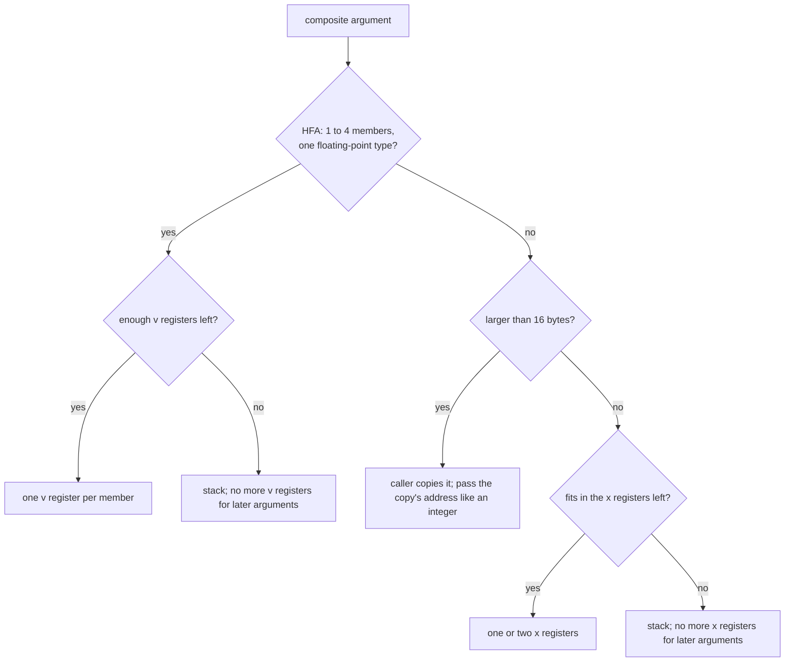

# A4. Calling conventions and ABIs

<p class="page-intro">A calling convention is the agreement that lets two pieces of machine code, compiled separately and perhaps by different compilers, call each other. This chapter reads the three conventions a Vortex back end meets (AAPCS64, Apple's changes to it, and the SysV AMD64 psABI) and traces real calls through each, because every call from generated code into the runtime crosses one of them.</p>

<p class="vx-meta" markdown="1">Level: Intermediate · Reading time: about 45 minutes · Builds on: [A2. Reading and writing AArch64 assembly](a2-aarch64-assembly.md), [A3. Floats and vectors in registers](a3-floats-and-vectors.md)</p>

???+ remember "Before you start, remember"

    ??? question "What does a function receive when it is called with `&mut values`?"

        Access to the caller's own array, not a copy: writes through the
        parameter change the caller's storage. In machine terms, the
        function receives an address.

        Introduced in [8. Data in memory](../compiler/guide/stage-8-data-in-memory.md#references-and-passing-without-copying). Decision: [record 40](../decisions/references.md#d40).

    ??? question "What happens to the upper half of `x0` when an instruction writes `w0`?"

        It becomes zero. A `w` name selects the low 32 bits of the
        register, and any write to it clears bits 32 to 63.

        Introduced in [A2. Reading and writing AArch64 assembly](a2-aarch64-assembly.md#registers-by-name).

    ??? question "Where does `bl` leave the return address, and what does `ret` read?"

        `bl` writes the address of the next instruction into `x30`, the
        link register, and does not touch the stack. `ret` branches to the
        address in `x30`.

        Introduced in [A2. Reading and writing AArch64 assembly](a2-aarch64-assembly.md#branches-and-loops).

    ??? question "How are `s3`, `d3` and `q3` related?"

        They are the low 32 bits, the low 64 bits and all 128 bits of the
        same register, `v3`.

        Introduced in [A3. Floats and vectors in registers](a3-floats-and-vectors.md#a-second-register-file).

    ??? question "What does generated code call when a runtime check fails?"

        One function in the runtime library, passing the kind of check, its
        source position and the values the message shows. That function
        writes the error line and exits with status 101.

        Introduced in [6. The first machine code](../compiler/guide/stage-6-first-machine-code.md#the-small-runtime). Decision: [I8](../decisions/implementation.md#i8).

!!! goals "In this chapter"

    - Assign the arguments of a call to registers and stack slots under AAPCS64, Apple arm64 and SysV AMD64, and check the answer against a compiler's listing.
    - Explain which registers survive a call on each ISA, and predict where a compiler keeps a floating-point value that must live across a call.
    - Recognize the rules Apple changes, and name the bug each one causes in a back end that ignores it.
    - Work out the stack pointer's alignment through a call on AArch64 and on x86-64.
    - Decide how a struct or array passed by value travels, and when the caller passes its address instead.

## A contract with no compiler in the room

[Stage 10](../compiler/guide/stage-10-matrix-multiplication.md#the-program-the-milestone-asks-for)
ends with this function:

```vortex
// items: valid
fn multiply(a: &[f32; 2, 3], b: &[f32; 3, 2], c: &mut [f32; 2, 2]) {
}
```

Its three parameters are references, and [record 40](../decisions/references.md#d40)
says a reference is passed as the address of its referent. So a call to
`multiply` hands over three addresses. Here is what that looks like when
clang compiles a C caller that builds the three arrays on its stack and calls
a C `multiply` with the same shape (Apple clang 21, `-O1`, macOS on an Apple
M4 Pro, September 2026; the lines that fill the arrays are left out):

```gas
	sub	x0, x29, #32        ; address of a
	add	x1, sp, #16         ; address of b
	mov	x2, sp              ; address of c
	bl	_multiply
```

The first argument goes in `x0`, the second in `x1`, the third in `x2`, and
`bl` jumps. Nothing in the instruction set forces that choice. `bl` only
jumps and records where to come back to. The choice comes from a document
that every compiler, linker and assembly programmer for the platform follows:
a **calling convention**, the rules for where a function finds its
arguments, where it leaves its result, and which registers it must give back
unchanged. A calling convention is one part of an **application binary
interface** (ABI), the full set of rules that let separately built machine
code work together; the rest covers data layout, object files and symbol
names, which [B3](b3-object-files.md) and [B4](b4-linking-and-loading.md)
take up.

The rules have to be written down because the two sides of a call are built
apart. The runtime library that implements `print` and the error report is
compiled once by a C compiler. The code that calls it is produced later by
your compiler, which never sees the runtime's source. If the caller puts the
line number in `x2` and the callee reads it from `x3`, the program still
assembles, links and runs; it reports the wrong line. Most ABI bugs look like
this: no crash, only a wrong value.

AAPCS64 states the scope of the contract precisely. It covers the routines of
each **publicly visible interface**: a function that code outside its own
group of compilation units may call. Behind such an interface, code may make
private arrangements, a point the last section returns to[^aapcs64].
Everything before that section is about public interfaces.

## Where arguments go: two counters, not one

Start with a call that runs out of registers. The C function
`take10(int a0, ..., int a9)` takes ten `int` arguments, and a caller passes
the numbers 0 to 9. Compiled for Linux on AArch64 by the same clang, the
call becomes (frame setup removed):

```gas
	mov	w0, wzr
	mov	w8, #9
	mov	w9, #8
	mov	w1, #1
	...                         // w2 to w6 in the same way
	mov	w7, #7
	str	w8, [sp, #8]            // a9
	str	w9, [sp]                // a8
	bl	take10
```

The first eight arguments land in `w0` to `w7`, the 32-bit views of `x0` to
`x7`, and the last two go to memory at `sp` and `sp + 8`. Each stored value
is only four bytes wide, yet the two slots are eight bytes apart.

The rule behind this is **AAPCS64**, Arm's Procedure Call Standard for the
64-bit architecture: the base convention for AArch64 that Linux uses as it
stands and Apple uses with changes[^aapcs64]. It describes argument passing
as an algorithm with three stages. Stage A sets three counters to zero: the
**next general-purpose register number** (NGRN), the **next SIMD and
floating-point register number** (NSRN), and the **next stacked argument
address** (NSAA), which starts at the stack pointer. Stage B rewrites awkward
arguments, for example replacing a large struct with a pointer to a copy.
Stage C then walks the arguments left to right and places each one.

For scalars, stage C comes down to four rules:

- An integer or pointer of up to eight bytes goes in `x[NGRN]` while NGRN is
  below 8, and NGRN goes up by one.
- A `float` or `double` goes in `v[NSRN]` (seen as `s` or `d`) while NSRN is
  below 8, and NSRN goes up by one.
- Once a bank is full, an argument of that kind goes to the stack at NSAA.
  A slot is at least eight bytes, so a four-byte `int` still advances NSAA
  by eight. That is why `a9` sits at `sp + 8`.
- Any bits of a register or slot that the argument does not fill have
  **unspecified value**: they may hold anything.

The two counters never interact. A floating-point argument does not use up a
general-purpose register, and the reverse holds too, so a function can
receive eight integers and eight doubles, sixteen values, without touching
the stack. AAPCS64 also says that floating-point values travel in the SIMD
and floating-point registers or on the stack, never in general-purpose
registers, unless they are part of a small struct that is not a homogeneous
floating-point aggregate[^aapcs64] (a case the section on structs explains).

Results use the same registers. The standard's rule is short: if a value of
the result type would be passed in registers as the only argument of a
function, it comes back in those same registers. So an `int` or pointer
result comes back in `x0` (a 16-byte integer uses `x0` and `x1`), and a
`double` in `d0`. A larger result is written to memory the caller provides,
and the caller passes that memory's address in `x8`, the **indirect result
location register**[^aapcs64].

The next example applies the scalar rules to two calls under three
conventions. The first call is `take10`. The second has the shape of a
matrix kernel: three pointers, two `float` scale factors, three `int`
sizes and two `long` strides.

--8<-- "includes/examples/backend/a4-calling-conventions/classify_arguments.cpp.md"

The AAPCS64 line for `take10` matches the listing. The Apple and SysV lines
disagree with it in ways the next sections explain. Figure 1 draws the
stack part of the first call under all three conventions.

<figure class="vx-figure">
<svg viewBox="0 0 760 300" role="img" aria-label="Where take10 puts its last arguments under three conventions" aria-describedby="a4-slots-desc">
<title id="a4-slots-title">Where take10 puts its last arguments under three conventions</title>
<desc id="a4-slots-desc">Three rows, one per convention, each showing the outgoing argument area at the call as a strip of four-byte cells starting at sp. AAPCS64: a0 to a7 in x0 to x7; a8 in the cell at sp plus 0 followed by four bytes of padding, a9 at sp plus 8 followed by padding; 16 bytes. Apple arm64: a0 to a7 in x0 to x7; a8 at sp plus 0 and a9 at sp plus 4, packed, then padding to 16 bytes. SysV AMD64: a0 to a5 in rdi, rsi, rdx, rcx, r8 and r9; a6, a7, a8 and a9 at sp plus 0, 8, 16 and 24, each followed by four bytes of padding; 32 bytes.</desc>
<text class="vx-text" x="20" y="36">AAPCS64</text>
<text class="vx-text-muted" x="20" y="56">a0-a7 in x0-x7</text>
<rect class="vx-box-accent" x="300" y="24" width="50" height="36"/>
<text class="vx-mono" x="325" y="47" text-anchor="middle">a8</text>
<rect class="vx-box" x="350" y="24" width="50" height="36"/>
<text class="vx-text-muted" x="375" y="47" text-anchor="middle">pad</text>
<rect class="vx-box-accent" x="400" y="24" width="50" height="36"/>
<text class="vx-mono" x="425" y="47" text-anchor="middle">a9</text>
<rect class="vx-box" x="450" y="24" width="50" height="36"/>
<text class="vx-text-muted" x="475" y="47" text-anchor="middle">pad</text>
<text class="vx-text-muted" x="520" y="47">16 bytes: 8-byte slots</text>
<g class="vx-seq" style="--vx-i: 1; --vx-n: 3">
<text class="vx-text" x="20" y="126">Apple arm64</text>
<text class="vx-text-muted" x="20" y="146">a0-a7 in x0-x7</text>
<rect class="vx-box-accent" x="300" y="114" width="50" height="36"/>
<text class="vx-mono" x="325" y="137" text-anchor="middle">a8</text>
<rect class="vx-box-accent" x="350" y="114" width="50" height="36"/>
<text class="vx-mono" x="375" y="137" text-anchor="middle">a9</text>
<rect class="vx-box" x="400" y="114" width="100" height="36"/>
<text class="vx-text-muted" x="450" y="137" text-anchor="middle">pad to 16</text>
<text class="vx-text-muted" x="520" y="137">8 bytes used: packed</text>
</g>
<g class="vx-seq" style="--vx-i: 2; --vx-n: 3">
<text class="vx-text" x="20" y="216">SysV AMD64</text>
<text class="vx-text-muted" x="20" y="236">a0-a5 in rdi, rsi, rdx,</text>
<text class="vx-text-muted" x="20" y="252">rcx, r8, r9</text>
<rect class="vx-box-accent" x="300" y="204" width="50" height="36"/>
<text class="vx-mono" x="325" y="227" text-anchor="middle">a6</text>
<rect class="vx-box" x="350" y="204" width="50" height="36"/>
<rect class="vx-box-accent" x="400" y="204" width="50" height="36"/>
<text class="vx-mono" x="425" y="227" text-anchor="middle">a7</text>
<rect class="vx-box" x="450" y="204" width="50" height="36"/>
<rect class="vx-box-accent" x="500" y="204" width="50" height="36"/>
<text class="vx-mono" x="525" y="227" text-anchor="middle">a8</text>
<rect class="vx-box" x="550" y="204" width="50" height="36"/>
<rect class="vx-box-accent" x="600" y="204" width="50" height="36"/>
<text class="vx-mono" x="625" y="227" text-anchor="middle">a9</text>
<rect class="vx-box" x="650" y="204" width="50" height="36"/>
<text class="vx-text-muted" x="500" y="270" text-anchor="middle">32 bytes: 8-byte slots, and two fewer registers</text>
</g>
<text class="vx-text-muted" x="300" y="80">sp+0</text>
<text class="vx-text-muted" x="400" y="80">sp+8</text>
<text class="vx-text-muted" x="300" y="170">sp+0</text>
<text class="vx-text-muted" x="350" y="170">sp+4</text>
<text class="vx-text-muted" x="300" y="290">sp+0</text>
<text class="vx-text-muted" x="400" y="290">+8</text>
<text class="vx-text-muted" x="600" y="290">+24</text>
</svg>
<figcaption>Figure 1. The same call, three stack layouts. Each cell is four bytes, and the strip starts at the stack pointer at the moment of the call. AAPCS64 and SysV give every stack argument an 8-byte slot; Apple packs them at their natural size. SysV also has two fewer integer registers, so four arguments reach the stack instead of two.</figcaption>
</figure>

??? check "A function takes seven `double` arguments followed by one `int`. Which register holds the `int` under AAPCS64?"

    `w0`, the low half of `x0`. The doubles fill `d0` to `d6` and advance
    only NSRN. NGRN is still 0 when the `int` arrives, so its position in
    the parameter list does not matter.

## Caller-saved and callee-saved registers

Arguments are half of the contract. The other half says what a call may
destroy. Suppose a function computes a value, calls another function, and
uses the value afterwards. Somebody has to make sure the value survives the
call, and the convention decides who.

A **caller-saved** register (also called volatile, or call-clobbered) may be
overwritten by any call. If the caller needs its value afterwards, the caller
must keep a copy somewhere safe, usually on its own stack, and reload it. A
**callee-saved** register (non-volatile, call-preserved) must hold the same
value after the call as before it. A callee that wants to use one must save
the old value first and restore it before returning[^aapcs64].

Neither kind alone would work well. If every register were caller-saved, a
caller would save every live value around every call, even to a callee that
touches two registers. If every register were callee-saved, every function
would save every register it uses, even when no caller cares. A split lets
each side pay only for what it uses: a value that must live across many calls
goes in a callee-saved register, and the function pays once, in its
prologue, to save that register's previous contents; a short-lived value goes
in a caller-saved register and costs nothing at all. Figure 2 shows how
AAPCS64 divides its two register files.

<figure class="vx-figure">
<svg viewBox="0 0 760 270" role="img" aria-label="AAPCS64 register roles" aria-describedby="a4-regs-desc">
<title id="a4-regs-title">AAPCS64 register roles</title>
<desc id="a4-regs-desc">Two rows of boxes. General-purpose row: x0 to x7 carry arguments and results and are caller-saved; x8 is the indirect result address; x9 to x15 are caller-saved scratch; x16 and x17 are scratch that a linker veneer may overwrite at any call; x18 is the platform register, reserved on Apple; x19 to x28 are callee-saved; x29 is the frame pointer; x30 is the link register; sp is callee-saved. SIMD and floating-point row: v0 to v7 carry arguments and results and are caller-saved; v8 to v15 are split, with the low 64 bits, d8 to d15, callee-saved and the upper 64 bits caller-saved; v16 to v31 are caller-saved.</desc>
<text class="vx-text" x="20" y="24">general-purpose registers</text>
<rect class="vx-box-accent" x="20" y="36" width="140" height="40" rx="3"/>
<text class="vx-mono" x="90" y="61" text-anchor="middle">x0-x7</text>
<rect class="vx-box" x="164" y="36" width="44" height="40" rx="3"/>
<text class="vx-mono" x="186" y="61" text-anchor="middle">x8</text>
<rect class="vx-box" x="212" y="36" width="96" height="40" rx="3"/>
<text class="vx-mono" x="260" y="61" text-anchor="middle">x9-x15</text>
<rect class="vx-box-bad" x="312" y="36" width="76" height="40" rx="3"/>
<text class="vx-mono" x="350" y="61" text-anchor="middle">x16,x17</text>
<rect class="vx-box-bad" x="392" y="36" width="44" height="40" rx="3"/>
<text class="vx-mono" x="414" y="61" text-anchor="middle">x18</text>
<rect class="vx-box-strong" x="440" y="36" width="140" height="40" rx="3"/>
<text class="vx-mono" x="510" y="61" text-anchor="middle">x19-x28</text>
<rect class="vx-box-strong" x="584" y="36" width="48" height="40" rx="3"/>
<text class="vx-mono" x="608" y="61" text-anchor="middle">x29</text>
<rect class="vx-box" x="636" y="36" width="48" height="40" rx="3"/>
<text class="vx-mono" x="660" y="61" text-anchor="middle">x30</text>
<rect class="vx-box-strong" x="688" y="36" width="52" height="40" rx="3"/>
<text class="vx-mono" x="714" y="61" text-anchor="middle">sp</text>
<text class="vx-text-muted" x="90" y="94" text-anchor="middle">arguments, results</text>
<text class="vx-text-muted" x="186" y="94" text-anchor="middle">result</text>
<text class="vx-text-muted" x="186" y="108" text-anchor="middle">address</text>
<text class="vx-text-muted" x="260" y="94" text-anchor="middle">scratch</text>
<text class="vx-text-muted" x="350" y="94" text-anchor="middle">veneers</text>
<text class="vx-text-muted" x="414" y="94" text-anchor="middle">platform</text>
<text class="vx-text-muted" x="510" y="94" text-anchor="middle">callee-saved</text>
<text class="vx-text-muted" x="608" y="94" text-anchor="middle">frame</text>
<text class="vx-text-muted" x="660" y="94" text-anchor="middle">link</text>
<text class="vx-text" x="20" y="142">SIMD and floating-point registers</text>
<rect class="vx-box-accent" x="20" y="154" width="200" height="40" rx="3"/>
<text class="vx-mono" x="120" y="179" text-anchor="middle">v0-v7</text>
<rect class="vx-box-strong" x="224" y="154" width="110" height="40" rx="3"/>
<text class="vx-mono" x="279" y="179" text-anchor="middle">d8-d15</text>
<rect class="vx-box" x="334" y="154" width="110" height="40" rx="3"/>
<text class="vx-text-muted" x="389" y="179" text-anchor="middle">upper 64 bits</text>
<rect class="vx-box" x="448" y="154" width="292" height="40" rx="3"/>
<text class="vx-mono" x="594" y="179" text-anchor="middle">v16-v31</text>
<text class="vx-text-muted" x="120" y="212" text-anchor="middle">arguments, results</text>
<text class="vx-text-muted" x="334" y="212" text-anchor="middle">v8-v15: only the low half is callee-saved</text>
<text class="vx-text-muted" x="594" y="212" text-anchor="middle">scratch</text>
<rect class="vx-box-accent" x="20" y="236" width="22" height="16"/>
<text class="vx-text-muted" x="48" y="249">arguments (caller-saved)</text>
<rect class="vx-box" x="210" y="236" width="22" height="16"/>
<text class="vx-text-muted" x="238" y="249">caller-saved</text>
<rect class="vx-box-strong" x="340" y="236" width="22" height="16"/>
<text class="vx-text-muted" x="368" y="249">callee-saved</text>
<rect class="vx-box-bad" x="470" y="236" width="22" height="16"/>
<text class="vx-text-muted" x="498" y="249">may change under you, or reserved</text>
</svg>
<figcaption>Figure 2. The AAPCS64 roles of both register files. Dark outlines mark registers a callee must hand back unchanged. Only the low 64 bits of <code>v8</code> to <code>v15</code> are protected, so a scalar <code>f32</code> or <code>f64</code> kept there survives a call and a full 128-bit vector does not.</figcaption>
</figure>

The figure encodes several rules from the standard's register
tables[^aapcs64]:

- `x19` to `x28`, `x29` and `sp` are callee-saved. `x0` to `x18` are
  caller-saved, although `x18` may instead be reserved by the platform, and
  Apple reserves it.
- `x16` and `x17` (named IP0 and IP1) may be overwritten between a call and
  its target by a **veneer**, a small stub the linker inserts when the target
  is out of branch range or lives in a shared library. So even a call to a
  function that uses neither register can change them.
- `v8` to `v15` are callee-saved, but only their bottom 64 bits; the caller
  must preserve anything larger. `v0` to `v7` and `v16` to `v31` are
  caller-saved.
- The condition flags N, Z, C and V are undefined on entry to and on return
  from a public interface, so no comparison result survives a call.

x86-64 draws the line elsewhere. The **SysV AMD64 psABI**, the processor
supplement to the System V ABI that Linux and other Unix-like systems use on
x86-64, makes `rbx`, `rbp`, `r12` to `r15` and `rsp` callee-saved, and **no
XMM register at all**: its register table marks every one of them as not
preserved across calls[^sysv].

The difference shows up as soon as a floating-point value must live across a
call. Here is a small C function, compiled with `-O2` by the same Apple clang
21 for Linux on AArch64 and for Linux on x86-64:

```c
void report(long line);
double scale_then_report(double x, long line) {
    double y = x * 3.0;
    report(line);
    return y + x;
}
```

```gas
// AArch64
	stp	d9, d8, [sp, #-32]!     // save the caller's d8, d9
	fmov	d1, #3.00000000
	stp	x29, x30, [sp, #16]
	add	x29, sp, #16
	fmov	d8, d0                  // x lives in d8 across the call
	fmul	d9, d0, d1              // y lives in d9 across the call
	bl	report
	ldp	x29, x30, [sp, #16]
	fadd	d0, d8, d9
	ldp	d9, d8, [sp], #32       // give the caller its d8, d9 back
	ret
```

```gas
# x86-64
	subq	$24, %rsp
	movsd	%xmm0, 16(%rsp)          # x spilled to the stack
	movsd	.LCPI0_0(%rip), %xmm1
	mulsd	%xmm0, %xmm1
	movsd	%xmm1, 8(%rsp)           # y spilled to the stack
	callq	report@PLT
	movsd	8(%rsp), %xmm0           # reload y
	addsd	16(%rsp), %xmm0          # reload x and add
	addq	$24, %rsp
	retq
```

On AArch64, clang moves `x` and `y` into `d8` and `d9`, which the call
cannot disturb. Because this function now uses two callee-saved registers,
it must save their old contents for its own caller: that is the `stp d9, d8`
at the top and the `ldp` at the bottom. The cost is paid once per call of
`scale_then_report`, however many calls it makes inside. On x86-64 no XMM
register survives the call, so both values are stored to the stack before
`callq` and loaded again after it. If `report` were called inside a loop,
the AArch64 version would pay nothing per iteration and the x86-64 version a
store and a load per live value per call.

A Vortex kernel with a bounds check in its inner loop is in this position:
the check calls the runtime on its failure path. The reporting function
never returns, so nothing needs to survive that particular call, but a back
end that does not know this treats it as an ordinary call.
[C3](c3-linear-scan.md) and [C5](c5-spilling.md) return to how an allocator
chooses between the two kinds of register.

??? check "A caller keeps a four-lane `f32` vector in `q9` across a call. Is the value safe under AAPCS64?"

    No. Only the low 64 bits of `v9` (that is, `d9`, two of the four lanes)
    are callee-saved. The callee may overwrite the upper 64 bits, so the
    caller must save the full 128-bit value itself, or keep it in memory,
    across the call.

## Narrow arguments and who extends them

The fourth stage C rule said that bits an argument does not fill are
unspecified. It matters whenever an argument is narrower than its register,
and it hides a trap. Compile two one-line C functions for three targets:

```c
long widen8(signed char c) { return c; }
long widen32(int i) { return i; }
```

| Target | `widen8` | `widen32` |
| --- | --- | --- |
| Linux, AArch64 | `sxtb x0, w0` | `sxtw x0, w0` |
| macOS, arm64 | `sxtw x0, w0` | `sxtw x0, w0` |
| Linux, x86-64 | `movslq %edi, %rax` | `movslq %edi, %rax` |

These are the whole function bodies, from Apple clang 21 at `-O2`, apart
from `ret`. On Linux AArch64 the callee sign-extends from bit 7 (`sxtb`,
sign extend byte), because under AAPCS64 only the low eight bits of `w0`
are the argument[^aapcs64]. The standard says it in one of its
observations: named integral values "must be narrowed by the callee rather
than the caller".

On macOS the same source becomes `sxtw`, which extends from bit 31. The
compiler trusts that bits 8 to 31 already hold copies of the sign bit. That
trust comes from one of Apple's rules: the caller must sign- or zero-extend
any argument narrower than 32 bits, where the standard expects the callee to
do it[^apple].

Notice what Apple does not promise. The rule stops at 32 bits, so in
`widen32` both AArch64 targets still extend the upper half themselves. An
`int` index arrives in `w1` with bits 32 to 63 of `x1` unspecified on every
AArch64 platform, which is the trap [A2](a2-aarch64-assembly.md#registers-by-name)
warned about.

The x86-64 column needs care. The psABI says the extra bits of an integer
argument are unspecified and that the consumer must extend them[^sysv], yet
this clang reads `%edi` as an already-extended 32-bit value in `widen8`. A
function compiled by clang therefore expects what the psABI text does not
require. A back end whose code will call clang-compiled functions is safer
extending narrow arguments to 32 bits on the caller side as well, and
extending them again on the callee side whenever it reads one.

The next example models the register that carries a `signed char` of -5
and reads it the three ways a callee might:

--8<-- "includes/examples/backend/a4-calling-conventions/narrow_extension.cpp.md"

Under the standard rule only `sxtb` gives -5. Under Apple's rule `sxtb` and
`sxtw` both do. Reading all 64 bits is wrong under both, because neither
rule says anything about bits 32 to 63. A callee compiled for Apple that is
called by code following only the standard rule will read garbage, and it
will do so only when the leftover bits happen to be nonzero: a bug that
passes most tests.

??? check "Your runtime is written in C and declares `void vx_print_bool(bool b)`. What must generated code leave in bits 8 to 31 of `w0` before the call on macOS arm64, and on Linux arm64?"

    On macOS, the zero-extended value: bits 8 to 31 must be zero, because
    the C callee was compiled to trust the caller's extension and may test
    all of `w0`. On Linux the standard allows anything there, since the
    callee extends for itself. Zero-extending costs one instruction or
    nothing, so a back end that always does it is correct on both, and
    bits 32 to 63 remain unspecified either way.

## Apple's arm64 deviations

AAPCS64 leaves some decisions to each platform, and Apple publishes its
choices, together with the places where it departs from the standard, in
"Writing ARM64 code for Apple platforms"[^apple]. Apart from these
differences, Apple's platforms follow the standard, and Apple warns that code
breaking the rules may behave unexpectedly or crash. The ones that matter to
a back end:

- **`x18` is reserved.** Apple's text is two sentences: the platforms reserve
  the register, and code must not use it. A register allocator for Apple
  targets must leave `x18` out of its pool entirely.
- **`x29` always points at a valid frame record.** The standard lets each
  platform choose how strictly frame records are kept[^aapcs64]; Apple
  picks a strict option so that stack traces work without debug information.
  Leaf functions may skip creating a record. [A5](a5-stack-frames.md#the-frame-record-and-the-chain)
  builds frame records.
- **A 128-byte red zone.** The bytes immediately below the stack pointer are not
  changed by exceptions, so a function may keep temporary data there without
  moving `sp`[^apple]. AAPCS64 defines no red zone.
  [A5](a5-stack-frames.md#the-red-zone) covers when a compiler can use it.
- **Stack arguments are packed.** An argument on the stack takes its natural
  size, not an 8-byte slot, and the total is padded to keep the stack
  aligned[^apple]. Apple's listing for the `take10` call shows it:
  `mov x8, #8` then `movk x8, #9, lsl #32` builds one 64-bit word holding 8
  in its low half and 9 in its high half, and one `str x8, [sp]` stores both
  arguments, `a8` at `sp` and `a9` at `sp + 4`.
- **A 16-byte-aligned argument may start in an odd register.** Where the
  standard rounds NGRN up to an even number for such an argument, Apple
  allows `x1` and `x2`[^apple].
- **The caller extends narrow arguments**, as the previous section showed.
- **Every variadic argument goes on the stack.** For the arguments that
  match the `...` of a function such as `printf`, Apple skips the registers
  and gives each argument 8-byte stack slots. As a result `va_list` is a
  plain `char *`[^apple].
- **Two C types differ:** `char` is signed, and `long double` is the same
  64-bit type as `double`[^apple].

The variadic rule deserves a listing, because `print` in a Vortex runtime
written in C is the natural place to meet it. Here is
`void show(double x) { printf("%f\n", x); }` for the three targets:

```gas
; macOS arm64
	sub	sp, sp, #32
	stp	x29, x30, [sp, #16]
	add	x29, sp, #16
	str	d0, [sp]                ; the variadic double goes to the stack
	adrp	x0, l_.str@PAGE
	add	x0, x0, l_.str@PAGEOFF
	bl	_printf
```

```gas
// Linux, AArch64
	adrp	x0, .L.str
	add	x0, x0, :lo12:.L.str
	b	printf                  // x is still in d0: no store needed
```

```gas
# Linux, x86-64
	movl	$.L.str, %edi
	movb	$1, %al                  # one vector register used
	jmp	printf                   # x is still in xmm0
```

The format string is a named argument, so it goes in `x0` or `edi`
everywhere. The `double` is variadic. On Linux it stays in the first
floating-point argument register, and clang turns the call into a jump
(`b`, `jmp`), a **tail call** that reuses the caller's return address. On
macOS it must be stored at `sp`, so this function builds a frame of its own
and makes an ordinary call. A back end that treats a variadic call like an ordinary one works
on Linux and prints garbage on macOS. Only arguments that match a `...` are
affected: a runtime function with a fixed signature, such as one `print`
helper per type, receives a `double` in `d0` on every AArch64 platform.

## A third convention: SysV AMD64

The SysV AMD64 psABI is the convention [B2](b2-x86-64.md) generates code for.
Its register rules, from the psABI's register table and parameter-passing
section[^sysv]:

- Integer and pointer arguments go in `rdi`, `rsi`, `rdx`, `rcx`, `r8` and
  `r9`: six registers, where AAPCS64 has eight.
- Floating-point arguments go in `xmm0` to `xmm7`, the same count as
  AAPCS64.
- Results come back in `rax` (with `rdx` for a second eightbyte) or in
  `xmm0` (with `xmm1`). A result too large for registers goes to memory the
  caller provides, whose address the caller passes in `rdi` as a hidden
  first argument; the callee returns the same address in `rax`.
- `rbx`, `rbp`, `r12` to `r15` and `rsp` are callee-saved; everything else
  is caller-saved, including every XMM register.
- For a call to a variadic function, `al` holds an upper bound on the number
  of vector registers the call uses, between 0 and 8. That is the
  `movb $1, %al` in the `printf` listing above.
- Stack arguments take 8-byte slots, and the 128 bytes below `rsp` form a
  red zone that signal handlers must not change, which leaf functions may use
  for their whole frame.

The rule that most affects code generation concerns the stack pointer. The
psABI requires the stack to be 16-byte aligned immediately before the
`call` instruction runs. `call` then pushes the 8-byte return address, so at
the first instruction of the callee `rsp + 8` is a multiple of 16[^sysv].
AArch64 has the same 16-byte rule at a public interface (and the hardware requires it whenever `sp` is used to access memory)[^aapcs64], but `bl`
puts the return address in `x30` and leaves `sp` alone. So on AArch64 the
alignment at the call and the alignment in the callee are the same fact, and
on x86-64 they differ by eight. Figure 3 shows both stacks at the callee's
first instruction.

<figure class="vx-figure">
<svg viewBox="0 0 760 330" role="img" aria-label="The stack at the first instruction of take10 on AArch64 and on x86-64" aria-describedby="a4-entry-desc">
<title id="a4-entry-title">The stack at the first instruction of take10 on AArch64 and on x86-64</title>
<desc id="a4-entry-desc">Two stacks side by side, higher addresses at the top. AArch64 on Linux: the caller's saved x29 and x30, then a8 at sp plus 0 and a9 at sp plus 8; sp points at a8 and is a multiple of 16; the return address is in register x30, not in memory. x86-64: eight bytes of padding the caller pushed, then a9, a8, a7 and a6 in 8-byte slots from high to low, then the return address pushed by call; rsp points at the return address, so rsp is 8 more than a multiple of 16, and a6 is found at rsp plus 8.</desc>
<text class="vx-text" x="170" y="24" text-anchor="middle">AArch64 (bl)</text>
<rect class="vx-box" x="80" y="40" width="180" height="36"/>
<text class="vx-text-muted" x="170" y="63" text-anchor="middle">caller: saved x29, x30</text>
<rect class="vx-box-accent" x="80" y="76" width="180" height="36"/>
<text class="vx-mono" x="170" y="99" text-anchor="middle">a9</text>
<rect class="vx-box-accent" x="80" y="112" width="180" height="36"/>
<text class="vx-mono" x="170" y="135" text-anchor="middle">a8</text>
<line class="vx-line" x1="30" y1="148" x2="74" y2="148"/>
<polygon class="vx-arrowhead" points="72,143 80,148 72,153"/>
<text class="vx-mono" x="30" y="140">sp</text>
<text class="vx-text-muted" x="80" y="172">sp mod 16 = 0</text>
<rect class="vx-box-strong" x="80" y="200" width="180" height="36" rx="3"/>
<text class="vx-mono" x="170" y="223" text-anchor="middle">x30 = return address</text>
<text class="vx-text-muted" x="80" y="256">the return address is in a register</text>
<text class="vx-text" x="560" y="24" text-anchor="middle">x86-64 (call)</text>
<rect class="vx-box" x="470" y="40" width="180" height="30"/>
<text class="vx-text-muted" x="560" y="60" text-anchor="middle">padding (pushq %rax)</text>
<rect class="vx-box-accent" x="470" y="70" width="180" height="30"/>
<text class="vx-mono" x="560" y="90" text-anchor="middle">a9</text>
<rect class="vx-box-accent" x="470" y="100" width="180" height="30"/>
<text class="vx-mono" x="560" y="120" text-anchor="middle">a8</text>
<rect class="vx-box-accent" x="470" y="130" width="180" height="30"/>
<text class="vx-mono" x="560" y="150" text-anchor="middle">a7</text>
<rect class="vx-box-accent" x="470" y="160" width="180" height="30"/>
<text class="vx-mono" x="560" y="180" text-anchor="middle">a6</text>
<g class="vx-pulse">
<rect class="vx-box-strong" x="470" y="190" width="180" height="30"/>
<text class="vx-mono" x="560" y="210" text-anchor="middle">return address</text>
</g>
<line class="vx-line" x1="410" y1="220" x2="464" y2="220"/>
<polygon class="vx-arrowhead" points="462,215 470,220 462,225"/>
<text class="vx-mono" x="410" y="212">rsp</text>
<text class="vx-text-muted" x="660" y="180">rsp+8</text>
<text class="vx-text-muted" x="470" y="244">rsp mod 16 = 8</text>
<text class="vx-text-muted" x="470" y="262">(rsp + 8) mod 16 = 0</text>
<text class="vx-text-muted" x="380" y="306" text-anchor="middle">higher addresses at the top; each stack argument slot is 8 bytes</text>
</svg>
<figcaption>Figure 3. The first instruction of <code>take10</code>, on each ISA. On AArch64 the arguments start at <code>sp</code>, which is aligned, and the return address is in <code>x30</code>. On x86-64, <code>call</code> pushed the return address, so <code>rsp</code> is eight bytes past an aligned address and the first stack argument sits at <code>rsp + 8</code>.</figcaption>
</figure>

### Walking a call by hand

Here is the x86-64 listing of the caller of `take10`, with the register
moves shortened. Follow `rsp mod 16` through it, one step at a time.

```gas
call10:
	pushq	%rax
	xorl	%edi, %edi
	movl	$1, %esi
	...                              # rdx, rcx, r8d, r9d get 2 to 5
	pushq	$9
	pushq	$8
	pushq	$7
	pushq	$6
	callq	take10
	addq	$32, %rsp
	popq	%rax
	retq
```

<div class="vx-stepper" markdown="1">
<div class="vx-step" markdown="1">

**Step 1. On entry to `call10`**

`call10` was itself reached by a `call`, so the psABI guarantees
`(rsp + 8) mod 16 = 0`. In other words `rsp mod 16 = 8`.

| Instruction | `rsp` change | `rsp mod 16` |
| --- | --- | --- |
| (entry) | | 8 |

</div>
<div class="vx-step" markdown="1">

**Step 2. `pushq %rax`**

The value of `rax` does not matter. The push moves `rsp` down by 8 to make
it a multiple of 16, and the matching `popq %rax` at the end undoes it.

| Instruction | `rsp` change | `rsp mod 16` |
| --- | --- | --- |
| `pushq %rax` | -8 | 0 |

</div>
<div class="vx-step" markdown="1">

**Step 3. Six register arguments**

`a0` to `a5` go in `edi`, `esi`, `edx`, `ecx`, `r8d` and `r9d`. Writing a
32-bit register on x86-64 clears its upper half, much as a `w` write does on
AArch64, so `xorl %edi, %edi` sets all of `rdi` to 0. Nothing touches `rsp`.

| Instruction | `rsp` change | `rsp mod 16` |
| --- | --- | --- |
| six moves | 0 | 0 |

</div>
<div class="vx-step" markdown="1">

**Step 4. `pushq $9`, `$8`, `$7`, `$6`**

The stack arguments are pushed from last to first, so `a6`, pushed last,
ends up at the lowest address. Four pushes of 8 bytes move `rsp` by 32, a
multiple of 16. With three stack arguments instead of four, the pushes
alone would restore the alignment and the padding push would not be
needed.

| Instruction | `rsp` change | `rsp mod 16` |
| --- | --- | --- |
| four pushes | -32 | 0 |

</div>
<div class="vx-step" markdown="1">

**Step 5. `callq take10`**

The rule holds: `rsp` is 16-byte aligned immediately before `call`. The
call pushes the return address, and `take10` starts with `rsp mod 16 = 8`,
finding `a6` at `8(%rsp)`, as Figure 3 shows.

| Instruction | `rsp` change | `rsp mod 16` |
| --- | --- | --- |
| `callq` (inside `take10`) | -8 | 8 |

</div>
<div class="vx-step" markdown="1">

**Step 6. After the call**

`ret` in `take10` popped the return address. `addq $32, %rsp` discards the
four stack arguments; the caller owns that area and cleans it up. `popq %rax`
removes the padding, and `rsp` is back where it was on entry.

| Instruction | `rsp` change | `rsp mod 16` |
| --- | --- | --- |
| `addq $32`, `popq %rax` | +40 | 8 |

</div>
</div>

The AArch64 callers need no such arithmetic across the call itself, only for
the frame. The Linux listing reserves 32 bytes with `sub sp, sp, #32`: 16
for the saved `x29` and `x30` and 16 for `a8` and `a9`. The macOS listing
also reserves 32, because its packed 8 bytes of arguments still round up to
16. The next example computes the reservation both ISAs need for 0 to 32
bytes of stack arguments. Its x86-64 line for 32 bytes gives 40, the push of
`rax` plus four pushes.

--8<-- "includes/examples/backend/a4-calling-conventions/stack_alignment.cpp.md"

A misaligned stack often goes unnoticed. Most instructions do not care, so
a program with a misaligned call can pass its tests until the callee (or
something it calls) uses an instruction or library routine that assumes the
guaranteed alignment. On AArch64 the hardware itself requires `sp` to be a
multiple of 16 whenever it is used to address memory[^aapcs64]. Test the
invariant directly rather than waiting for a crash.

??? check "A function takes nine `double` arguments and nothing else. How many reach the stack under SysV AMD64, and how many bytes does the caller push or reserve for them?"

    One reaches the stack: `xmm0` to `xmm7` hold the first eight. It takes
    one 8-byte slot, so the caller also needs 8 bytes of padding somewhere
    in its frame to keep `rsp` a multiple of 16 at the `call`. AAPCS64 has
    the same eight registers, so the ninth goes to `[sp]` there too, in a
    16-byte-aligned area.

## Structs and arrays by value

Vortex lets a function take a struct or an array by value. Inside Vortex
that is the compiler's own business, but a Vortex function that exchanges a
struct with C code, or a runtime helper that takes one, must follow the
platform rules for **composite types**: structs, unions and arrays. Here the
two conventions differ most. Compile three C functions:

```c
struct Vec3 { float x, y, z; };
struct Row  { float v[6]; };
float vsum(struct Vec3 p) { return p.x + p.y + p.z; }
float first(struct Row r) { return r.v[0]; }
struct Row make_row(float a);   /* returns a Row by value */
```

| Function | AArch64 (macOS) | x86-64 (Linux) |
| --- | --- | --- |
| `vsum` | `x`, `y`, `z` arrive in `s0`, `s1`, `s2` | `x` and `y` arrive together in `xmm0`, `z` in `xmm1` |
| `first` | `ldr s0, [x0]`: the caller passed an address | `movss 8(%rsp), %xmm0`: the struct was copied onto the stack |
| `make_row` | writes the result through `x8` | writes the result through `rdi`, returns `rdi` in `rax` |

AAPCS64 treats `Vec3` as a **homogeneous floating-point aggregate** (HFA):
a composite whose members all have the same floating-point type, with at most
four of them. An HFA goes one member per register in `v[NSRN]` onward, if
enough registers are free; otherwise it goes on the stack, never in
general-purpose registers[^aapcs64]. `Row` has six members, so it is not an
HFA. Any composite larger than 16 bytes that is not an HFA is copied by the
caller to memory, and the argument becomes a pointer to that copy. What
remains, a composite of at most 16 bytes, goes in one or two consecutive `x`
registers, as though loaded from memory with `ldr`[^aapcs64].

The psABI instead cuts a composite into **eightbytes**, 8-byte chunks, and
gives each chunk a class. A chunk that holds only `float` or `double` fields
is class SSE and travels in the next XMM register; a chunk with any integer
field is class INTEGER and travels in the next general-purpose register.
A composite larger than two eightbytes (with an exception for wide vector
types) is class MEMORY and is copied onto the stack[^sysv]. `Vec3` is 12
bytes: its first eightbyte holds `x` and `y`, both floats, so both share
`xmm0`; the second holds `z` and goes in `xmm1`. `Row` is 24 bytes, so it is
MEMORY, and the callee finds the copy in its caller's argument area.

Figure 4 puts the AAPCS64 decision in one place.



*Figure 4. How AAPCS64 passes a struct or array by value, simplified to
members that are plain scalars. The two "stack" boxes set NSRN or NGRN to 8,
so a later small argument cannot fill the registers that were skipped.*

The last detail in the figure comes from the standard's rules C.3 and C.13:
once a composite does not fit in the remaining registers of its bank, that
bank is closed for the rest of the call[^aapcs64]. The psABI states only
that an argument that does not fit goes whole to the stack, undoing any
registers already given to part of it; its per-argument rules then offer
the next free register to the following argument[^sysv].

The example classifies five small structs under both conventions:

--8<-- "includes/examples/backend/a4-calling-conventions/aggregates.cpp.md"

The `{int n; float w}` line shows the psABI's merging rule: one eightbyte
holds both an integer and a float, and INTEGER wins, so the whole struct
travels in `rdi`. The `{double d; long n}` line shows the opposite
situation: two eightbytes of different classes travel in two different
banks, `xmm0` and `rdi`.

Now try one without running anything. A struct holds two `double` fields and
one `float`.

??? check "How does `struct { double a, b; float c; }` travel under AAPCS64, and under SysV AMD64?"

    It is not an HFA: the members have two different floating-point types,
    and homogeneity compares the types. Its size is 24 bytes (8 + 8 + 4,
    padded to a multiple of its 8-byte alignment), more than 16, so under
    AAPCS64 the caller makes a copy and passes its address in the next `x`
    register. Under SysV it is larger than two eightbytes, so it is class
    MEMORY and the caller copies it onto the stack. Neither convention puts
    any of it in a floating-point register.

## Private conventions and Windows, briefly

The public rules bind only public interfaces. AAPCS64's definition of
conformance says that if both sides of an interface are compiled by the same
compiler and the interface is not publicly visible, the two sides may make
private arrangements, such as more argument registers or non-standard data
formats. Two rules still hold behind such an interface: the stack
constraints, because conforming code elsewhere in the call chain relies on
them, and the rules for `x16` and `x17`, because the linker may still insert
veneers[^aapcs64]. The psABI similarly applies its calling sequence only to
global functions and lets local functions that other compilation units
cannot reach use other conventions, while recommending the standard one
where possible[^sysv].

Go is the best-known compiler that takes this freedom. Its internal
convention, ABIInternal, passes arguments in up to sixteen integer and
sixteen floating-point registers on arm64 (`R0` to `R15` and `F0` to `F15`),
has no callee-saved registers at all, and is documented as unstable between
Go versions. Hand-written assembly uses a separate stable convention, ABI0,
and the two meet through generated wrappers[^go-abi]. Even so, Go keeps
`R18` reserved and keeps `R29` as a frame pointer compatible with the
platform, so that platform debuggers and profilers still work.

The same limits apply if Vortex-to-Vortex calls get a private convention.
The stack stays aligned, `x16` and `x17` may still change at any call, and
on Apple targets `x18` stays untouched and `x29` keeps pointing at a frame
record, because the linker, debuggers, profilers and signal handlers know
only the public rules.

Windows x64 is the other x86-64 convention, and a Vortex back end is
unlikely to target it soon. Three differences are worth knowing[^msvc]:

- Arguments are assigned by **position**, not by kind. The first four
  arguments use `rcx`, `rdx`, `r8`, `r9` or `xmm0` to `xmm3` according to
  their position, so in `f(int a, double b)` the `double` goes in `xmm1`,
  and `xmm0` and `rdx` go unused.
- The caller always reserves stack space for the four register arguments,
  the **shadow store**, even when the callee takes fewer; the callee may
  save its register arguments there.
- `rdi`, `rsi` and `xmm6` to `xmm15` are non-volatile, unlike SysV, and for
  a variadic call a floating-point value is placed in both its XMM register
  and the matching integer register.

## For Vortex

!!! vortex "Exercise"

    **Write down your ABI, then test it at the one boundary Vortex v0.1
    must cross.** Generated code calls the runtime library: `print`, and the
    reporting function a failed check calls ([I8](../decisions/implementation.md#i8)).
    That call crosses a public interface, so it must follow the platform
    convention exactly, whatever you choose for calls between Vortex
    functions.

    1. **The table.** In your compiler's architecture notes, record for each
       Vortex type that can be a parameter or a result (`bool`, `char`,
       `i32`, `u32`, `usize`, `f32`, `f64`, a reference, a struct, an array)
       where it travels on each target you support, and who extends it if it
       is narrower than 32 bits. Check every row against the source this
       chapter cites for that target. If your back end emits C or LLVM IR,
       record the C or IR type you declare for each Vortex type, since that
       declaration is what makes the tool apply the convention.
    2. **The decision.** Decide whether Vortex-to-Vortex calls use the
       platform convention or a private one, and write down why. Include
       what a debugger, a profiler and a crash report would need from your
       frames.
    3. **The boundary test.** Write Vortex test programs whose output proves
       the runtime receives its arguments in the right places: a failed
       bounds check inside a function with at least four parameters
       (references and `f64` values among them), at a line and column
       above 255, with an index and extent above 255 too, so that a value
       truncated to a byte would show. Compare the whole runtime error line
       and exit status ([I7](../decisions/implementation.md#i7)). Add a
       `print` of `f32`, `f64`, `bool` and `char` values in one program.
    4. **The survival test.** Write a Vortex function that keeps at least
       eight `f64` values and eight `i32` values live across a call to
       another Vortex function that itself uses many values, and prints
       them all afterwards. Known answers make it a test of your
       caller-saved and callee-saved handling, whatever convention you
       chose.

    **Not yet.** Do not add variadic functions, C interop for structs or
    arrays by value, or Windows. Do not optimize the convention (for
    example, extra argument registers for Vortex-to-Vortex calls) before the
    tests above exist.

    **Done when** the tests pass on macOS arm64 (and on every other target
    your [I1](../decisions/implementation.md#i1) decision lists), and each
    fails for a deliberate, temporary breakage: two runtime arguments
    swapped, a narrow argument left unextended by the caller (if you emit
    assembly), and a callee-saved register used without being saved.
    Also check the assembly of one runtime call site by hand against your
    table: argument registers, stack alignment at the `bl`, and no use of
    `x18`.

## Key ideas

!!! recap "You can now answer"

    - **Why must a calling convention be written down?** The caller and callee are built separately and neither reads the other's source; only a shared rule connects where one puts an argument and where the other looks for it.
    - **How does AAPCS64 place scalar arguments?** Two independent counters, one for `x0` to `x7` and one for `v0` to `v7`; once a bank is full, that kind of argument goes to the stack in 8-byte slots.
    - **Why does a `double` survive a call more cheaply on AArch64 than on x86-64?** AAPCS64 makes the low 64 bits of `v8` to `v15` callee-saved, so the value can stay in `d8`; SysV makes no XMM register callee-saved, so the caller must spill it around each call.
    - **Which Apple rules break code written only for the standard?** `x18` is reserved, the caller extends arguments narrower than 32 bits, stack arguments are packed, and every variadic argument goes on the stack.
    - **Why is stack alignment different to reason about on x86-64?** `call` pushes an 8-byte return address, so a callee starts with `rsp mod 16 = 8`, while `bl` leaves `sp` alone and the alignment at the call is the alignment in the callee.
    - **When is a struct passed by address instead of in registers?** Under AAPCS64 when it is larger than 16 bytes and not an HFA; under SysV when it is larger than 16 bytes, which makes it class MEMORY and copies it onto the stack instead.

## Where this comes back

!!! next "You will use this again in"

    - [A5. Stack frames](a5-stack-frames.md): *callee-saved registers*, *the red zone*, *the frame record*, *stack alignment*
    - [B1. The simplest back end that works](b1-simplest-backend.md): *argument registers*, *calls into the runtime*
    - [B2. A second target: x86-64](b2-x86-64.md): *the SysV argument registers*, *`rsp + 8` at entry*
    - [B4. Linking and loading](b4-linking-and-loading.md): *veneers and `x16`, `x17`*
    - [C3. Register allocation I: linear scan](c3-linear-scan.md): *caller-saved and callee-saved registers*, *reserved registers*
    - [C5. Spilling, splitting and rematerialization](c5-spilling.md): *values live across calls*
    - [D2. JIT compilation](d2-jit.md): *calling generated code through a public interface*
    - [E2. Describing a target](e2-describing-a-target.md): *calling conventions as data*

## Sources and further reading

AAPCS64's "Parameter passing rules" is short enough to read in one sitting
and is the reference whenever a case is unclear. Apple's page lists its
differences in one place.

[^aapcs64]: Arm, "Procedure Call Standard for the Arm 64-bit Architecture (AArch64)", release 2025Q4: "Conformance" and its footnote on private arrangements, "General-purpose Registers", "SIMD and Floating-Point registers", "The Stack", "The Frame Pointer", "Use of IP0 and IP1 by the linker", "Homogeneous Aggregates", "Parameter passing rules" (stages A to C and the observations after them) and "Result return". <https://github.com/ARM-software/abi-aa/blob/main/aapcs64/aapcs64.rst>
[^apple]: Apple, "Writing ARM64 code for Apple platforms", Apple Developer Documentation: sections "Respect the purpose of specific CPU registers", "Handle data types and data alignment properly", "Respect the stack's red zone", "Pass arguments to functions correctly" and "Update code that passes arguments to variadic functions". <https://developer.apple.com/documentation/xcode/writing-arm64-code-for-apple-platforms>
[^sysv]: x86-64 psABI maintainers, "System V Application Binary Interface, AMD64 Architecture Processor Supplement", chapter "Low Level System Information": "Function Calling Sequence", "Registers", "The Stack Frame", "Parameter Passing" and "Variable Argument Lists". <https://gitlab.com/x86-psABIs/x86-64-ABI>
[^msvc]: Microsoft, "x64 calling convention", Microsoft Learn (updated 2025): "Calling convention defaults", "Parameter passing", "Varargs" and "Caller/callee saved registers". <https://learn.microsoft.com/en-us/cpp/build/x64-calling-convention>
[^go-abi]: The Go Authors, "Go internal ABI specification" (`src/cmd/compile/abi-internal.md`): the introduction and "arm64 architecture". <https://github.com/golang/go/blob/master/src/cmd/compile/abi-internal.md>
