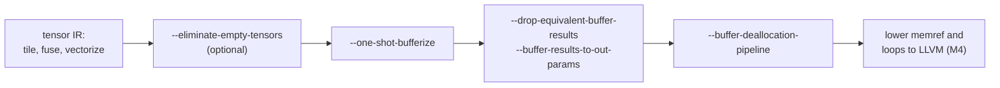

# M7. Bufferization

A tensor is a value with a shape; a memref is a reference to a region of memory. This chapter follows small functions through the pass that turns the first into the second, learns to predict where that pass writes in place and where it must copy, and finds that Vortex's `&mut` output is the shape a tensor function should have if it is to cost nothing to bufferize.

Level: Advanced · Reading time: about 35 minutes · Builds on: [M5. Structured ops: linalg, tensor and memref](m5-structured-ops.md), [M6. Loops: affine and scf](m6-affine-and-scf.md)

???+ remember "Before you start, remember"

    ??? question "A tensor-form `linalg.generic` has an `outs` operand and also returns a result. Why both?"

        `outs` names the value each output element starts from. A tensor cannot be changed, so the operation cannot fill `outs` in place; it returns a new tensor instead. That pairing of an operand with a result is destination-passing style.

        Introduced in [M5. Structured ops: linalg, tensor and memref](m5-structured-ops.md#values-or-buffers-tensor-against-memref).

    ??? question "What can a memref type not say about two memref arguments of the same function?"

        Whether they overlap. A memref records a shape, an element type and a layout; two memref arguments may point at the same memory, and nothing in their types says otherwise.

        Introduced in [M2. Reading MLIR](m2-reading-mlir.md#types-say-what-a-value-is).

    ??? question "When does a definition dominate a use?"

        When every path from the entry to the use passes through the definition. In straight-line code, a definition dominates everything written after it.

        Introduced in [O2. Control-flow graphs and dominance](../optimize/o2-cfg-and-dominance.md#dominance).

    ??? question "What does passing `&mut c` promise about the other arguments of the same call, and what does that let a compiler do?"

        That none of them is `c`. Because a callee never sees a by-value argument change while it runs, a compiler may pass a large array by address instead of copying it, and nobody can tell.

        Introduced in [References and mutability, decision 25](../decisions/references.md#d25).

!!! goals "In this chapter"

    - Explain why MLIR computes on immutable tensors first and assigns memory to them late, and what bufferization must preserve when it does.
    - Predict, for a destination-passing operation, which of the only two buffers One-Shot Bufferize will consider for its result.
    - Find a read-after-write conflict by hand in a small tensor function, and confirm it with the pass's analysis-only report.
    - Read bufferized output: where each `memref.alloc` and `memref.copy` came from, what happened to the function signature, and what the pass leaves to later passes.
    - Connect in-place bufferization to Vortex's `&mut` outputs and decision 25's call rule, and test a tensor-form kernel that bufferizes with no allocation at all.

## Values first, memory later

[M5](m5-structured-ops.md) wrote the same row sum twice, once on `memref` buffers and once on `tensor` values, and noted that the tensor version leaves open whether a later pass reuses storage or copies. This chapter is that later pass.

Why write tensors at all, if the program ends up on buffers? Because transformations are easier on values. A tensor is an SSA value, "an immutable object" in the tensor dialect's words,[^tensor] so a pass that tiles, fuses or reorders tensor operations only has to follow use-def chains; it never has to ask whether some other operation wrote the same memory in between. The MLIR documentation recommends exactly this order: tile and fuse on tensors, then bufferize what remains, one of the last steps before lowering to LLVM.[^buf]

**Bufferization** is the step that gives every tensor value a place in memory: it rewrites operations on tensors into operations on memrefs.[^buf] Like any pass, it must not change what the program computes, the contract [O1](../optimize/o1-optimizer-contract.md) states. What it may change is how much memory the program uses and how many bytes it copies. The documentation names the two goals directly: use as little memory as possible, and copy as little memory as possible.[^buf]

Those goals pull against a hazard. Giving every result a fresh buffer is always correct, and wastes both memory and copies. Reusing an existing buffer is cheap, and wrong whenever someone still needs the old contents. The design paper for MLIR's code generation compares the problem to **register coalescing**, the part of register allocation that deletes copies by letting two values share one register ([C4](../backend/c4-graph-coloring.md#coalescing-deleting-copies) covers it).[^vasilache] Two tensors may share a buffer when their lifetimes do not collide, as two values may share a register.

**One-Shot Bufferize** is MLIR's main bufferization pass, `--one-shot-bufferize`. It works in two phases: an analysis decides, for every place a tensor is written, whether the write may reuse an existing buffer, and then a rewrite replaces tensor operations with memref operations according to those decisions.[^buf] The analysis looks at one function at a time, reads exact SSA use-def information, and is greedy: it takes operations one at a time and decides for each on the spot.[^buf] The rest of the chapter takes those decisions apart on functions small enough to follow by hand.

## Where a result can live

Here are two functions that scale a four-element array by a runtime factor. They differ only in where their `linalg.generic` gets its destination:

--8<-- "includes/examples/mlir/m7-bufferization/scale_dps.mlir.md"

Recall **destination-passing style** from M5: an operation in this style has, for each tensor result, one tensor operand that the result is understood to overwrite, its **destination**. For `linalg.generic` the destination is the `outs` operand. The documentation puts quotation marks around "destination", because in tensor land nothing is overwritten; the result is a new value.[^buf] The pairing matters only to bufferization, where it becomes an offer: this result may live in that operand's buffer.

For a destination-passing operation, One-Shot Bufferize considers exactly two buffers for a result `%r` with destination `%d`: the buffer of `%d`, or a newly allocated one. Other buffers in the function that might happen to be free are not considered, to keep the problem simple.[^buf] An operation with no destination, such as `tensor.generate`, always gets a new allocation.[^passes] That is a short list, and it is why the choice of destination, made before bufferization runs, decides most of what the output looks like.

In `@scale` the destination is `%init`, made by **`tensor.empty`**: an operation that produces a tensor of a given shape whose contents are unspecified. Its only purpose is to carry the shape, so that an operation with no natural destination can still be written in destination-passing style.[^tensor] A `tensor.empty` has no buffer of its own, so the result's only option is a new allocation. In the output it has become `memref.alloc`, sixteen bytes (four `f32`s) aligned to 64, and the function returns it.

In `@scale_into` the destination is `%dest`, a parameter. Nothing else reads `%dest`, so the result may take its buffer: the output writes straight into `%arg2`, the caller's memory, and allocates nothing. The function also stopped returning anything. The tensor function returned its result, which bufferized to `%arg2` itself; `--drop-equivalent-buffer-results`, the second pass in this example, removes a returned memref that is the same buffer as an argument, since the caller already holds it.[^passes]

Look at what `@scale_into` became: a function that takes an input buffer, a factor and an output buffer, writes the output and returns nothing. That is the shape of the stage 10 kernel, `multiply(a: &[f32; 2, 3], b: &[f32; 3, 2], c: &mut [f32; 2, 2])` ([stage 10](../compiler/guide/stage-10-matrix-multiplication.md#the-program-the-milestone-asks-for)). The paper describing this design makes the same comparison from the C++ side: an output tensor is like a C++ output parameter passed by non-const reference, except that at the tensor level it changes nothing about what the program means.[^vasilache] Vortex made its outputs `&mut` parameters for its own reasons; bufferization rewards exactly that shape.

<figure class="vx-figure">
<svg viewBox="0 0 760 250" role="img" aria-label="Where scale and scale_into put their results after bufferization: scale writes into a new allocation and returns it, scale_into writes into the caller's buffer and returns nothing" aria-describedby="m7-f1-desc">
<title id="m7-f1-title">Two destinations, two outcomes</title>
<desc id="m7-f1-desc">Two panels side by side. Left panel, titled scale: a box for the input buffer arg0 feeds an arrow into a box labelled linalg.generic, which writes along an animated arrow into a highlighted box labelled memref.alloc, new, sixteen bytes. An arrow from the allocation leads to a box labelled return alloc. A note says the destination was tensor.empty, which has no buffer. Right panel, titled scale_into: the input buffer arg0 feeds linalg.generic, which writes along an animated arrow into a strong box labelled arg2, the caller's buffer. A box beneath says return, nothing. A note says the destination was a parameter, so its buffer is reused.</desc>
<defs><marker id="m7-f1-head" viewBox="0 0 10 10" refX="9" refY="5" markerWidth="6" markerHeight="6" orient="auto"><path class="vx-arrowhead" d="M0 0 L10 5 L0 10 z"/></marker></defs>
<text class="vx-text" x="20" y="24">@scale: destination is tensor.empty</text>
<text class="vx-text" x="400" y="24">@scale_into: destination is a parameter</text>
<line class="vx-line" x1="380" y1="10" x2="380" y2="240"/>
<rect class="vx-box" x="20" y="44" width="110" height="44" rx="4"/>
<text class="vx-mono" x="75" y="71" text-anchor="middle">%arg0</text>
<rect class="vx-box-strong" x="170" y="44" width="170" height="44" rx="4"/>
<text class="vx-mono" x="255" y="71" text-anchor="middle">linalg.generic</text>
<path class="vx-line" d="M130 66 L166 66" marker-end="url(#m7-f1-head)"/>
<rect class="vx-box-accent" x="170" y="120" width="170" height="54" rx="4"/>
<text class="vx-mono" x="255" y="143" text-anchor="middle">memref.alloc</text>
<text class="vx-text-muted" x="255" y="162" text-anchor="middle">new, 16 bytes</text>
<path class="vx-flow" d="M255 88 L255 116" marker-end="url(#m7-f1-head)"/>
<rect class="vx-box" x="170" y="196" width="170" height="36" rx="4"/>
<text class="vx-mono" x="255" y="219" text-anchor="middle">return %alloc</text>
<path class="vx-line" d="M255 174 L255 192" marker-end="url(#m7-f1-head)"/>
<text class="vx-text-muted" x="20" y="140">no buffer to reuse:</text>
<text class="vx-text-muted" x="20" y="158">allocate</text>
<rect class="vx-box" x="400" y="44" width="110" height="44" rx="4"/>
<text class="vx-mono" x="455" y="71" text-anchor="middle">%arg0</text>
<rect class="vx-box-strong" x="550" y="44" width="170" height="44" rx="4"/>
<text class="vx-mono" x="635" y="71" text-anchor="middle">linalg.generic</text>
<path class="vx-line" d="M510 66 L546 66" marker-end="url(#m7-f1-head)"/>
<rect class="vx-box-strong" x="550" y="120" width="170" height="54" rx="4"/>
<text class="vx-mono" x="635" y="143" text-anchor="middle">%arg2</text>
<text class="vx-text-muted" x="635" y="162" text-anchor="middle">the caller's buffer</text>
<path class="vx-flow" d="M635 88 L635 116" marker-end="url(#m7-f1-head)"/>
<rect class="vx-box" x="550" y="196" width="170" height="36" rx="4"/>
<text class="vx-mono" x="635" y="219" text-anchor="middle">return</text>
<text class="vx-text-muted" x="400" y="140">destination's buffer</text>
<text class="vx-text-muted" x="400" y="158">is free: reuse it</text>
</svg>
<figcaption>Figure 1. The same computation with two destinations, after <code>scale_dps.mlir</code> is bufferized. One-Shot Bufferize only ever considers the destination's buffer or a new one. <code>tensor.empty</code> has no buffer, so <code>@scale</code> allocates; <code>%dest</code> is a parameter, so <code>@scale_into</code> writes into the caller's memory, like a Vortex <code>&amp;mut</code> output.</figcaption>
</figure>

??? check "A function applies three elementwise `linalg.generic` operations in a row, each consuming the previous result and each writing into its own fresh `tensor.empty`. How many `memref.alloc` operations does bufferization produce, and what one change to the IR brings it to one?"

    Three. Each result's only candidates are its own destination's buffer or a new one, and each destination is a separate `tensor.empty` with no buffer, so each op allocates. The pass does not look for other free buffers to reuse. Making the second and third operations use the previous result as their `outs` (legal here, since each element is read and written by the same step) gives each a destination with a buffer, and nothing reads that old value afterwards: one allocation in total. Both counts were checked with `mlir-opt` 18.1.8 on 2026-09-24.

## The function boundary

`scale_dps.mlir` ran with `--one-shot-bufferize=bufferize-function-boundaries function-boundary-type-conversion=identity-layout-map`. Both options matter.

By default, One-Shot Bufferize does not touch function signatures: a function that takes and returns tensors keeps doing so, and only its body is rewritten.[^buf] The body meets the signature through `bufferization.to_memref` and `bufferization.to_tensor`, operations a later section introduces, and the pass does not treat a parameter's buffer as one it may write: in MLIR 18.1.8, `fetch_add` below bufferized without the option copies its argument before storing (checked on 2026-09-24).

**Function-boundary bufferization**, the option `bufferize-function-boundaries`, turns every tensor parameter and result into a memref as well.[^buf] The pass documentation calls the option experimental and lists what it does not support in the current release: recursive or circular calls, external functions that return a tensor, and functions with several blocks or several returns.[^passes] MLIR 18.1.8 rejects a self-recursive function with the message that it "expected callgraph to be free of circular dependencies" (checked on 2026-09-24).

The second option chooses the memref layout of parameters. The default is the most general one, `memref<4xf32, strided<[?], offset: ?>>`: a buffer whose offset and stride are known only at run time, which accepts a view into any larger array. `identity-layout-map` asks for plain `memref<4xf32>`, the contiguous row-major layout M2 described.[^passes] Plain types keep this chapter's outputs short; the next example keeps the default so you can see it.

The analysis also needs to know whether it may write into a parameter's buffer. The answer is yes: under function-boundary bufferization, "the buffer of function arguments is always writable" unless a parameter is marked `bufferization.writable = false`; where a caller still needs the old contents, the copy goes at the call site.[^passes] A later section shows such a copy.

## Reading before writing, and writing before reading

Here is the smallest function that updates a tensor. It reads element `%i`, adds `%d`, and writes the sum back at the same position:

--8<-- "includes/examples/mlir/m7-bufferization/fetch_add.mlir.md"

`tensor.insert` is in destination-passing style: its destination is `%t`, and its result `%u` is a copy of `%t` with one element replaced.[^passes][^tensor] Can `%u` live in `%t`'s buffer? Walk through it by hand.

1. `%t` is defined as a block argument, the function's parameter. Its buffer is the caller's memory, `%arg0`.
2. `tensor.extract` reads `%t` at `%i`. It becomes `memref.load %arg0[%arg1]`.
3. `tensor.insert` would write into `%t`'s buffer if it went in place. Is anything going to read `%t` after this point? The only other read of `%t` is the extract, and it has already happened.
4. So nothing needs the old contents. The write goes in place: `memref.store %1, %arg0[%arg1]`.
5. `%u` is therefore the same buffer as `%t`, and the function returns `%arg0` itself.

The result is one load and one store on the caller's memory, with no allocation and no copy. The output keeps the default strided layout on `%arg0`, since this example did not ask for plain memrefs.

Now move one read. Suppose the function also wanted element `%i` of the original `%t` after the insert. The value `%t` has not changed (tensors never do), so the answer must be the old element. But if the insert wrote into `%t`'s buffer, a load from that buffer afterwards would see the new one. Before reading on, predict what the pass does.

That situation is a **read-after-write conflict**, RaW for short: a read of a tensor that expects its old contents, placed after a write that would overwrite those contents if it reused the buffer. The documentation defines it by three parts, in dominance order: a definition of `%t`, a conflicting write to `%t`'s buffer, and a read of `%t`.[^buf] When the analysis finds one, it gives the write a copy instead of `%t`'s buffer.[^buf]

The paper describes how the analysis finds these.[^vasilache] For each candidate in-place write, it pretends the write goes in place. It then takes every read of the same value (and of values known to share its buffer), finds the write each read expects to see, and checks whether the pretended write would land in between. If so, that is a conflict and the write goes out of place; if not, the analysis commits to in place and merges the two values into one alias set.

<figure class="vx-figure">
<svg viewBox="0 0 760 300" role="img" aria-label="Two timelines. In fetch_add the read of t comes before the write into t, so the write goes in place. In add_then_peek a second read of t comes after the write, so the write would clobber data that read needs: a read-after-write conflict" aria-describedby="m7-f2-desc">
<title id="m7-f2-title">A read-after-write conflict is about order</title>
<desc id="m7-f2-desc">Two rows of boxes in program order, left to right. Top row, fetch_add: definition of t, a block argument; tensor.extract of t, a read; tensor.insert into t, a write, marked in place; return. Arrows join the boxes. A note under the row says the only read of t happens before the write, so the write may reuse t's buffer. Bottom row, add_then_peek: the same four boxes, then a fifth box, a second tensor.extract of t, a read, highlighted. The insert box is drawn with a dashed warning outline and marked conflicting write, out of place. A curved arrow runs from the second extract back over the insert to the definition, labelled expects the value defined here; it passes over the write, which is the conflict.</desc>
<defs><marker id="m7-f2-head" viewBox="0 0 10 10" refX="9" refY="5" markerWidth="6" markerHeight="6" orient="auto"><path class="vx-arrowhead" d="M0 0 L10 5 L0 10 z"/></marker></defs>
<text class="vx-text" x="15" y="24">fetch_add: read, then write</text>
<rect class="vx-box" x="15" y="40" width="130" height="50" rx="4"/>
<text class="vx-mono" x="80" y="62" text-anchor="middle">%t</text>
<text class="vx-text-muted" x="80" y="80" text-anchor="middle">definition</text>
<rect class="vx-box" x="160" y="40" width="130" height="50" rx="4"/>
<text class="vx-mono" x="225" y="62" text-anchor="middle">extract %t</text>
<text class="vx-text-muted" x="225" y="80" text-anchor="middle">read</text>
<rect class="vx-box-strong" x="305" y="40" width="130" height="50" rx="4"/>
<text class="vx-mono" x="370" y="62" text-anchor="middle">insert into %t</text>
<text class="vx-text-muted" x="370" y="80" text-anchor="middle">write: in place</text>
<rect class="vx-box" x="450" y="40" width="130" height="50" rx="4"/>
<text class="vx-mono" x="515" y="62" text-anchor="middle">return</text>
<text class="vx-text-muted" x="515" y="80" text-anchor="middle">%u, %old</text>
<path class="vx-line" d="M145 65 L156 65" marker-end="url(#m7-f2-head)"/>
<path class="vx-line" d="M290 65 L301 65" marker-end="url(#m7-f2-head)"/>
<path class="vx-line" d="M435 65 L446 65" marker-end="url(#m7-f2-head)"/>
<text class="vx-text-muted" x="15" y="114">No read of %t follows the write, so the write may take %t's buffer.</text>
<text class="vx-text" x="15" y="140">add_then_peek: write, then read</text>
<path class="vx-flow" d="M660 206 C 660 166, 80 166, 80 202" marker-end="url(#m7-f2-head)"/>
<text class="vx-text-accent" x="370" y="162" text-anchor="middle">expects the value defined here</text>
<rect class="vx-box" x="15" y="206" width="130" height="50" rx="4"/>
<text class="vx-mono" x="80" y="228" text-anchor="middle">%t</text>
<text class="vx-text-muted" x="80" y="246" text-anchor="middle">DEF</text>
<rect class="vx-box" x="160" y="206" width="130" height="50" rx="4"/>
<text class="vx-mono" x="225" y="228" text-anchor="middle">extract %t</text>
<text class="vx-text-muted" x="225" y="246" text-anchor="middle">read</text>
<rect class="vx-box-bad" x="305" y="206" width="130" height="50" rx="4"/>
<text class="vx-mono" x="370" y="228" text-anchor="middle">insert into %t</text>
<text class="vx-text-muted" x="370" y="246" text-anchor="middle">CONFL-WRITE</text>
<rect class="vx-box-accent vx-pulse" x="595" y="206" width="130" height="50" rx="4"/>
<text class="vx-mono" x="660" y="228" text-anchor="middle">extract %t</text>
<text class="vx-text-muted" x="660" y="246" text-anchor="middle">READ</text>
<path class="vx-line" d="M145 231 L156 231" marker-end="url(#m7-f2-head)"/>
<path class="vx-line" d="M290 231 L301 231" marker-end="url(#m7-f2-head)"/>
<path class="vx-line" d="M435 231 L591 231" marker-end="url(#m7-f2-head)"/>
<text class="vx-text-muted" x="15" y="284">The write sits between the definition and a read that needs the old value: copy before writing.</text>
</svg>
<figcaption>Figure 2. The same three parts in two orders. In <code>fetch_add</code> (top) the only read of <code>%t</code> comes before the write, so the write reuses <code>%t</code>'s buffer. In <code>add_then_peek</code> (bottom) a read after the write still expects the value defined at the top; writing in place would change what it sees. The labels DEF, CONFL-WRITE and READ are the ones the pass prints in <code>conflict_report.mlir</code>.</figcaption>
</figure>

The pass can show you its reasoning. With the options `test-analysis-only print-conflicts`, it runs the analysis, does not rewrite anything, and annotates the tensor IR with its decisions and with every conflict it found.[^buf] Here is the function with the extra read:

--8<-- "includes/examples/mlir/m7-bufferization/conflict_report.mlir.md"

Read the output in two layers.

- Each tensor operation carries `__inplace_operands_attr__`, one entry per operand: `"none"` for an operand that is not a tensor, `"true"` for a tensor operand that bufferizes in place, `"false"` for one that gets a copy.[^buf] On `tensor.insert` the entries are the scalar, the destination and the index, and the destination is `"false"`: this write will go to a copy.
- The conflict is labelled `C_0`, in three pieces: `DEF: bbArg 0` on the function (the definition is block argument 0, the parameter `%t`), `CONFL-WRITE: 1` on the insert (its operand 1, the destination, would write the buffer), and `READ: 0` on the second extract (its operand 0 reads `%t`).[^buf] Those are Figure 2's three boxes.

One more annotation is worth reading. The parameter is now marked `bufferization.access = "read"`: once the insert goes to a copy, the function never writes its argument. On `fetch_add`, the same report marks the parameter `"read-write"` (checked with `mlir-opt` 18.1.8 on 2026-09-24). That is the difference a caller has to care about, and the section on calls returns to it.

The analysis is greedy, so the order in which it visits operations can change which write gets the copy when several could. An operation analyzed earlier is more likely to stay in place. The current documentation gives bottom-up as the default order, and the option `analysis-heuristic` chooses another.[^passes]

??? check "In `add_then_peek`, the first `tensor.extract` also reads `%t`, yet the report does not label it `READ`. Why is it not part of the conflict?"

    Because it runs before the write. A read-after-write conflict needs the write to fall between the definition the read expects and the read itself. The first extract reads `%t` before the insert exists in program order, so an in-place insert could not change what it sees. Only the second extract, which comes after the insert and still expects the original `%t`, conflicts.

## When the copy happens

`add_then_peek` showed the decision; here is what a decision of "copy" becomes. This function writes a four-element patch into the front of an eight-element tensor, then returns both the patched tensor and the original:

--8<-- "includes/examples/mlir/m7-bufferization/patch_conflict.mlir.md"

`tensor.insert_slice` is the slice version of `tensor.insert`: its result is a copy of the destination `%t` with a sub-range replaced by `%patch`.[^tensor] The function returns `%t` itself as its second result, and a return is a read. So the write into `%t`'s buffer would come between `%t`'s definition and a read that expects the original: a read-after-write conflict, as before.

The output shows the copy in full. `memref.alloc` makes a new eight-element buffer, `memref.copy` fills it with the whole of `%arg0`, and `memref.subview` names its first four elements as a view without moving any data. A second `memref.copy` writes the patch into that view. The function returns the new buffer for `%patched` and `%arg0`, untouched, for `%t`. Figure 3 draws both levels.

<figure class="vx-figure">
<svg viewBox="0 0 640 452" role="img" aria-label="Bufferizing patch_then_reread: one tensor argument is read again after the write, so bufferization copies it into a new buffer instead of writing the patch in place" aria-describedby="m7-f3-desc">
<title id="m7-f3-title">Bufferizing a read-after-write conflict</title>
<desc id="m7-f3-desc">Two panels, tensor values on top and memrefs on the bottom, divided by a horizontal line. Top panel: box t of type tensor 8xf32 and box patch of type tensor 4xf32 both feed into a tensor.insert_slice box, which produces patched, tensor 8xf32. A separate arrow leaves t, runs along the top of the panel and down the right edge, to a second result box labelled t, returned again, bypassing the insert_slice op. Bottom panel: box arg0, memref 8xf32, and box arg1, memref 4xf32, are the buffers for t and patch. An animated arrow labelled memref.copy, the forced copy, runs from arg0 to a highlighted box alloc, memref 8xf32, new. A second arrow from arg1 into alloc is labelled write into 0 to 4. Alloc feeds a box labelled return 0 equals alloc. A separate arrow runs from the left side of arg0 down the left edge and along the bottom to a box labelled return 1 equals arg0, unchanged.</desc>
<defs><marker id="m7-f3-head" viewBox="0 0 10 10" refX="9" refY="5" markerWidth="6" markerHeight="6" orient="auto"><path class="vx-arrowhead" d="M0 0 L10 5 L0 10 z"/></marker></defs>
<text class="vx-text" x="320" y="22" text-anchor="middle">Before bufferization: tensor values (SSA)</text>
<text class="vx-text" x="320" y="258" text-anchor="middle">After One-Shot Bufferize: memrefs</text>
<line class="vx-line" x1="10" y1="240" x2="630" y2="240"/>
<rect class="vx-box" x="30" y="60" width="140" height="50" rx="4"/>
<text class="vx-mono" x="100" y="82" text-anchor="middle">%t</text>
<text class="vx-text-muted" x="100" y="100" text-anchor="middle">tensor&lt;8xf32&gt;</text>
<rect class="vx-box" x="30" y="150" width="140" height="50" rx="4"/>
<text class="vx-mono" x="100" y="172" text-anchor="middle">%patch</text>
<text class="vx-text-muted" x="100" y="190" text-anchor="middle">tensor&lt;4xf32&gt;</text>
<rect class="vx-box-strong" x="215" y="100" width="210" height="50" rx="4"/>
<text class="vx-mono" x="320" y="130" text-anchor="middle">tensor.insert_slice</text>
<rect class="vx-box" x="460" y="60" width="140" height="50" rx="4"/>
<text class="vx-mono" x="530" y="82" text-anchor="middle">%patched</text>
<text class="vx-text-muted" x="530" y="100" text-anchor="middle">tensor&lt;8xf32&gt;</text>
<rect class="vx-box" x="460" y="150" width="140" height="50" rx="4"/>
<text class="vx-mono" x="530" y="172" text-anchor="middle">%t</text>
<text class="vx-text-muted" x="530" y="190" text-anchor="middle">returned again</text>
<path class="vx-line" d="M170 85 L211 113" marker-end="url(#m7-f3-head)"/>
<path class="vx-line" d="M170 175 L211 140" marker-end="url(#m7-f3-head)"/>
<path class="vx-line" d="M425 115 L456 90" marker-end="url(#m7-f3-head)"/>
<path class="vx-line" d="M100 60 L100 40 L620 40 L620 175 L604 175" marker-end="url(#m7-f3-head)"/>
<text class="vx-text-muted" x="320" y="34" text-anchor="middle">%t used again, unchanged</text>
<rect class="vx-box" x="30" y="280" width="140" height="50" rx="4"/>
<text class="vx-mono" x="100" y="302" text-anchor="middle">%arg0</text>
<text class="vx-text-muted" x="100" y="320" text-anchor="middle">memref&lt;8xf32&gt;</text>
<rect class="vx-box" x="30" y="370" width="140" height="50" rx="4"/>
<text class="vx-mono" x="100" y="392" text-anchor="middle">%arg1</text>
<text class="vx-text-muted" x="100" y="410" text-anchor="middle">memref&lt;4xf32&gt;</text>
<rect class="vx-box-accent" x="225" y="325" width="190" height="50" rx="4"/>
<text class="vx-mono" x="320" y="347" text-anchor="middle">%alloc</text>
<text class="vx-text-muted" x="320" y="365" text-anchor="middle">memref&lt;8xf32&gt;, new</text>
<rect class="vx-box" x="460" y="280" width="140" height="50" rx="4"/>
<text class="vx-mono" x="530" y="302" text-anchor="middle">return 0</text>
<text class="vx-text-muted" x="530" y="320" text-anchor="middle">= %alloc</text>
<rect class="vx-box" x="460" y="370" width="140" height="50" rx="4"/>
<text class="vx-mono" x="530" y="392" text-anchor="middle">return 1</text>
<text class="vx-text-muted" x="530" y="410" text-anchor="middle">= %arg0, unchanged</text>
<text class="vx-text-accent" x="200" y="290" text-anchor="middle">memref.copy</text>
<text class="vx-text-muted" x="200" y="306" text-anchor="middle">the forced copy</text>
<path class="vx-flow" d="M170 312 L221 338" marker-end="url(#m7-f3-head)"/>
<path class="vx-line" d="M170 392 L221 362" marker-end="url(#m7-f3-head)"/>
<text class="vx-text-muted" x="236" y="400">write into [0:4]</text>
<path class="vx-line" d="M415 340 L456 310" marker-end="url(#m7-f3-head)"/>
<path class="vx-line" d="M30 305 L16 305 L16 440 L530 440 L530 424" marker-end="url(#m7-f3-head)"/>
</svg>
<figcaption>Figure 3. Bufferizing <code>patch_then_reread</code> (<code>patch_conflict.mlir</code>). <code>%t</code> is read after the write, as the second return value. One-Shot Bufferize keeps <code>%arg0</code> as <code>%t</code>'s buffer for that return, and gives the write a fresh <code>%alloc</code> filled by a copy, so the patch never reaches the memory the second result still needs.</figcaption>
</figure>

A read-after-write conflict is one of two reasons the documentation gives for a copy. The other is a buffer that may not be written at all.[^buf] A tensor constant, `arith.constant dense<[1.0, 2.0, 3.0, 4.0]> : tensor<4xf32>`, bufferizes to a read-only global, `memref.global "private" constant`; a `tensor.insert` into it produces `memref.get_global`, then an allocation and a copy, and only then the store (checked with `mlir-opt` 18.1.8 on 2026-09-24).

A copy is not always a defect to fix. The paper's own list of goals is to allocate and copy as little as possible,[^vasilache] and a copy that preserves a value the program still reads is the least the program needs. What deserves attention is a copy you did not expect, and the analysis-only report tells you which write caused it.

## Copies at a call

With function boundaries bufferized, a callee may write into its parameter's buffer, as `fetch_add` did. That moves the question to the caller: if the caller still needs the argument after the call, someone has to copy it. One-Shot Bufferize puts that copy in the caller.[^passes]

--8<-- "includes/examples/mlir/m7-bufferization/bump_caller.mlir.md"

`@bump` bufferized to one store into `%arg0`, its parameter: the callee writes in place and returns the same buffer. `@caller` passes `%t` to `@bump` and then reads `%t` again. That later read is a read-after-write conflict across the call, so the caller allocates a buffer, copies `%arg0` into it, passes the copy to `@bump` and reads the original afterwards. To make this decision the pass needs to know, when it bufferizes `@caller`, that `@bump` writes its argument. It analyzes and bufferizes callees before their callers, so that information is always available; that ordering is why recursive calls are not supported.[^passes]

Compare this with Vortex. [Decision 25](../decisions/references.md#d25) says passing an array by value copies it, and forbids a call such as `add_into(&mut values, values)`, which passes one variable both as `&mut` and by value. The decision's reason is that a callee then never sees a by-value argument change while it runs, "so a compiler may pass a large array by address unnoticed". That is an in-place decision made by a language rule instead of an analysis. MLIR proves, call by call, that a write cannot be observed, and inserts a copy where it could be. Vortex rejects the program that would need the copy and asks the programmer to write it (`let copy = values;`).

??? check "In `bump_caller.mlir`, delete the `tensor.extract` of `%t` after the call and return only `%u`. What does the caller's bufferized body become?"

    No allocation and no copy: `@caller` passes `%arg0` straight to `@bump`. Without the later read, nothing needs `%t`'s old contents after the call, so there is no conflict, and the callee may write into the caller's buffer, which is the caller's own parameter.

## Crossing the boundary by hand

Sometimes tensor code has to meet memory that already exists: a runtime routine that takes a buffer, or an output a caller allocated. The bufferization dialect has three operations for that boundary.[^bufdialect]

- `bufferization.to_tensor %m` gives a tensor value for the contents of an existing memref.
- `bufferization.to_memref %t` gives the buffer a tensor will occupy. Current MLIR calls this operation `to_buffer`; 18.1.8 uses the older name (checked on 2026-09-24).
- `bufferization.materialize_in_destination %t in %m` says that a tensor's contents must end up in a given buffer.

These operations cross the line the analysis relies on. Inside a function the analysis sees every use of every tensor; a memref that arrives through `to_tensor` may have other users the analysis cannot see, because One-Shot Bufferize ignores operations that do not work on tensors.[^buf] So it requires a promise. The **`restrict`** attribute on `to_tensor` states that no other `to_tensor` or `materialize_in_destination` in the function uses the same memref or one that aliases it. The documentation compares it with C's `restrict` keyword, and One-Shot Bufferize supports only `to_tensor` operations that carry it.[^buf][^bufdialect] MLIR 18.1.8 rejects a bare one: "to_tensor ops without `restrict` are not supported by One-Shot Analysis" (checked on 2026-09-24).

A second attribute, **`writable`**, says the tensor's buffer may be written in place. Without it, every write into the tensor from `to_tensor` goes to a copy.[^bufdialect] With both, in MLIR 18.1.8, a `tensor.insert` into the result of `to_tensor %m restrict writable` bufferizes to a single `memref.store` into `%m` (checked on 2026-09-24).

`restrict` is a promise, not a check. The documentation warns that IR which uses it incorrectly may bufferize incorrectly.[^bufdialect] Vortex's own [decision 41](../decisions/references.md#d41) contrasts the two kinds of rule: it describes C's `restrict` as "an unchecked promise of no aliasing", while Vortex checks its no-overlap rule and turns code generation's assumption into a guarantee. A Vortex compiler that hands memory to MLIR through `to_tensor restrict` would be restating a fact it has already checked, which is the only safe way to write that attribute. [O9](../optimize/o9-alias-analysis.md#promises-the-front-end-writes-down) shows the same pattern in LLVM IR.

## What One-Shot Bufferize leaves for later

Bufferization is one step in a pipeline, and it deliberately leaves several jobs to other passes.

**Freeing memory.** One-Shot Bufferize never deallocates what it allocates; its output may contain `memref.alloc` and no `memref.dealloc`.[^dealloc] The documentation recommends running `--buffer-deallocation-pipeline` afterwards.[^passes] That pipeline tracks **ownership**, the responsibility to free a buffer, which the deallocation documentation likens to `std::unique_ptr` in C++.[^dealloc] In MLIR 18.1.8 it adds a `memref.dealloc` after the last use of a temporary buffer, and adds none to `@scale`, whose allocation is returned to the caller (both checked on 2026-09-24).

**Results as output parameters.** A function that returns a freshly allocated memref, like `@scale`, makes its caller take ownership of memory it did not ask for. `--buffer-results-to-out-params` rewrites every memref result into an extra parameter the caller provides.[^passes] In MLIR 18.1.8 this turns `@scale` into a function with an output parameter, but the body still allocates and ends with a `memref.copy` into the new parameter (checked on 2026-09-24); the current documentation describes an option to remove that allocation, which 18.1.8 does not list. Writing the destination as a parameter from the start, as `@scale_into` does, needs no such repair.

**Placeholders that could have been slices.** `--eliminate-empty-tensors` looks for a `tensor.empty` whose result ends up inserted into a larger tensor, and replaces it with a slice of that larger tensor, so the computation writes into its final place instead of into a temporary.[^passes] This is the tensor-level version of the choice Figure 1 shows.

*Figure 4. Where bufferization sits in a pipeline. Transformations run on tensors first; One-Shot Bufferize assigns buffers; optional passes reshape the calling convention; deallocation runs once every allocation exists; lowering to LLVM, as in [M4](m4-dialect-conversion.md), works on memrefs.*

??? check "A tensor function returns a result computed into `tensor.empty`, and you add `--buffer-deallocation-pipeline` after bufferization. Does the returned buffer get freed inside the function?"

    No. The returned buffer's ownership passes to the caller, so the function must not free it; the pipeline frees only buffers whose last use is inside the function. `@scale` bufferized and followed by the pipeline still has its `memref.alloc` and no `memref.dealloc` (checked with MLIR 18.1.8 on 2026-09-24). Freeing it is the caller's job, one more reason to prefer a caller-provided destination.

## Vortex and bufferization

Vortex v0.1 has no tensors: its arrays are storage from the start, and a function writes results through `&mut`. So a Vortex compiler that lowered to MLIR's memref-level dialects, as the exercises in [M2](m2-reading-mlir.md#for-vortex) and [M5](m5-structured-ops.md#for-vortex) did, would never run bufferization at all.

The question is whether a compiler should raise Vortex arrays to tensors to get tensor-level transformations such as tiling and fusion ([M9](m9-transform-dialect.md)), and then bufferize back. This chapter gives three facts to weigh:

1. A tensor function whose destinations are its parameters bufferizes to a function with the same signature as the Vortex source, with no allocations (`@scale_into`).
2. A by-value parameter that the function never writes stays read-only after bufferization, and one it does write needs its caller to copy only where the caller still reads it (`bump_caller.mlir`).
3. Decision 25 already guarantees no overlap between an `&mut` output and any other argument, the fact `restrict` asks a front end to state.

None of this settles whether Vortex should use MLIR; [M12](m12-vortex-gpu-path.md) weighs that. It does say that a tensor-form Vortex kernel with its outputs as destinations has nothing for bufferization to repair, which the exercise below lets you check.

## For Vortex

!!! vortex "Exercise"

    **Extend** the MLIR-emitting tool from the [M5 exercise](m5-structured-ops.md#for-vortex) with a tensor mode: given the checked [stage 10 kernel](../compiler/guide/stage-10-matrix-multiplication.md#the-program-the-milestone-asks-for), emit `multiply` as a `func.func` whose three array parameters are `tensor` values, whose `c` is the destination of its computation, and which returns the final value of `c`. Use only the `func`, `arith`, `tensor` and `linalg` dialects.

    1. Before any code, a one-page note: for every tensor operation you plan to emit, name its destination operand and predict its `__inplace_operands_attr__` entries under `test-analysis-only print-conflicts`. Remember that the kernel overwrites `c`, while M2 found that `linalg.matmul` adds into what its output already holds.
    2. A choice, argued from this chapter's examples, between making `c` the destination (as `@scale_into` does) and starting from `tensor.empty` (as `@scale` does). Write down what each choice would cost after bufferization and which one matches `c: &mut`.
    3. A prediction of what bufferization does to `a` and `b`: whether either is written or copied, argued from the kernel's reads and writes and from decision 25.

    **Not yet:** deallocation, `--buffer-results-to-out-params`, lowering the bufferized output to LLVM ([M4](m4-dialect-conversion.md)), tiling or fusing on tensors ([M9](m9-transform-dialect.md)), and any decision about whether Vortex adopts MLIR ([M12](m12-vortex-gpu-path.md)). No change to `src/`: the tool stays separate from the `vortex` command, as in M2.

    **Proof that it works:**

    - The emitted file passes `mlir-opt` with no options, and the analysis-only report matches every prediction in your note. Keep the report as a golden file.
    - After `--one-shot-bufferize="bufferize-function-boundaries function-boundary-type-conversion=identity-layout-map" --drop-equivalent-buffer-results`, a test finds a function with three memref parameters and no results, and finds no `memref.alloc` and no `memref.copy` anywhere in it.
    - The analysis-only report marks the parameters for `a` and `b` with `bufferization.access = "read"`, and a test fails if either is ever marked as written.
    - A canary: change one emitted operation so that its destination is a `tensor.empty` instead of `c`, and confirm that the no-allocation test fails. A test that cannot fail proves nothing.

## Key ideas

!!! recap "Questions you can now answer"

    - **Why transform on tensors and bufferize late?** Tensors are immutable values, so passes follow use-def chains without asking who wrote memory in between; bufferization then assigns memory once.
    - **Which buffers does One-Shot Bufferize consider for a result?** Only two: the buffer of the operation's destination operand, or a new allocation.
    - **What is a read-after-write conflict?** A read of a tensor that expects its old contents, placed after a write that would overwrite them if it reused the buffer: definition, conflicting write, read, in dominance order.
    - **Where does a `memref.alloc` in bufferized output come from?** A destination with no buffer (`tensor.empty`), an operation with no destination, a conflict that forces a copy, or a buffer that may not be written, such as a constant.
    - **What does `bufferize-function-boundaries` assume about parameters?** That their buffers are writable; a caller that still reads an argument after a writing call copies it first.
    - **What does `restrict` on `bufferization.to_tensor` promise?** That no other `to_tensor` or `materialize_in_destination` in the function uses an aliasing memref. It is unchecked, so a front end should write it only for facts it has already checked.
    - **Which tensor signature bufferizes to Vortex's `&mut` shape with no allocation?** One whose outputs are parameters used as destinations and returned, as in `@scale_into`.

## Where this comes back

!!! next "You will use this again in"

    - [M9. Schedules as IR: the transform dialect](m9-transform-dialect.md): *tensor.empty*, *destination-passing style*, *One-Shot Bufferize*
    - [M10. MLIR for GPUs](m10-mlir-for-gpus.md): *memref*, *function-boundary bufferization*, *allocation*
    - [M11. End-to-end ML compilers](m11-ml-compilers.md): *one-shot-bufferize in a pipeline*
    - [M12. Designing Vortex's GPU path](m12-vortex-gpu-path.md): *tensors or memrefs*, *restrict*
    - [O9. Memory: alias analysis and MemorySSA](../optimize/o9-alias-analysis.md): *aliasing*, *restrict*, *read after write*
    - [C4. Register allocation II: graphs and SSA](../backend/c4-graph-coloring.md): *coalescing*

## Sources and further reading

Read the Bufferization page first, with this chapter's examples open: its sections on destination-passing style and on debugging buffer copies cover the two ideas the examples test.[^buf] Section 3.4 of Vasilache and colleagues' paper explains why the design limits itself to destinations, and how the conflict search walks use-def chains.[^vasilache] The Passes page is the reference for every option this chapter used, and changes between releases; check it against the MLIR you run.[^passes]

[^buf]: MLIR Project, "Bufferization", sections "Overview", "What is One-Shot Bufferize?", "Goals of Bufferization", "Destination-Passing Style", "Tensor / Buffer Boundary", "Using One-Shot Bufferize" and "Debugging Buffer Copies". <https://mlir.llvm.org/docs/Bufferization/>
[^passes]: MLIR Project, "Passes", section "Bufferization Passes", entries `-one-shot-bufferize`, `-drop-equivalent-buffer-results`, `-buffer-results-to-out-params` and `-eliminate-empty-tensors`. <https://mlir.llvm.org/docs/Passes/>
[^tensor]: MLIR Project, "'tensor' Dialect", introduction and entries `tensor.empty`, `tensor.insert` and `tensor.insert_slice`. <https://mlir.llvm.org/docs/Dialects/TensorOps/>
[^bufdialect]: MLIR Project, "'bufferization' Dialect", entries `bufferization.to_tensor` and `bufferization.materialize_in_destination`. <https://mlir.llvm.org/docs/Dialects/BufferizationOps/>
[^dealloc]: MLIR Project, "Ownership-based Buffer Deallocation", introduction. <https://mlir.llvm.org/docs/OwnershipBasedBufferDeallocation/>
[^vasilache]: Nicolas Vasilache, Oleksandr Zinenko, Aart J.C. Bik, Mahesh Ravishankar, Thomas Raoux, Alexander Belyaev, Matthias Springer, Tobias Gysi, Diego Caballero, Stephan Herhut, Stella Laurenzo and Albert Cohen, "Composable and Modular Code Generation in MLIR: A Structured and Retargetable Approach to Tensor Compiler Construction", arXiv:2202.03293, 2022, section 3.4 "Bufferization". <https://arxiv.org/abs/2202.03293>
