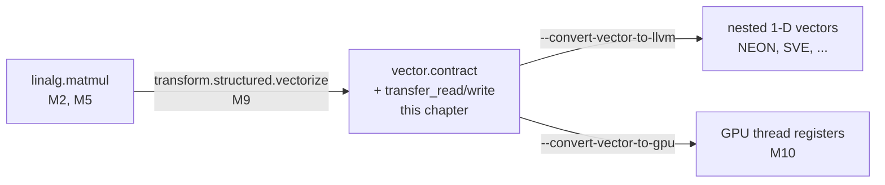

# M8. Vectorization in MLIR

The vector dialect gives a tile of a computation its own SSA-valued type, separate from the loop and the memory it came from. This chapter reads that type, the op that moves it across the memory boundary, and the op that contracts it, and follows one small tile down to the hardware vectors a real register file holds.

Level: Intermediate · Reading time: about 30 minutes · Builds on: [M6. Loops: affine and scf](m6-affine-and-scf.md), [P10. Vectorization](../optimize/p10-vectorization.md)

???+ remember "Before you start, remember"

    ??? question "What is a memref's type, and what can it not say about a Vortex &mut argument?"

        A memref such as `memref<8x16xf32>` names a shape, an element type and, with no layout written, row-major order: a reference to a region of memory. Nothing in that type says the memory it names is reached through no other argument of the same call; that promise is Vortex's `&mut` rule, not MLIR's.

        Introduced in [M2. Reading MLIR](m2-reading-mlir.md#types-say-what-a-value-is).

    ??? question "In an operation's generic form, what tells you a bracketed entry is a property rather than a discardable attribute?"

        Properties sit inside `<{ }>` and belong to the operation's own definition, the ones it checks itself, such as `predicate` on `arith.cmpf`. Discardable attributes sit in a plain `{ }` and carry a dialect prefix that gives them their meaning, such as `linalg.memoized_indexing_maps`.

        Introduced in [M2. Reading MLIR](m2-reading-mlir.md#attributes-and-properties-hold-the-constants).

    ??? question "What three facts does a loop vectorizer need before it may widen a loop at all?"

        A computable trip count, no loop-carried dependence that the widening would reorder illegally, and either no aliasing between the memory it touches or a proof, such as Vortex's `&mut` exclusivity, that removes the need for a runtime check.

        Introduced in [P10. Vectorization](../optimize/p10-vectorization.md#what-else-a-vectorizer-needs).

    ??? question "Why does Vortex's [f32; 64, 64] fit NEON's fixed-width model better than SVE's scalable one?"

        SVE's whole point is running correctly at a vector length the compiler does not know until the program runs. Vortex's array extents are constants in the type, known to the compiler at every call site, so nothing is gained by leaving the width undetermined.

        Introduced in [P10. Vectorization](../optimize/p10-vectorization.md#neon-sve-and-sme).

!!! goals "In this chapter"

    - Explain what a virtual vector type is, and why `vector.transfer_read` and `vector.transfer_write` are the only vector-dialect operations that touch memory.
    - Read a `vector.contract` operation's `indexing_maps`, `iterator_types` and `kind` as `linalg.matmul`'s own shape, moved one level down from a region to explicit properties.
    - Explain why a multi-dimensional vector type matches no real register, and predict what a lowering pass unrolls it into.
    - Distinguish padding at a transfer op's memory boundary from a vectorized loop's scalar epilogue, and say what a compile-time-known shape buys Vortex at each one.
    - Connect NEON's fixed lane width, already chosen once in P10 for LLVM IR, to the same choice the vector dialect makes when a lowering picks its target.

## A tile that is a value, not an address

[P10](../optimize/p10-vectorization.md) vectorized a loop after the loop already existed: LLVM's loop vectorizer widens iterations that read and write memory through addresses, because by the time LLVM IR runs a loop, that is what a loop is. [M2](m2-reading-mlir.md#a-named-operation-hides-a-region) showed a level above that, where a whole matrix multiply is one operation, `linalg.matmul`, with no loop and no address arithmetic anywhere in it. The **vector dialect** sits between the two. It gives a tile of a computation, a handful of elements meant to move together, its own type: an SSA value with a shape, produced and consumed like any other value in the IR, not a description of where those elements live.

`vector<2x2xf32>` names four `f32` elements arranged two by two. Nothing about that type says which memref they came from, or whether they came from a memref at all; a `vector<2x2xf32>` can be a function argument, the result of an `arith.addf`, or the operand of another vector op, exactly as an `f32` scalar can. Getting elements into that shape from memory, and back out again, is the job of exactly two operations, and the vector dialect defines no others that read or write memory at all:[^vector]

--8<-- "includes/examples/mlir/m8-vectorization/tile_transfer.mlir.md"

`vector.transfer_read` names a memref, a starting index per dimension, and a **pad** value: the value a lane gets if the read reaches past the memref's bound. `vector.transfer_write` is the mirror operation, writing a vector's elements back to a memref at a starting index. Between the two, `arith.addf %tile, %tile` runs on the vector value directly, the same operation Horner's rule used on a single `f32` in [M2](m2-reading-mlir.md#one-function-two-spellings), now typed at `vector<2x2xf32>` instead. `%tile` is never an address; the two transfer ops are the only places this function reaches into memory at all. `%c0` from the first draft of this example never appeared, because neither transfer op needed a zero offset; deleting an unused constant is as ordinary a cleanup in MLIR as it is in any other IR.

The `in_bounds = [true, true]` on each transfer op is a per-dimension promise: for this dimension, every index the read or write touches is inside the memref, so the operation never needs to invent a padded value or skip a lane. A `4x4` memref read at offset `(1, 1)` with a `2x2` tile reaches indices 1 and 2 in each dimension, both inside `0..4`, so the promise holds, and it is the caller's job to have checked that before writing `true`.

??? check "Which vector-dialect operations in this chapter's first example read or write memory, and which do not?"

    `vector.transfer_read` and `vector.transfer_write` are the only two; `arith.addf` runs entirely on the `vector<2x2xf32>` value between them, the same operation it would be on a scalar, with no memref in sight.

## vector.contract: the same shape as linalg.matmul, one level down

A matrix multiply is a **contraction**: two inputs, indexed along a shared dimension that disappears from the output because it gets summed away. `linalg.matmul` expressed that with a region, a small block of code the operation runs once per output element, reading `M2`'s own printout of it.[^m2contract] `vector.contract` expresses the same contraction over values already sitting in vector registers, and it needs no region at all, because a reduction over vector lanes has only a handful of possible combinators, and the operation names the one it wants as a property instead of writing it out as code:

--8<-- "includes/examples/mlir/m8-vectorization/vector_contract_matmul.mlir.md"

Compare `indexing_maps` here with the ones [M2](m2-reading-mlir.md#a-named-operation-hides-a-region) printed for `linalg.matmul`: renaming `row`, `column` and `k` to `m`, `n` and `k`, the two are the same three affine maps, `(m, k)` for the first input, `(k, n)` for the second, `(m, n)` for the output. `iterator_types` says the same thing `linalg.matmul` says with `parallel` and `reduction` iterators: `m` and `n` each pick out one independent output element, and `k` is the dimension the operation sums over. What changes is `kind = #vector.kind<add>`: where `linalg.matmul`'s region multiplies two scalars and adds a third, `vector.contract` names `add` as its **combining kind**, the operation used to fold each contracted element into the accumulator, drawn from a fixed set that also includes `mul`, `min`, `max` and a few others documented on the vector dialect.[^vector] A region can express any per-element computation; a combining kind can only be one of a short, fixed list, and a matrix multiply's accumulation is on that list, so `vector.contract` can drop the region and keep its output verifiable by the type checker alone.

Both `indexing_maps` and `kind` print inside `<{ }>` in the operation's generic form, the same properties bracket [M2](m2-reading-mlir.md#attributes-and-properties-hold-the-constants) used for `linalg.matmul`'s own `operandSegmentSizes`: they are part of what `vector.contract` means, checked by the operation's own verifier, not discardable attributes a pass could drop without changing the computation.

Decision 56 does not lose its grip going into vector-typed code. `arith.addf` on `vector<2x2xf32>` values carries the same `fastmath = #arith.fastmath<none>` property the scalar version carries in [M2](m2-reading-mlir.md#attributes-and-properties-hold-the-constants); printing this chapter's first example in generic form shows it on the `%doubled` computation directly. `vector.contract` is not itself an `arith` operation, so it carries no `fastmath` property to check, but any lowering that turns it into scalar or vector `arith.mulf` and `arith.addf` inherits the same rule those operations always carry: one rounding per operation, no contraction, no reassociation, unless something explicitly grants it.

??? check "linalg.matmul expresses its reduction as a region; vector.contract expresses the same reduction as a kind property. Why can vector.contract get away with dropping the region?"

    Because a contraction over vector lanes only ever combines them one of a few fixed ways: add, multiply, min, max, and similar. A region can express any per-element computation a linalg op might need, but a vector contraction's combinator is always one of a short, closed list, so naming it as a property, checked by the verifier, is enough; there is nothing a region could express here that the property cannot already name.

## Padding instead of a scalar epilogue

[P10](../optimize/p10-vectorization.md#trip-counts-and-the-scalar-epilogue) handled a loop trip count that does not divide evenly by keeping the loop's original scalar body and reaching it a second time, as a **scalar epilogue**, after the widened body has consumed every full-width group. The vector dialect solves the same problem differently, closer to where a single tile is read:

--8<-- "includes/examples/mlir/m8-vectorization/partial_tile_padding.mlir.md"

A `2x2` read at offset `(2, 2)` into a `3x3` memref reaches indices 2 and 3 in each dimension; index 3 is out of bounds in a memref sized 3. With no `in_bounds` attribute written, `vector.transfer_read` defaults to treating every dimension as possibly out of bounds, and the printer leaves the attribute off entirely rather than spelling out a value that is already the default, the same convention [M2](m2-reading-mlir.md#attributes-and-properties-hold-the-constants) noted for `fastmath<none>`. Every lane whose index falls outside the memref receives `%pad`, `-1.0` here, instead of a value read from memory. One operation, no second copy of any code, covers both the real elements and the padded ones.

The two strategies solve the same shape of problem at different distances from the machine. LLVM's loop vectorizer runs after a loop already exists in address-and-branch form, so its only tool for a leftover remainder is more control flow: a second, scalar path the compiler must also generate, verify and schedule. `vector.transfer_read` sits above that; it names a request for a rectangular tile, and padding lets the operation answer that request completely even when the tile does not fit, with no second code path anywhere. The cost moves from extra instructions to a branch, or predicate, inside the load and store themselves, and where that cost lands depends on the target this vector op eventually lowers to.

Vortex rarely needs either strategy. [Decision 11](../decisions/arrays.md#d11) fixes every array extent as a constant known at every call site, so a lowering that picks its tile size can pick one that divides each dimension evenly and never emit anything but `in_bounds = [true, true]`, exactly as this chapter's first example already does. Padding exists in the vector dialect because MLIR has to serve dialects and front ends whose shapes are not always known until the program runs; a Vortex lowering can use that generality without ever paying for it, the same relationship P10 already drew between the LLVM vectorizer's runtime alias checks and the `noalias` proof a `&mut` parameter hands the vectorizer for free.

??? check "A lowering tiles a Vortex [f32; 64, 64] array at width 4 in both dimensions. Does any transfer_read it emits ever need padding?"

    No. 64 divides evenly by 4 in both dimensions, and the array's extent is a compile-time constant, so every tile the lowering emits fits inside the array exactly. Every transfer op it generates can carry `in_bounds = [true, true]` and never supply a pad value that could reach the output.

## From a virtual shape to a hardware register

`vector<2x2xf32>` has no matching register on any real chip. NEON's widest general vector register is 128 bits, read as some number of equal-width lanes, one dimension, never two.[^neon] A `vector<2x2xf32>` is what the vector dialect's own documentation calls a **virtual vector**: a machine-agnostic shape, chosen by a pass that reasons about a tile of a computation, before any pass has decided which target that tile will run on or how wide its registers are.[^vector] Somewhere on the way to a target, that shape has to become something a register file can hold.

--8<-- "includes/examples/mlir/m8-vectorization/nd_vector_lowering.mlir.md"

Lowering with `--convert-vector-to-llvm` and `--convert-func-to-llvm` turns `vector<2x2xf32>` into `!llvm.array<2 x vector<2xf32>>`: an array of two one-dimensional vectors, one per row, rather than one flat four-lane vector. The vector dialect's documentation names this directly: a higher-rank vector is "unrolled to smaller k-D vector types and operations that correspond to the HW," working down toward the rank a real instruction set defines.[^vector-unroll] Two `vector<2xf32>` values, each narrow enough that NEON, or any other mainstream SIMD extension, has an instruction that moves one, is a shape a compiler can hand to an instruction selector unchanged. One `vector<4xf32>` built by flattening the tile would already have decided, before any target-aware pass has run, that row 0 and row 1 belong in the same register in that order; a wider or differently shaped target might prefer them in two registers, or four, or interleaved with another tile entirely, and a decision made this early would have to be undone rather than simply not made yet.

<figure class="vx-figure">
<svg viewBox="0 0 700 300" role="img" aria-labelledby="m8-f1-title m8-f1-desc">
<title id="m8-f1-title">A 2x2 virtual vector unrolling into two 1-D hardware vectors</title>
<desc id="m8-f1-desc">On the left, one box represents a single value of type vector 2 by 2 of f32, drawn as a 2 by 2 grid of four cells labelled by row and column. An arrow labelled convert vector to llvm points to two boxes on the right, stacked vertically. The upper right box holds row 0's two cells and is labelled vector of 2 f32; the lower right box holds row 1's two cells and is labelled the same. A brace on the far right groups both boxes and is labelled llvm array of 2 vector of 2 f32. No cell moves between the two right-hand boxes: each keeps the two elements of its own row together.</desc>
<defs>
<marker id="m8-f1-head" viewBox="0 0 10 10" refX="9" refY="5" markerWidth="6" markerHeight="6" orient="auto"><path class="vx-arrowhead" d="M0 0 L10 5 L0 10 z"/></marker>
</defs>
<text class="vx-text-muted" x="105" y="35" text-anchor="middle">vector&lt;2x2xf32&gt;</text>
<rect class="vx-box-strong" x="35" y="55" width="140" height="140" rx="4"/>
<line class="vx-line" x1="35" y1="125" x2="175" y2="125"/>
<line class="vx-line" x1="105" y1="55" x2="105" y2="195"/>
<text class="vx-mono" x="70" y="95" text-anchor="middle">[0,0]</text>
<text class="vx-mono" x="140" y="95" text-anchor="middle">[0,1]</text>
<text class="vx-mono" x="70" y="165" text-anchor="middle">[1,0]</text>
<text class="vx-mono" x="140" y="165" text-anchor="middle">[1,1]</text>
<path class="vx-flow" d="M175 125 L255 125" marker-end="url(#m8-f1-head)"/>
<text class="vx-text-muted" x="215" y="112" text-anchor="middle">--convert-vector-to-llvm</text>
<g class="vx-seq" style="--vx-i: 0; --vx-n: 2">
<text class="vx-text-muted" x="345" y="65" text-anchor="middle">row 0</text>
<rect class="vx-box-accent" x="280" y="75" width="130" height="50" rx="4"/>
<line class="vx-line" x1="345" y1="75" x2="345" y2="125"/>
<text class="vx-mono" x="312" y="105" text-anchor="middle">[0,0]</text>
<text class="vx-mono" x="378" y="105" text-anchor="middle">[0,1]</text>
<text class="vx-text-muted" x="345" y="143" text-anchor="middle">vector&lt;2xf32&gt;</text>
</g>
<g class="vx-seq" style="--vx-i: 1; --vx-n: 2">
<text class="vx-text-muted" x="345" y="175" text-anchor="middle">row 1</text>
<rect class="vx-box-accent" x="280" y="185" width="130" height="50" rx="4"/>
<line class="vx-line" x1="345" y1="185" x2="345" y2="235"/>
<text class="vx-mono" x="312" y="215" text-anchor="middle">[1,0]</text>
<text class="vx-mono" x="378" y="215" text-anchor="middle">[1,1]</text>
<text class="vx-text-muted" x="345" y="253" text-anchor="middle">vector&lt;2xf32&gt;</text>
</g>
<path class="vx-line" d="M425 75 C 448 75, 448 235, 425 235"/>
<text class="vx-mono" x="560" y="130" text-anchor="middle">!llvm.array&lt;2 x</text>
<text class="vx-mono" x="560" y="150" text-anchor="middle">vector&lt;2xf32&gt;&gt;</text>
</svg>
<figcaption>Figure 1. Lowering <code>vector&lt;2x2xf32&gt;</code> with <code>--convert-vector-to-llvm</code> produces one 1-D <code>vector&lt;2xf32&gt;</code> per row, held in an LLVM array, rather than one flat 4-lane vector. Each row's two elements stay together; nothing crosses between rows.</figcaption>
</figure>

Vortex's `matmul` kernel would meet this same unrolling wherever a lowering chose a tile wider than one dimension, such as the 2x2 accumulator tile [P12](../optimize/p12-fast-gemm.md) builds toward: the tile's shape can stay a single `vector<2x2xf32>` value through every pass that reasons about the tile as a whole, `vector.contract` among them, and only unroll into per-row 1-D vectors at the point a real target is chosen, the same point [P10](../optimize/p10-vectorization.md#four-lanes-one-instruction) fixed a lane width for the same kernel one level lower in the stack, working on LLVM IR instead of MLIR.

??? check "A pass could flatten vector<2x2xf32> straight into vector<4xf32> instead of an array of two vector<2xf32> values. What would that choice cost?"

    It would fix, before any target-aware pass has run, that row 0 and row 1 belong in one register in that exact order. A target whose native width does not match 4, or whose preferred layout for a 2-D tile differs, would need that choice undone before it could proceed. Unrolling to nested 1-D vectors keeps each row a separate value, so a later, target-aware pass makes that placement decision once, instead of a target-agnostic pass making it early and a later pass reversing it.

## Where this fits in the pipeline

None of this chapter's examples start from `linalg.matmul`. In a real pipeline, an operation shaped like `vector.contract` more often arrives by rewriting a structured op than by being written out by hand: the transform dialect defines `transform.structured.vectorize`, an operation that rewrites a targeted `linalg` operation directly into vector-dialect operations shaped like this chapter's own.[^transform] [M9](m9-transform-dialect.md) covers the schedule language that operation lives in; this chapter only needed to show what its output looks like once it lands.

The same virtual-vector value can flow toward either branch of that diagram. Lowered with `--convert-vector-to-llvm`, it becomes the nested hardware vectors this chapter's third example showed. Lowered with `--convert-vector-to-gpu` instead, the vector dialect's documentation describes essentially the same virtual-vector value ending up spread across a warp's or workgroup's registers rather than one thread's;[^vector] [M10](m10-mlir-for-gpus.md) is where that path is built out.

## For Vortex

!!! vortex "Exercise"

    **Build** a vector-dialect variant of the MLIR-writing tool [M2's exercise](m2-reading-mlir.md#for-vortex) asked for: given the scalar MLIR your tool already emits for the [stage 10 kernel](../compiler/guide/stage-10-matrix-multiplication.md#the-program-the-milestone-asks-for), produce a second version whose `column` loop body reads and writes `vector<Wxf32>` tiles instead of one `f32` at a time, for a width `W` you choose.

    1. A width decision, made once, for `f32`: 4, matching NEON's 128-bit lane width, is a defensible starting point, the same width [P10](../optimize/p10-vectorization.md#neon-sve-and-sme) settled on at the LLVM level.
    2. `vector.transfer_read` and `vector.transfer_write` at the `column` loop's memory accesses, with `in_bounds` set to `true` in every dimension, never computed as an unknown, since [decision 11](../decisions/arrays.md#d11) makes every shape a compile-time constant your tool already has in hand.
    3. A refusal, not a silent scalar fallback, for the `k` loop: it carries a reduction on `sum`, the same fact [P10](../optimize/p10-vectorization.md#reductions-ordered-or-reassociated) already named as blocking, and this chapter gave that reduction no vector-dialect treatment either. Name the construct in the refusal, the way [M2's exercise](m2-reading-mlir.md#for-vortex) already asks your tool to refuse constructs outside its subset.
    4. No `fastmath` value other than `none` on any `arith` operation your tool emits, vector-typed or not: the rule [decision 56](../decisions/numbers.md#d56) sets does not relax because the type grew a shape.

    **Not yet:** driving this from the transform dialect ([M9](m9-transform-dialect.md)) instead of writing the vector ops directly; a GPU-facing lowering ([M10](m10-mlir-for-gpus.md)); any width other than 4 for `f32`; masking or padding for a shape that is not a multiple of `W` in every dimension, since Vortex's fixed shapes mean your tool can choose `W` to avoid that case entirely rather than handle it.

    **Proof that it works:**

    - The vector-typed file your tool emits for the stage 10 kernel, and for one non-square shape, both pass `mlir-opt` with no options.
    - A test that reads every `arith` operation's generic form in the emitted file and fails if any `fastmath` value is not `none`.
    - A test that reads every `vector.transfer_read` and `vector.transfer_write` your tool emits and fails if any lacks `in_bounds = [true, ...]` set to `true` in every dimension, so an accidental fallback to padding is caught rather than silently accepted.
    - A refusal test: point your tool at a shape whose relevant dimension is not a multiple of your chosen `W`, and confirm it refuses by name rather than emitting a transfer op that would need padding.
    - A round trip in the style [M2's exercise](m2-reading-mlir.md#for-vortex) used: `mlir-opt --mlir-print-op-generic` on the emitted file, piped back through `mlir-opt`, prints exactly what `mlir-opt` alone printed.

## Key ideas

!!! recap "Questions you can now answer"

    - **What is a virtual vector, and how does its type differ from a memref's?** A machine-agnostic vector type, such as `vector<2x2xf32>`, that names a shape and element type but no memory location. A memref is a reference to memory; a vector is an SSA value, produced and consumed like any other value, that happens to hold several elements.
    - **Which vector-dialect operations touch memory?** Only `vector.transfer_read` and `vector.transfer_write`. Every other vector operation, `vector.contract` included, works entirely on values already in vector-typed form.
    - **How does vector.contract's indexing_maps relate to linalg.matmul's?** They are the same affine maps, read the same way: one map per operand, naming which indices of a shared iteration space that operand's elements come from. `vector.contract` adds a `kind` property in place of `linalg.matmul`'s region, because a vector contraction's combinator is always one of a short, fixed list.
    - **Why does a 2x2 virtual vector lower to an array of two 1-D vectors rather than one flat 4-lane vector?** No mainstream SIMD extension defines a two-dimensional register; flattening early would also fix a row-major layout and a total width before any target-aware pass has chosen what the target actually wants. Nested 1-D vectors keep that decision open.
    - **How does a transfer op handle a tile that reaches past its memref's bound, and how does that differ from a vectorized LLVM loop's approach to the same problem?** It pads the out-of-bounds lanes with a supplied value, in the one operation that reads the tile. An LLVM loop vectorizer instead keeps a second, scalar copy of the loop body as an epilogue, run after the vectorized body, because by the time it runs a loop already exists as address-and-branch control flow.
    - **Why does Vortex rarely need either strategy?** Every Vortex array extent is a compile-time constant, so a lowering can choose a tile width that divides each shape evenly and never emit a transfer op that needs padding, or a loop that needs a scalar epilogue.

## Where this comes back

!!! next "You will use this again in"

    - [M9. Schedules as IR: the transform dialect](m9-transform-dialect.md): *transform.structured.vectorize*, *payload IR built from vector ops*
    - [M10. MLIR for GPUs](m10-mlir-for-gpus.md): *the same virtual-vector value, lowered toward GPU thread registers instead of NEON*
    - [P11. Floating point under optimization](../optimize/p11-floating-point.md): *fastmath none stays the rule once a value carries a shape*
    - [P12. Anatomy of a fast GEMM](../optimize/p12-fast-gemm.md): *the micro-kernel's accumulator tile, expressed as a vector.contract instead of a loop of scalar FMAs*

## Sources and further reading

Read the vector dialect's own documentation first: its rationale section explains virtual versus hardware vectors directly, in the same terms this chapter used. [M2](m2-reading-mlir.md#sources-and-further-reading) is the chapter to reread for the generic-form vocabulary, properties, attributes and `linalg.matmul`'s own indexing maps, this chapter's `vector.contract` example leaned on throughout. The transform dialect's own page is the natural next stop for `transform.structured.vectorize`, ahead of [M9](m9-transform-dialect.md)'s fuller treatment of the schedule language it lives in.

[^vector]: MLIR Project, "'vector' Dialect", sections "Positioning in the Codegen Framework", "Properties of Virtual Vectors and their Implication on Codegen" and "Operations", read on 2026-09-24. <https://mlir.llvm.org/docs/Dialects/Vector/>
[^vector-unroll]: MLIR Project, "'vector' Dialect", section "Properties of Virtual Vectors and their Implication on Codegen", on higher-rank vectors being unrolled to smaller k-D vector types and operations corresponding to the target's hardware vectors, read on 2026-09-24. <https://mlir.llvm.org/docs/Dialects/Vector/>
[^m2contract]: M2's own reading of `linalg.matmul`'s generic form, its `indexing_maps`, region body and `operandSegmentSizes` property. <https://mlir.llvm.org/docs/Dialects/Linalg/>
[^neon]: Arm, "Intrinsics", the Neon, SVE, SVE2, SME and Helium reference, on NEON's 128-bit general vector registers, read on 2026-09-24. <https://developer.arm.com/architectures/instruction-sets/intrinsics/>
[^transform]: MLIR Project, "'transform' Dialect", on `transform.structured.vectorize` (`transform::VectorizeOp`) vectorizing a targeted structured operation, read on 2026-09-24. <https://mlir.llvm.org/docs/Dialects/Transform/>
