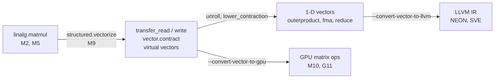

# M8. Vectorization in MLIR

MLIR vectorizes from the top down: a structured operation that already says which dimensions are parallel becomes a handful of operations on multi-dimensional vector values, which later passes cut down to the registers a real machine has. This chapter follows one matrix multiply through that path, by hand and with mlir-opt, and marks where a lowering can quietly break Vortex's floating-point rule.

Level: Intermediate · Reading time: about 40 minutes · Builds on: [M6. Loops: affine and scf](m6-affine-and-scf.md), [P10. Vectorization](../optimize/p10-vectorization.md)

???+ remember "Before you start, remember"

    ??? question "At the point (d0, d1, d2) of `linalg.matmul`'s iteration space, which element does each operand supply?"

        The first input supplies `(d0, d2)`, the second `(d2, d1)` and the output `(d0, d1)`. With `d0`, `d1` and `d2` standing for `row`, `column` and `k`, those are `a[row, k]`, `b[k, column]` and `c[row, column]`, and the body adds the product into the output element.

        Introduced in [M2. Reading MLIR](m2-reading-mlir.md#a-named-operation-hides-a-region).

    ??? question "What does `fastmath = #arith.fastmath<none>` on an `arith.addf` promise, and does MLIR's verifier require it?"

        It grants no fast-math permission: no contraction into a fused multiply-add and no reassociation. The verifier accepts any flag, so keeping decision 56 is a test you write, not a check MLIR makes.

        Introduced in [M2. Reading MLIR](m2-reading-mlir.md#attributes-and-properties-hold-the-constants).

    ??? question "Besides independent iterations, what does a loop vectorizer need before it may widen a loop?"

        A countable loop, no call it cannot see through, and proof that the arrays it stores to do not overlap the ones it reads, or a runtime check that stands in for the proof.

        Introduced in [P10. Vectorization](../optimize/p10-vectorization.md#what-else-a-vectorizer-needs).

    ??? question "What is the difference between an ordered and a reassociated floating-point reduction?"

        An ordered reduction adds the lanes into the running total one at a time, in index order, so the result has the same bits as the scalar loop. A reassociated one keeps partial sums per lane and combines them at the end, which is faster and can round differently.

        Introduced in [P10. Vectorization](../optimize/p10-vectorization.md#reductions-ordered-or-reassociated).

    ??? question "What does LLVM's loop vectorizer do with iterations left over when the trip count is not a multiple of the width?"

        It runs them in a scalar epilogue: a copy of the original loop that starts where the vector loop stopped.

        Introduced in [P10. Vectorization](../optimize/p10-vectorization.md#trip-counts-and-the-scalar-epilogue).

!!! goals "In this chapter"

    - Explain what a virtual vector is, how the transfer operations move one between memory and SSA values, and what `in_bounds` and the padding value promise.
    - Vectorize a `linalg.matmul` with the transform dialect and read the resulting `vector.contract` as the same computation, one level down.
    - Predict how an n-D vector lowers to LLVM and then to NEON registers, and explain why MLIR keeps it as an array of 1-D vectors instead of flattening it.
    - Compare padding and masking at a tile's edge with P10's scalar epilogue, and say what Vortex's fixed shapes remove.
    - Recognize the contraction lowerings that fuse a multiply and an add, and write the test that catches them in a Vortex pipeline.

## Two ways to find vectors

[P10](../optimize/p10-vectorization.md#two-vectorizers) vectorized from the bottom up. LLVM's loop vectorizer looks at a loop made of loads, stores, branches and address arithmetic, and has to prove that the iterations are independent before it may run four at once. It works hard to recover a fact the programmer knew all along.

MLIR can start higher. [M2](m2-reading-mlir.md#a-named-operation-hides-a-region) showed `linalg.matmul` as one operation whose iteration space is written down: three dimensions, two of them independent and one summed over. Nothing has to be proved. The vector dialect's documentation makes the point directly: vectorizing loops amounts to raising structure that was lost, while vectorizing a structured operation is a pattern rewrite.[^vector] The paper that describes MLIR's code generation path says the same about `linalg`: the vectorizer reads the indexing expressions that the operation already carries.[^vasilache]

The **vector dialect** is where the result lands. It defines a type for a group of elements meant to be processed together, and operations on values of that type. The documentation separates three levels.[^vector]

- **Virtual vectors** are machine-independent: any rank, any size, such as `vector<4x3x8xf32>`. Vectorizers and hand-written kernels produce them.
- **Hardware vectors** are the shapes and operations a particular instruction set provides, such as NEON's 128-bit registers or a GPU's matrix instructions, often in a dialect per target.
- **The LLVM level** is LLVM IR's own vector types, which have one dimension only.

Lowering moves from the first level to the last, a step at a time. This chapter follows one small matrix multiply along that path.

## A tile that is a value

A value of type `vector<2x2xf32>` holds four `f32` elements arranged two by two. It is an SSA value like any other: it can be a function argument, the result of `arith.addf`, or the operand of another operation. Nothing in the type says where the elements came from. A memref names a place in memory; a vector names a value.

Something has to move elements between the two. The most general operations for that are the **transfer operations**, `vector.transfer_read` and `vector.transfer_write`:[^vector]

--8<-- "includes/examples/mlir/m8-vectorization/tile_transfer.mlir.md"

`vector.transfer_read %src[%c1, %c1], %pad` reads a slice of `%src` starting at index `(1, 1)`. The slice's size comes from the result type, so this reads rows 1 and 2, columns 1 and 2. The operand `%pad` is the **padding value**: the value a lane receives if its index falls outside the memref. `arith.addf` then doubles the value, not the memory, and `vector.transfer_write` stores the result into `%dst` at the same position.

`in_bounds = [true, true]` is a promise per dimension: along this dimension, every index the transfer touches is inside the memref. With the promise, the operation never needs the padding value, and the documentation says such a read, with no mask, can be lowered to a plain load. Without it the default is `false`, meaning the access may run off the end, and the printer leaves the attribute out when every dimension has the default.[^vector] The promise is not checked: MLIR 18.1.8 accepts `in_bounds = [true, true]` on a read that starts at `(3, 3)` in a `4x4` memref (checked on 2026-09-24). A false promise is the author's mistake, and the verifier does not report it.

The transfer operations are not the only way to touch memory. The dialect also has `vector.load` and `vector.store`, and masked, gather and scatter variants. The difference is in what they promise. `vector.load` reads a slice whose innermost dimension must be contiguous in memory, and its documentation says nothing may be assumed about elements read out of bounds.[^vector]

A transfer operation can also transpose or broadcast through its `permutation_map`, pad, and mask, and it works on tensors as well as memrefs. The documentation explains the name: it is a "read" and not a "load" because a whole virtual vector usually does not fit one hardware register.[^vector] The code generation paper calls the transfer operations a "Swiss army knife" between memory and vectors.[^vasilache]

??? check "In the example, which operations touch memory? If the read started at `(2, 3)` instead of `(1, 1)`, what should `in_bounds` say?"

    Only the two transfer operations touch memory; `arith.addf` works on the vector value. Starting at `(2, 3)`, the tile covers rows 2 and 3, both inside, and columns 3 and 4, and column 4 is outside a `4x4` memref. The promise is per dimension, so the correct spelling is `in_bounds = [true, false]`: the two lanes in column 4 receive `%pad`. Keeping `[true, true]` would still pass the verifier, and a lowering could then emit a plain load that reads past the buffer.

## From linalg.matmul to vector.contract

Now a whole operation. This file multiplies a `4x8` matrix by an `8x4` matrix into a `4x4` output, all in buffers, and adds a **schedule**: a second piece of IR, in the transform dialect, that says which transformation to apply to which operation. [M9](m9-transform-dialect.md) is about schedules; here you need only to read this one. It finds the `linalg.matmul`, goes up to the function around it, and asks for everything in the function to be vectorized.[^transform]

--8<-- "includes/examples/mlir/m8-vectorization/vectorize_matmul.mlir.md"

Read the function in the output from the top.

1. Three `vector.transfer_read`s bring in all of `%arg0`, `%arg1` and `%arg2` as values of type `vector<4x8xf32>`, `vector<8x4xf32>` and `vector<4x4xf32>`. The shapes are static and each tile covers its whole buffer, so each read carries `in_bounds = [true, true]`.
2. One `vector.contract` computes the product.
3. One `vector.transfer_write` stores the result into `%arg2`.

That is the recipe the code generation paper gives for vectorizing any `linalg` operation: a transfer read per operand, the computation in vector form, and a transfer write back, indexed the way the `linalg` operation indexes its operands.[^vasilache] With static shapes that fit in one tile, there is no loop left at all. For a large matrix you would first tile the operation ([M6](m6-affine-and-scf.md#tiling-traced-by-hand)) and vectorize the tile inside the loops.

The operation is `transform.structured.vectorize_children_and_apply_patterns`, and the second half of its name matters. With the plainer `transform.structured.vectorize` on the same function, MLIR 18.1.8 produced a different shape (checked on the owner's machine on 2026-09-24). Both inputs were read into `vector<4x4x8xf32>`, one element for every point of the iteration space, using permutation maps with a `0` in them, which repeat an element along a dimension it does not depend on. Then came an elementwise `arith.mulf` of the two, and a `vector.multi_reduction <add>` over dimension 2, the `k` dimension. The reads also lacked `in_bounds`. The pattern set folds the multiply-and-reduce into `vector.contract` and infers the `in_bounds` promises; its documentation names the multi-reduction-to-contract rewrite among them.[^transform] Figure 1 draws the three stages.

<figure class="vx-figure">
<svg viewBox="0 0 760 330" role="img" aria-label="Three stages of vectorizing a 4 by 8 times 8 by 4 matrix multiply" aria-describedby="m8-f1-desc">
<title id="m8-f1-title">Three stages of vectorizing a matrix multiply</title>
<desc id="m8-f1-desc">Three panels from left to right, joined by arrows. Left panel, linalg.matmul: an iteration space drawn as a box with axes m of size 4, n of size 4 and k of size 8; each point multiplies a of m k by b of k n and adds into c of m n. Middle panel, after transform.structured.vectorize: a, of shape 4 by 8, is repeated along n into a 4 by 4 by 8 value; b, of shape 8 by 4, is transposed and repeated along m into another 4 by 4 by 8 value; an elementwise arith.mulf multiplies them, and vector.multi_reduction add over dimension 2, the k dimension, produces a 4 by 4 result added to c. Right panel, after the cleanup patterns: a single vector.contract takes the 4 by 8 and 8 by 4 values and the 4 by 4 accumulator, with no 128-element intermediate.</desc>
<defs>
<marker id="m8-f1-head" viewBox="0 0 10 10" refX="9" refY="5" markerWidth="6" markerHeight="6" orient="auto"><path class="vx-arrowhead" d="M0 0 L10 5 L0 10 z"/></marker>
</defs>
<text class="vx-text" x="110" y="24" text-anchor="middle">linalg.matmul</text>
<rect class="vx-box-strong" x="30" y="60" width="130" height="130" rx="4"/>
<path class="vx-line" d="M30 60 L70 36 L200 36 L160 60"/>
<path class="vx-line" d="M160 190 L200 166 L200 36"/>
<text class="vx-text-muted" x="95" y="210" text-anchor="middle">m × n = 4 × 4</text>
<text class="vx-text-muted" x="214" y="120">k = 8</text>
<text class="vx-mono" x="95" y="120" text-anchor="middle">one point:</text>
<text class="vx-mono" x="95" y="140" text-anchor="middle">c += a·b</text>
<text class="vx-text-muted" x="110" y="250" text-anchor="middle">parallel m, n</text>
<text class="vx-text-muted" x="110" y="268" text-anchor="middle">reduction k</text>
<path class="vx-flow" d="M250 130 L282 130" marker-end="url(#m8-f1-head)"/>
<text class="vx-text" x="420" y="24" text-anchor="middle">structured.vectorize</text>
<rect class="vx-box" x="300" y="44" width="110" height="40" rx="4"/>
<text class="vx-mono" x="355" y="69" text-anchor="middle">a: 4x8</text>
<rect class="vx-box" x="430" y="44" width="110" height="40" rx="4"/>
<text class="vx-mono" x="485" y="69" text-anchor="middle">b: 8x4</text>
<text class="vx-text-muted" x="355" y="104" text-anchor="middle">repeat along n</text>
<text class="vx-text-muted" x="485" y="104" text-anchor="middle">transpose, repeat along m</text>
<rect class="vx-box-accent" x="300" y="114" width="110" height="40" rx="4"/>
<text class="vx-mono" x="355" y="139" text-anchor="middle">4x4x8</text>
<rect class="vx-box-accent" x="430" y="114" width="110" height="40" rx="4"/>
<text class="vx-mono" x="485" y="139" text-anchor="middle">4x4x8</text>
<rect class="vx-box" x="340" y="176" width="160" height="36" rx="4"/>
<text class="vx-mono" x="420" y="199" text-anchor="middle">arith.mulf 4x4x8</text>
<rect class="vx-box" x="310" y="232" width="220" height="36" rx="4"/>
<text class="vx-mono" x="420" y="255" text-anchor="middle">multi_reduction add [2]</text>
<text class="vx-text-muted" x="420" y="292" text-anchor="middle">sums over k into c: 4x4</text>
<path class="vx-line" d="M420 154 L420 176"/>
<path class="vx-line" d="M420 212 L420 232"/>
<path class="vx-flow" d="M552 130 L584 130" marker-end="url(#m8-f1-head)"/>
<text class="vx-text" x="665" y="24" text-anchor="middle">+ cleanup patterns</text>
<rect class="vx-box-strong" x="596" y="96" width="150" height="70" rx="4"/>
<text class="vx-mono" x="671" y="124" text-anchor="middle">vector.contract</text>
<text class="vx-mono" x="671" y="146" text-anchor="middle">4x8, 8x4 → 4x4</text>
<text class="vx-text-muted" x="671" y="190" text-anchor="middle">no 128-element</text>
<text class="vx-text-muted" x="671" y="208" text-anchor="middle">intermediate</text>
</svg>
<figcaption>Figure 1. Vectorizing <code>linalg.matmul</code> in MLIR 18.1.8. The plain vectorizer (middle) turns the iteration space into one 128-element value per input, multiplies them lane by lane and sums over <code>k</code>. The cleanup patterns (right) recognize that multiply-then-sum as a contraction and replace all three operations with one.</figcaption>
</figure>

The middle stage is worth understanding even though you rarely keep it. It is the most literal reading of the iteration space: one lane per point `(m, n, k)`. A `4x4x8` value of `f32` has 128 elements, 4,096 bits, which is 32 NEON registers for each input, and it holds every element of `a` and `b` four times over. Recognizing the contraction lets the next stage choose a better schedule for the same arithmetic.

## Reading a vector.contract

A **contraction** multiplies elements of two inputs, sums the products along the dimensions the inputs share, and adds the sums into an accumulator. The documentation defines `vector.contract` that way and requires three things.[^vector]

- `indexing_maps`, one affine map per operand, from the iteration space to that operand's indices. The maps in the example's output are the ones [M2](m2-reading-mlir.md#a-named-operation-hides-a-region) read for `linalg.matmul`: `(d0, d2)` for the first input, `(d2, d1)` for the second, `(d0, d1)` for the accumulator.
- `iterator_types`, one per dimension. `d0` and `d1` are `parallel`: each value picks out a separate output element. `d2` is a `reduction`: it appears in both inputs and not in the accumulator, and the operation sums over it.
- `kind`, the **combining kind**: how each sum is folded into the accumulator. The current documentation lists `add`, `mul`, and several minimum and maximum variants for floats, plus `and`, `or` and `xor` for integers; `add` is the default.[^vector]

The third operand, `%2`, is the accumulator, read from `%arg2` before the contraction. So the output is `c + a·b`, exactly what `linalg.matmul` computes. M2 pointed out the consequence for Vortex: the stage 10 kernel overwrites `c`, so a translation through either operation must start from a zeroed accumulator.

Compare the two operations. `linalg.matmul` describes its computation with a region, a block of scalar code run at every point. `vector.contract` has no region: the maps and the kind say everything, because a contraction's only freedom is which dimensions pair up and how the sums combine. `linalg.matmul` works on tensors or memrefs; `vector.contract` works on values, and its result is a new value.

That difference is why the vector level is a good place to transform. The vector dialect's documentation lists work that becomes unnecessary when a tile is a value rather than memory: unroll-and-jam of loops, restructuring loads and stores to reuse registers, and forwarding stored values to later loads.[^vector] A value has no address, so no store can change it behind the compiler's back.

??? check "If the first indexing map were `(d0, d1, d2) -> (d2, d0)` and the rest stayed the same, what would the operation compute, and what shape would `%a` need?"

    `%a` would be indexed `[k, m]`, so it must have shape `8x4`, with `k` first. The operation would compute `c + aᵀ·b`: the transpose of `%a` times `%b`. The maps, not the operand order, decide which index is which, so a transposed input needs no separate transpose operation.

## Padding at the edge of a tile

Tiles do not always fit. A `2x2` tile placed at the bottom-right corner of a `3x3` memref has one real element and three lanes outside. [P10](../optimize/p10-vectorization.md#trip-counts-and-the-scalar-epilogue) handled the leftover iterations of a loop with a scalar epilogue. A transfer operation handles them inside the one operation, with the padding value. This example reads the corner tile and then lowers the read one step, to 1-D reads, with `--convert-vector-to-scf=full-unroll` and `--canonicalize`:

--8<-- "includes/examples/mlir/m8-vectorization/partial_tile_padding.mlir.md"

The 2-D read became 1-D rows. Row 3 lies entirely outside the memref, which the compiler can see from the constant indices, so that row became part of a constant: `%cst_0`, a `2x2` vector of `-1.0`. Row 2 is partly inside, so it stayed a 1-D `vector.transfer_read` of two elements, still without `in_bounds`, and `vector.insert` places it in row 0 of the result. Figure 2 shows the tile, its lanes and the mask each row needs.

<figure class="vx-figure">
<svg viewBox="0 0 760 290" role="img" aria-label="A 2 by 2 tile at the corner of a 3 by 3 memref, with the lanes that need padding" aria-describedby="m8-f2-desc">
<title id="m8-f2-title">A 2 by 2 tile at the corner of a 3 by 3 memref</title>
<desc id="m8-f2-desc">On the left, a 3 by 3 grid of memref elements with indices from 0 to 2 in each dimension. A 2 by 2 tile starts at row 2, column 2. Only its top-left lane, element 2 2, lies inside the grid and is highlighted; the other three lanes, 2 3, 3 2 and 3 3, lie outside and are marked pad. On the right, the two rows of the tile after lowering. Row 2 becomes a 1-D read with lane mask 1 0: lane 0 loads element 2 2, lane 1 takes the padding value; in LLVM this is llvm.intr.masked.load with the padding value as pass-through. Row 3 becomes the constant minus 1, minus 1 with no load at all.</desc>
<text class="vx-text" x="150" y="24" text-anchor="middle">memref&lt;3x3xf32&gt;, tile at [2, 2]</text>
<rect class="vx-box" x="40" y="50" width="60" height="50"/>
<rect class="vx-box" x="100" y="50" width="60" height="50"/>
<rect class="vx-box" x="160" y="50" width="60" height="50"/>
<rect class="vx-box" x="40" y="100" width="60" height="50"/>
<rect class="vx-box" x="100" y="100" width="60" height="50"/>
<rect class="vx-box" x="160" y="100" width="60" height="50"/>
<rect class="vx-box" x="40" y="150" width="60" height="50"/>
<rect class="vx-box" x="100" y="150" width="60" height="50"/>
<rect class="vx-cell-on" x="160" y="150" width="60" height="50"/>
<text class="vx-mono" x="190" y="180" text-anchor="middle">[2,2]</text>
<rect class="vx-box-bad" x="220" y="150" width="60" height="50"/>
<text class="vx-mono" x="250" y="180" text-anchor="middle">pad</text>
<rect class="vx-box-bad" x="160" y="200" width="60" height="50"/>
<text class="vx-mono" x="190" y="230" text-anchor="middle">pad</text>
<rect class="vx-box-bad" x="220" y="200" width="60" height="50"/>
<text class="vx-mono" x="250" y="230" text-anchor="middle">pad</text>
<rect class="vx-line" x="160" y="150" width="120" height="100" rx="3"/>
<text class="vx-text-muted" x="30" y="80" text-anchor="end">0</text>
<text class="vx-text-muted" x="30" y="130" text-anchor="end">1</text>
<text class="vx-text-muted" x="30" y="180" text-anchor="end">2</text>
<text class="vx-text-muted" x="30" y="230" text-anchor="end">3</text>
<text class="vx-text-muted" x="330" y="180">row 2</text>
<text class="vx-text-muted" x="330" y="230">row 3</text>
<g class="vx-seq" style="--vx-i: 0; --vx-n: 2">
<rect class="vx-box-accent" x="400" y="152" width="340" height="46" rx="4"/>
<text class="vx-mono" x="412" y="172">mask [1, 0]: load lane 0,</text>
<text class="vx-mono" x="412" y="190">lane 1 = pad (masked.load)</text>
</g>
<g class="vx-seq" style="--vx-i: 1; --vx-n: 2">
<rect class="vx-box" x="400" y="204" width="340" height="44" rx="4"/>
<text class="vx-mono" x="412" y="231">constant [-1.0, -1.0], no load</text>
</g>
</svg>
<figcaption>Figure 2. The corner tile of the padding example. One lane is inside the memref; the others take the padding value. After lowering, the row that is wholly outside becomes a constant, and the row that is partly inside becomes a load with a <strong>lane mask</strong>, one on-or-off bit per lane.</figcaption>
</figure>

Lowering the same file on to the LLVM dialect with `--convert-vector-to-llvm` turned row 2 into a comparison of each lane's index against the memref's size, producing a two-lane mask, and a call to `llvm.intr.masked.load` that returns `%pad` in the lanes whose bit is off (checked on 2026-09-24). A **lane mask** is a vector of `i1` values, one per lane, that says which lanes an operation acts on. The transfer operation's documentation defines its optional mask the same way: lanes whose bit is 0 receive the padding value.[^vector]

So the two strategies spend their cost in different places. P10's scalar epilogue adds a second copy of the loop and runs the leftover iterations one element at a time. Padding keeps one code path but pays for index comparisons, masks and masked memory operations wherever a tile might cross an edge, and a masked load may run slower than a plain one on a given target. The vector dialect keeps the choice open until the target is known: the transfer operation only states which lanes are real.

MLIR also offers the epilogue's approach. The code generation paper describes **peeling** a loop so that the main part runs full tiles only, and padding a partial tile out to a full one, as ways of reaching fixed shapes before vectorization.[^vasilache] `transform.structured.vectorize` can also be given explicit vector sizes, in which case it vectorizes with masked vectors of that size.[^transform]

Vortex has a stronger position than either. [Decision 11](../decisions/arrays.md#d11) makes every array extent a constant known at compile time, so the compiler knows, for each tile, whether it fits. If it picks tile sizes that divide the extents, every transfer can carry `in_bounds = true` in every dimension, and there is neither a mask nor an epilogue. When no convenient size divides an extent, as with a width of 4 and an extent of 6, the compiler chooses knowingly, per shape, among a narrower width, a masked last tile and a peeled one.

??? check "A lowering tiles a Vortex `[f32; 64, 64]` array with `4x4` tiles, and a `[f32; 8, 6]` array with the same tiles. Which transfers need padding or masks?"

    None for the `64x64` array: 64 is a multiple of 4 in both dimensions, so every tile fits and every transfer can carry `in_bounds = [true, true]`. For `8x6`, the tiles starting at column 4 cover columns 4 to 7, and columns 6 and 7 do not exist, so those four tiles need a mask or padding along the second dimension, or the lowering must choose another width, such as 2, or peel the last two columns. Because both extents are constants, the compiler knows exactly which tiles these are.

## From virtual vectors to NEON registers

No mainstream CPU has a `vector<4x8xf32>` register. AArch64's SIMD registers are 128 bits wide, one dimension, four `f32` lanes.[^aapcs64] LLVM IR likewise has only 1-D vector types.[^vector] Somewhere the tile has to be cut into pieces a register can hold. This example lowers a function that doubles a `4x8` tile:

--8<-- "includes/examples/mlir/m8-vectorization/nd_vector_lowering.mlir.md"

`vector<4x8xf32>` became `!llvm.array<4 x vector<8xf32>>`: an array of four 1-D vectors, one per row. The single `arith.addf` became four `llvm.fadd` operations, each extracting one row, adding, and inserting the result. The vector dialect's documentation gives this as the general rule: an n-D vector lowers to an (n-1)-D array of 1-D vectors, and its example is `vector<4x8x128xf32>` becoming a 4 by 8 array of 128-element vectors.[^vector]

That is not the end. `vector<8xf32>` is 256 bits, still twice a NEON register. Translating the output to LLVM IR with `mlir-translate` and compiling it with `llc -O2 -mtriple=arm64-apple-macos` produced eight `fadd.4s` instructions on registers `v0` to `v7` (checked on the owner's machine on 2026-09-24). LLVM's code generator split each 8-lane vector into two 4-lane halves. Figure 3 follows the tile through both steps.

<figure class="vx-figure">
<svg viewBox="0 0 760 300" role="img" aria-label="A 4 by 8 vector tile lowered to four 1-D vectors and then to eight NEON registers" aria-describedby="m8-f3-desc">
<title id="m8-f3-title">A 4 by 8 tile, four LLVM vectors, eight NEON registers</title>
<desc id="m8-f3-desc">On the left, one value of type vector 4 by 8 of f32, drawn as a grid of 4 rows and 8 columns. An arrow labelled convert-vector-to-llvm leads to the middle: four separate rows, each a vector of 8 f32, together forming an llvm array of 4. An arrow labelled llc leads to the right: eight NEON registers v0 to v7, each holding 4 lanes; row 0 fills v0 and v1, row 1 fills v2 and v3, row 2 fills v4 and v5, row 3 fills v6 and v7. The rows light up one after another. No lane moves between rows.</desc>
<defs>
<marker id="m8-f3-head" viewBox="0 0 10 10" refX="9" refY="5" markerWidth="6" markerHeight="6" orient="auto"><path class="vx-arrowhead" d="M0 0 L10 5 L0 10 z"/></marker>
</defs>
<text class="vx-text" x="110" y="30" text-anchor="middle">vector&lt;4x8xf32&gt;</text>
<rect class="vx-box-strong" x="20" y="60" width="180" height="180" rx="3"/>
<line class="vx-line" x1="20" y1="105" x2="200" y2="105"/>
<line class="vx-line" x1="20" y1="150" x2="200" y2="150"/>
<line class="vx-line" x1="20" y1="195" x2="200" y2="195"/>
<text class="vx-text-muted" x="110" y="262" text-anchor="middle">one SSA value</text>
<path class="vx-flow" d="M210 150 L262 150" marker-end="url(#m8-f3-head)"/>
<text class="vx-text-muted" x="236" y="138" text-anchor="middle">MLIR</text>
<text class="vx-text" x="360" y="30" text-anchor="middle">!llvm.array&lt;4 x vector&lt;8xf32&gt;&gt;</text>
<g class="vx-seq" style="--vx-i: 0; --vx-n: 4">
<rect class="vx-box-accent" x="275" y="60" width="170" height="36" rx="3"/>
<text class="vx-mono" x="360" y="83" text-anchor="middle">row 0: vector&lt;8xf32&gt;</text>
<rect class="vx-box-accent" x="530" y="60" width="100" height="36" rx="3"/>
<text class="vx-mono" x="580" y="83" text-anchor="middle">v0 .4s</text>
<rect class="vx-box-accent" x="640" y="60" width="100" height="36" rx="3"/>
<text class="vx-mono" x="690" y="83" text-anchor="middle">v1 .4s</text>
</g>
<g class="vx-seq" style="--vx-i: 1; --vx-n: 4">
<rect class="vx-box-accent" x="275" y="105" width="170" height="36" rx="3"/>
<text class="vx-mono" x="360" y="128" text-anchor="middle">row 1: vector&lt;8xf32&gt;</text>
<rect class="vx-box-accent" x="530" y="105" width="100" height="36" rx="3"/>
<text class="vx-mono" x="580" y="128" text-anchor="middle">v2 .4s</text>
<rect class="vx-box-accent" x="640" y="105" width="100" height="36" rx="3"/>
<text class="vx-mono" x="690" y="128" text-anchor="middle">v3 .4s</text>
</g>
<g class="vx-seq" style="--vx-i: 2; --vx-n: 4">
<rect class="vx-box-accent" x="275" y="150" width="170" height="36" rx="3"/>
<text class="vx-mono" x="360" y="173" text-anchor="middle">row 2: vector&lt;8xf32&gt;</text>
<rect class="vx-box-accent" x="530" y="150" width="100" height="36" rx="3"/>
<text class="vx-mono" x="580" y="173" text-anchor="middle">v4 .4s</text>
<rect class="vx-box-accent" x="640" y="150" width="100" height="36" rx="3"/>
<text class="vx-mono" x="690" y="173" text-anchor="middle">v5 .4s</text>
</g>
<g class="vx-seq" style="--vx-i: 3; --vx-n: 4">
<rect class="vx-box-accent" x="275" y="195" width="170" height="36" rx="3"/>
<text class="vx-mono" x="360" y="218" text-anchor="middle">row 3: vector&lt;8xf32&gt;</text>
<rect class="vx-box-accent" x="530" y="195" width="100" height="36" rx="3"/>
<text class="vx-mono" x="580" y="218" text-anchor="middle">v6 .4s</text>
<rect class="vx-box-accent" x="640" y="195" width="100" height="36" rx="3"/>
<text class="vx-mono" x="690" y="218" text-anchor="middle">v7 .4s</text>
</g>
<path class="vx-flow" d="M455 150 L515 150" marker-end="url(#m8-f3-head)"/>
<text class="vx-text-muted" x="485" y="138" text-anchor="middle">llc</text>
<text class="vx-text" x="635" y="30" text-anchor="middle">NEON, 128 bits each</text>
<text class="vx-text-muted" x="360" y="262" text-anchor="middle">four 1-D values</text>
<text class="vx-text-muted" x="635" y="262" text-anchor="middle">eight fadd.4s</text>
</svg>
<figcaption>Figure 3. A <code>vector&lt;4x8xf32&gt;</code> on its way to an M4. MLIR's LLVM lowering splits off the leading dimension into an array of rows; LLVM's code generator splits each 256-bit row into two 128-bit registers. At no step does a lane move to another row.</figcaption>
</figure>

Why an array of rows, and not one flat `vector<32xf32>`? The documentation weighs both.[^vector] A flat vector allows LLVM's `extractelement` and `shufflevector` with a lane number computed at run time. But it needs index arithmetic everywhere to convert between 2-D and 1-D positions, and it hides the real structure of the hardware: a vector larger than a register will be held in several registers whatever its type says.

The nested form matches what a register file can do. A register file cannot be indexed by a value computed at run time; the register number is fixed in the instruction. LLVM's `extractvalue` on an array accepts only constant indices, which says exactly that. A lowering that needs a dynamic row index has to go through memory, and the documentation prefers to make that visible in the IR rather than hide it behind a flat type.[^vector]

Cutting a large virtual vector into pieces the target handles well is called **unrolling** in the vector dialect: the multi-dimensional unrolling factors are carried by the vector type itself.[^vector] The code generation paper gives two purposes: splitting operations into sizes the target supports well, and splitting sizes that are not powers of two, such as `vector<12xf32>` into three `vector<4xf32>`, before LLVM's code generator sees them.[^vasilache] For the M4, a lowering that unrolls to `vector<4xf32>` pieces does in MLIR what `llc` otherwise does late.

Vector types also have a scalable form for SVE. In `vector<[4]xf32>`, the brackets mark a dimension whose length is a multiple of 4 fixed only when the program runs; the documentation lowers such types to LLVM's scalable vectors, and a type whose scalable dimension is not the last one cannot be converted to LLVM.[^vector] [P10](../optimize/p10-vectorization.md#neon-sve-and-sme) explained why Vortex's constant extents gain little from that.

## Lowering a contraction, and what it does to rounding

`vector.contract` does not correspond to one instruction on the M4 either. The code generation paper lists three ways to lower it: to **outer products**, to inner (dot) products, or to LLVM's matrix intrinsics.[^vasilache] The first is the shape of a fast matrix-multiply kernel ([P12](../optimize/p12-fast-gemm.md#the-register-blocked-micro-kernel)), so start there.

The **outer product** of a column vector `x` and a row vector `y` is the matrix whose element `(i, j)` is `x[i] · y[j]`. A matrix product is a sum of outer products, one per value of `k`: column `k` of `a` times row `k` of `b`. Each term updates every element of the accumulator once. This example asks for that strategy explicitly:

--8<-- "includes/examples/mlir/m8-vectorization/contract_to_outerproduct.mlir.md"

Follow the values in the output.

1. `vector.transpose %arg0` swaps rows and columns, so that each column of `a` becomes a row that `vector.extract` can take with a constant index.
2. `%1` is column 0 of `a` and `%2` is row 0 of `b`. `vector.outerproduct %1, %2, %arg2` computes their outer product and adds it to `%arg2`, the old accumulator.
3. `%4` and `%5` are column 1 and row 1. The second `vector.outerproduct` adds their outer product to `%3`, the result of the first.

So element `(i, j)` of the result is `(c[i][j] + a[i][0]·b[0][j]) + a[i][1]·b[1][j]`: the accumulator first, then the products in `k` order. That is the C-initialized order that [P12](../optimize/p12-fast-gemm.md#two-ways-to-accumulate) described for micro-kernels. Figure 4 draws the two updates.

<figure class="vx-figure">
<svg viewBox="0 0 760 270" role="img" aria-label="A 2 by 2 contraction lowered to two outer-product updates, each row of which becomes a fused multiply-add" aria-describedby="m8-f4-desc">
<title id="m8-f4-title">A 2 by 2 contraction as two outer-product updates</title>
<desc id="m8-f4-desc">Two steps from left to right. Step k equals 0: column 0 of a, with elements a00 and a10, times row 0 of b, with elements b00 and b01, is added to the accumulator c, giving a 2 by 2 result whose element i j is c i j plus a i 0 times b 0 j. Step k equals 1: column 1 of a times row 1 of b is added to that result. Beneath each step, each of the two rows of the update is marked as one llvm.intr.fmuladd on a vector of 2 f32, four in all, and in MLIR 18.1.8 compiled for AArch64 each became an fmla, a fused multiply-add with one rounding.</desc>
<text class="vx-text" x="185" y="26" text-anchor="middle">k = 0</text>
<rect class="vx-box" x="30" y="50" width="50" height="80" rx="3"/>
<text class="vx-mono" x="55" y="80" text-anchor="middle">a00</text>
<text class="vx-mono" x="55" y="112" text-anchor="middle">a10</text>
<text class="vx-text-muted" x="55" y="150" text-anchor="middle">col 0 of a</text>
<text class="vx-text" x="98" y="95" text-anchor="middle">⊗</text>
<rect class="vx-box" x="116" y="50" width="100" height="40" rx="3"/>
<text class="vx-mono" x="141" y="75" text-anchor="middle">b00</text>
<text class="vx-mono" x="191" y="75" text-anchor="middle">b01</text>
<text class="vx-text-muted" x="166" y="110" text-anchor="middle">row 0 of b</text>
<text class="vx-text" x="236" y="95" text-anchor="middle">+ c</text>
<rect class="vx-box-accent" x="256" y="50" width="104" height="80" rx="3"/>
<text class="vx-mono" x="308" y="80" text-anchor="middle">row 0</text>
<text class="vx-mono" x="308" y="112" text-anchor="middle">row 1</text>
<text class="vx-text-muted" x="308" y="150" text-anchor="middle">partial result</text>
<text class="vx-text" x="570" y="26" text-anchor="middle">k = 1</text>
<rect class="vx-box" x="415" y="50" width="50" height="80" rx="3"/>
<text class="vx-mono" x="440" y="80" text-anchor="middle">a01</text>
<text class="vx-mono" x="440" y="112" text-anchor="middle">a11</text>
<text class="vx-text-muted" x="440" y="150" text-anchor="middle">col 1 of a</text>
<text class="vx-text" x="483" y="95" text-anchor="middle">⊗</text>
<rect class="vx-box" x="501" y="50" width="100" height="40" rx="3"/>
<text class="vx-mono" x="526" y="75" text-anchor="middle">b10</text>
<text class="vx-mono" x="576" y="75" text-anchor="middle">b11</text>
<text class="vx-text-muted" x="551" y="110" text-anchor="middle">row 1 of b</text>
<text class="vx-text" x="628" y="95" text-anchor="middle">+</text>
<rect class="vx-box-strong" x="646" y="50" width="104" height="80" rx="3"/>
<text class="vx-mono" x="698" y="80" text-anchor="middle">row 0</text>
<text class="vx-mono" x="698" y="112" text-anchor="middle">row 1</text>
<text class="vx-text-muted" x="698" y="150" text-anchor="middle">result</text>
<line class="vx-line" x1="385" y1="40" x2="385" y2="250"/>
<g class="vx-pulse">
<rect class="vx-box-bad" x="30" y="178" width="330" height="60" rx="4"/>
<rect class="vx-box-bad" x="415" y="178" width="335" height="60" rx="4"/>
</g>
<text class="vx-mono" x="195" y="202" text-anchor="middle">2 × llvm.intr.fmuladd, vector&lt;2xf32&gt;</text>
<text class="vx-text-muted" x="195" y="224" text-anchor="middle">on the M4: fmla.2s, one rounding</text>
<text class="vx-mono" x="582" y="202" text-anchor="middle">2 × llvm.intr.fmuladd, vector&lt;2xf32&gt;</text>
<text class="vx-text-muted" x="582" y="224" text-anchor="middle">on the M4: fmla.2s, one rounding</text>
</svg>
<figcaption>Figure 4. The outer-product lowering of a <code>2x2</code> contraction. Each step adds one rank-1 matrix to the accumulator, and each row of that step becomes one multiply-add on a 2-lane vector. The highlighted boxes are where MLIR 18.1.8 emitted <code>llvm.intr.fmuladd</code>, which the AArch64 back end fused.</figcaption>
</figure>

Now lower one step further. Adding `--convert-vector-to-llvm` to the example's flags turns each `vector.outerproduct` into two calls to `llvm.intr.fmuladd`, one per row of the accumulator (checked with MLIR 18.1.8 on 2026-09-24). LLVM's Language Reference defines `llvm.fmuladd` as `a * b + c` where it is unspecified whether the product is rounded before the addition; the code generator may fuse the two.[^langref] It did: translated and compiled with `llc -O2 -mtriple=arm64-apple-macos`, the four calls became four `fmla.2s` instructions, AArch64's vector fused multiply-add ([A3](../backend/a3-floats-and-vectors.md#fused-multiply-add)).

That is exactly what [decision 56](../decisions/numbers.md#d56) forbids: one rounding where the program has two. Nothing in the input asked for it. `vector.contract` in 18.1.8 has no `fastmath` property at all; a `fastmath` written on it survives only as a discardable attribute that the operation does not interpret (checked on 2026-09-24). The fusion came from a lowering choice, and a test that reads every `arith` operation's `fastmath` flag, as [M2's exercise](m2-reading-mlir.md#for-vortex) asked for, sees nothing wrong.

Newer MLIR makes the fusion explicit rather than optional. The current documentation says an accumulating `vector.outerproduct` on floats is guaranteed to emit a fused multiply-add, lowering to `llvm.intr.fma`, and that `vector.fma` always lowers to `llvm.fma`; it also lists a `fastmath` attribute on `vector.contract`.[^vector] The version changes the spelling; for Vortex the result is the same. The outer-product path, as written, fuses.

The same contraction, given straight to `--convert-vector-to-llvm` in 18.1.8, took the dot-product path instead (checked on 2026-09-24). For each output element it multiplied a row of `a` by a column of `b` with a separate `arith.mulf`, summed the products with `llvm.intr.vector.reduce.fadd` starting from 0.0 and marked `fastmath<none>`, which LLVM defines as an ordered reduction,[^langref] and added the old accumulator at the end. Every operation rounds once, as decision 56 requires, but the order is P12's zero-initialized one, `c + ((0 + a₀b₀) + a₁b₁)`, not the C-initialized one above. The pass keeps that reduction ordered unless you pass its `reassociate-fp-reductions` option.[^passes]

So two lowerings of one operation round differently: one fuses each multiply and add, the other rounds every operation but adds the accumulator last instead of first. A Vortex pipeline that uses `vector.contract` has to choose its lowering on purpose, and its tests have to look below MLIR, at the LLVM IR or the assembly, for the fusion.

??? check "Your pipeline emits `vector.contract`, lowers it with the outer-product strategy and passes a test that every `arith` operation has `fastmath<none>`. Which check would catch the decision 56 violation, and why did the `fastmath` test miss it?"

    A check on the lowered code: fail if the LLVM IR contains a call to `llvm.fmuladd` or `llvm.fma` on `f32`, or if the assembly contains `fmla`, `fmadd` or another fused instruction. The `fastmath` test missed it because neither `vector.contract` nor `vector.outerproduct` is an `arith` operation, and the fusion was introduced by the lowering of `vector.outerproduct`, not by any flag in the input.

## Where the vector dialect sits

Putting the pieces in order gives the path this chapter walked, and the branches it did not take.

The branch to the right leads to hardware that does have two-dimensional operations. The code generation paper describes vector operations lowering either to LLVM's vector instructions or directly to target instructions that work on 2-D tiles, naming GPU warp-level matrix operations and Intel's AMX tile multiply as examples.[^vasilache] The `--convert-vector-to-gpu` pass lowers vector operations to the GPU dialect, with an option to target NVIDIA's `nvgpu` dialect instead.[^passes] [M10](m10-mlir-for-gpus.md) builds that path, and [G11](../gpu/g11-matrix-units.md) describes the matrix units it aims at.

Each arrow is a choice a compiler makes, and each can be made per target. That is the point of keeping the virtual level: a vectorizer that produces `vector.contract` does not need to know whether the machine has NEON, SVE, SME or a tensor core. The lowering does.

## For Vortex

!!! vortex "Exercise"

    **Build** a vector-typed variant of the MLIR-writing tool from [M2's exercise](m2-reading-mlir.md#for-vortex): for the [stage 10 kernel](../compiler/guide/stage-10-matrix-multiplication.md#the-program-the-milestone-asks-for) and its other shapes, write a second MLIR file in which the loop over `column` advances by a width `W` and the arithmetic works on `vector<Wxf32>` values, read and written with transfer operations. Use only the `builtin`, `func`, `arith`, `scf`, `memref` and `vector` dialects.

    1. A written decision, before any code: which loop becomes vector-typed, why the order of the additions into each element of `c` stays exactly what the scalar kernel does, and why the loop over `k` does not become a reduction across lanes ([P10](../optimize/p10-vectorization.md#reductions-ordered-or-reassociated)).
    2. A width `W` for `f32`, chosen once with a sentence of justification against the M4's 128-bit registers.
    3. `in_bounds` set to `true` in every dimension of every transfer your tool emits. For a shape whose extent is not a multiple of `W`, refuse it by name, the way M2's tool refuses constructs outside its subset.
    4. No `vector.contract`, `vector.outerproduct` or `vector.fma` in the output, and no `fastmath` value other than `none` on any `arith` operation, scalar or vector.

    **Not yet:** driving the rewrite from the transform dialect ([M9](m9-transform-dialect.md)); `vector.contract` and any contraction lowering; masks, padding or peeling for shapes that are not multiples of `W`; SVE's scalable types; GPU lowering ([M10](m10-mlir-for-gpus.md)); running the result.

    **Proof that it works:**

    - The vector-typed files for the stage 10 kernel and for two more shapes that are multiples of `W` pass `mlir-opt` with no options, and round-trip through `--mlir-print-op-generic` as in M2.
    - A test that reads every `vector.transfer_read` and `vector.transfer_write` in the output and fails unless each carries `in_bounds` with every entry `true`.
    - The decision 56 test from M2, extended to vector-typed `arith` operations.
    - A lowering canary: run the output through `--convert-vector-to-scf`, `--convert-scf-to-cf`, `--convert-vector-to-llvm`, `--finalize-memref-to-llvm`, `--convert-arith-to-llvm`, `--convert-func-to-llvm` and `--reconcile-unrealized-casts`, translate it with `mlir-translate --mlir-to-llvmir`, and fail if the LLVM IR contains `llvm.fmuladd` or `llvm.fma`, or if `llc -O2` for AArch64 produces `fmla` or `fmadd`. Then add one `vector.fma` by hand and confirm that the canary fails.
    - A refusal test: a `[f32; 8, 6]` output with `W = 4` produces a refusal that names the shape, not a file.

## Key ideas

!!! recap "Questions you can now answer"

    - **What is a virtual vector?** A value of vector type of any rank and size, such as `vector<4x8xf32>`, independent of any machine; lowering later cuts it into the 1-D vectors a target supports.
    - **What do the transfer operations add over a plain load?** A padding value for lanes out of bounds, per-dimension `in_bounds` promises, an optional mask, and a permutation map for transposing or broadcasting; they work on memrefs and tensors.
    - **How does `linalg.matmul` become `vector.contract`?** The vectorizer reads each operand with a transfer read, expresses the body over the whole iteration space, and cleanup patterns fold the multiply-and-reduce into one contraction with the same indexing maps.
    - **Why does `vector<4x8xf32>` lower to an array of four `vector<8xf32>`?** LLVM has only 1-D vectors, and a register file cannot be indexed at run time; keeping rows as separate values keeps that structure visible instead of hiding it behind a flat vector.
    - **How does a transfer handle a tile that crosses the edge?** Lanes outside receive the padding value; after lowering, that is a lane mask and a masked load, instead of P10's scalar epilogue.
    - **Why is the outer-product lowering of `vector.contract` a problem for Vortex?** It produces multiply-adds that LLVM may fuse (18.1.8) or must fuse (current MLIR), giving one rounding where decision 56 requires two, and no `fastmath` flag in the input shows it.

## Where this comes back

!!! next "You will use this again in"

    - [M9. Schedules as IR: the transform dialect](m9-transform-dialect.md): *structured.vectorize*, *apply_patterns*, *lower_contraction*
    - [M10. MLIR for GPUs](m10-mlir-for-gpus.md): *virtual vectors*, *convert-vector-to-gpu*
    - [M12. Designing Vortex's GPU path](m12-vortex-gpu-path.md): *choosing a lowering on purpose*, *fusion hidden in a lowering*
    - [P11. Floating point under optimization](../optimize/p11-floating-point.md): *llvm.fmuladd*, *contraction introduced by a lowering*
    - [P12. Anatomy of a fast GEMM](../optimize/p12-fast-gemm.md): *outer-product micro-kernel*, *C-initialized and zero-initialized order*
    - [G11. Matrix units](../gpu/g11-matrix-units.md): *hardware with 2-D operations*

## Sources and further reading

Read the vector dialect's documentation first, especially its sections on virtual vectors and on the trade-offs of lowering n-D vectors to LLVM: this chapter's figures follow its argument.[^vector] Then read sections 3.3 and 3.5 of the code generation paper, which walks a convolution and a matrix product through the same stages with larger tiles.[^vasilache] The transform dialect's entries for the vectorization operations are the reference for what each schedule step does.[^transform]

[^vector]: MLIR Project, "'vector' Dialect", sections "Components of a Generic Retargetable Vector-Level Dialect", "Short Description of the Existing Infrastructure", "Transformations Problems Avoided", "The Big Out-Of-Scope Piece: Automatic Vectorization" and "LLVM Lowering Tradeoffs", and the entries `vector.contract`, `vector.fma`, `vector.load`, `vector.outerproduct` and `vector.transfer_read`, read on 2026-09-24. <https://mlir.llvm.org/docs/Dialects/Vector/>
[^vasilache]: Nicolas Vasilache, Oleksandr Zinenko, Aart J. C. Bik, Mahesh Ravishankar, Thomas Raoux, Alexander Belyaev, Matthias Springer, Tobias Gysi, Diego Caballero, Stephan Herhut, Stella Laurenzo and Albert Cohen, "Composable and Modular Code Generation in MLIR: A Structured and Retargetable Approach to Tensor Compiler Construction", arXiv:2202.03293, 2022, sections 2.3.1, 3.3 and 3.5, read on 2026-09-24. <https://arxiv.org/abs/2202.03293>
[^transform]: MLIR Project, "'transform' Dialect", entries `transform.structured.vectorize`, `transform.structured.vectorize_children_and_apply_patterns` and `transform.apply_patterns.vector.lower_contraction`, read on 2026-09-24. <https://mlir.llvm.org/docs/Dialects/Transform/>
[^passes]: MLIR Project, "Passes", entries `-convert-vector-to-llvm` (option `-reassociate-fp-reductions`), `-convert-vector-to-scf` and `-convert-vector-to-gpu`, read on 2026-09-24. <https://mlir.llvm.org/docs/Passes/>
[^langref]: LLVM Project, "LLVM Language Reference Manual", sections "'llvm.fmuladd.*' Intrinsic" and "'llvm.vector.reduce.fadd.*' Intrinsic", read on 2026-09-24. <https://llvm.org/docs/LangRef.html>
[^aapcs64]: Arm, "Procedure Call Standard for the Arm 64-bit Architecture (AAPCS64)", section "SIMD and Floating-Point registers". <https://github.com/ARM-software/abi-aa/blob/main/aapcs64/aapcs64.rst>
