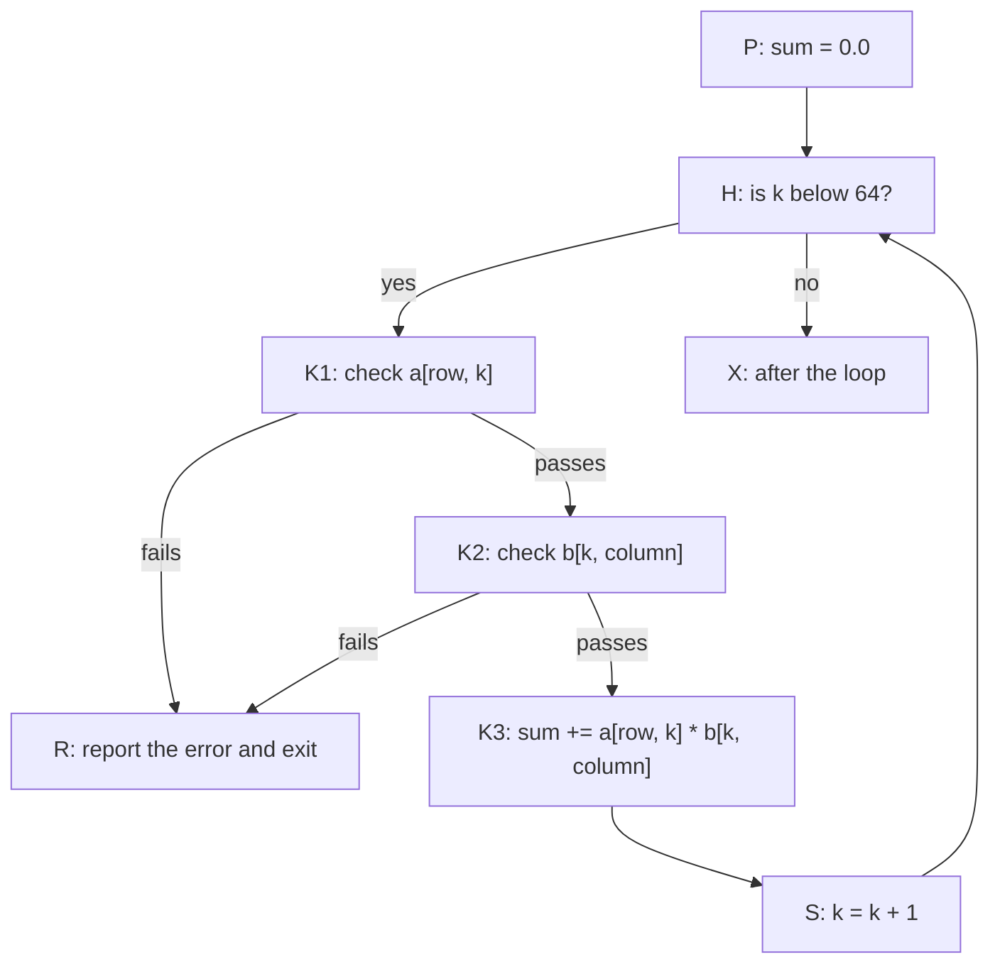

# O2. Control-flow graphs and dominance

<p class="page-intro">An optimizer keeps asking what happens on every path through a function: whether a value has already been computed, whether an index has already been checked, where two versions of a variable meet. This chapter builds the two structures that answer those questions, the control-flow graph and its dominator tree, and applies them to the code a Vortex compiler emits, from the stage 7 loop to the matrix multiplication kernel.</p>

<p class="vx-meta" markdown="1">Level: Intermediate · Reading time: about 45 minutes · Builds on: [O1. The optimizer's contract](o1-optimizer-contract.md), [Build v0.1, stage 7](../compiler/guide/stage-7-functions-and-control-flow.md)</p>

???+ remember "Before you start, remember"

    ??? question "What does a basic block never contain in its middle?"

        A branch, or a place a branch can land. Control enters a block only at its top and leaves only at its bottom.

        Introduced in [Build v0.1, stage 7](../compiler/guide/stage-7-functions-and-control-flow.md#basic-blocks-and-control-flow-graphs).

    ??? question "Where does `continue` go in a `while` loop, and where in a `for` loop?"

        In a `while` loop, back to the block that tests the condition. In a `for` loop, through the step that moves the loop variable to its next value, and from there to the test.

        Introduced in [Build v0.1, stage 7](../compiler/guide/stage-7-functions-and-control-flow.md#for-loops-over-integer-ranges).

    ??? question "May statements follow a `return`, `break` or `continue`, and do they run?"

        They may. They are valid and still checked, but they never run.

        Introduced in [Statements, decision 9](../decisions/statements.md#d9).

    ??? question "What code does a runtime check become, in the suggested default?"

        A comparison and a branch before the operation it guards. The failing side calls one reporting function in the runtime, which writes the error line and exits with status 101.

        Introduced in [Implementation, I8](../decisions/implementation.md#i8).

    ??? question "What must an optimized Vortex program keep?"

        Everything a program can observe: what it prints, its runtime error line and its exit status. Decision 56 adds that every floating-point operation keeps its exact IEEE 754 result, bit for bit.

        Introduced in [Conformance 1.3](../specification/conformance.md#13-implementation-conformance) and [Numbers, decision 56](../decisions/numbers.md#d56).

!!! goals "In this chapter"

    - Split a function into basic blocks and draw its control-flow graph, including the blocks no path reaches.
    - Compute dominators, the dominator tree and dominance frontiers, by hand and with the algorithm of Cooper, Harvey and Kennedy.
    - Explain why visiting blocks in reverse postorder makes that algorithm fast.
    - Recognize back edges, natural loops and irreducible control flow, and explain why Vortex's statements should produce only reducible graphs.
    - Use post-dominance to find where paths meet again, and connect it to control dependence and GPU reconvergence.

## Questions about every path

Here is the kernel from [stage 10](../compiler/guide/stage-10-matrix-multiplication.md#the-program-the-milestone-asks-for), written for the 64 by 64 matrices that [O1](o1-optimizer-contract.md) also uses:

```vortex
// items: valid
fn multiply(a: &[f32; 64, 64], b: &[f32; 64, 64], c: &mut [f32; 64, 64]) {
    for row in 0..64 {
        for column in 0..64 {
            let mut sum: f32 = 0.0;
            for k in 0..64 {
                sum += a[row, k] * b[k, column];
            }
            c[row, column] = sum;
        }
    }
}
```

A v0.1 compiler checks every index before it reads `a[row, k]` or `b[k, column]` ([stage 9](../compiler/guide/stage-9-runtime-safety.md)). Three later optimizations need facts about this code:

- To delete the check on `b[k, column]` ([O8](o8-loops.md)), a compiler must know that the test `k < 64` has succeeded on every path to the read.
- To keep `sum` in a register ([O3](o3-ssa.md)), it must know where the value from before the `k` loop meets the value from the last iteration.
- To reuse a value instead of recomputing it ([O6](o6-redundancy.md)), it must know that the first computation runs on every path to the second.

Each question is about every path through the function, and a function with a loop has infinitely many. Two finite structures answer them: the **control-flow graph**, which describes all the paths at once, and the **dominator tree**, which records, for each block, the blocks that every path to it must pass through. This chapter builds both, by hand and by algorithm, and follows them into loops, reversed graphs and real compiler passes.

## Basic blocks

[Stage 7](../compiler/guide/stage-7-functions-and-control-flow.md#while-loops) drew this program as a graph:

```vortex
// program: valid
fn main() {
    let mut count = 0;
    let mut total = 0;
    while count < 10 {
        count += 1;
        if count % 2 == 0 {
            continue;
        }
        if total > 10 {
            break;
        }
        total += count;
    }
    print(total);
}
```

A back end first lowers it to a flat list of instructions with labels and jumps. In pseudo-code, one lowering that follows stage 7's rules is:

```text
 0      count = 0
 1      total = 0
 2  B:  if not (count < 10) goto F
 3      count = count + 1
 4      if count % 2 == 0 goto B
 5      if total > 10 goto F
 6      total = total + count
 7      goto B
 8  F:  print(total)
 9      return
```

Instruction 4 is the `continue`, which goes back to the test, and instruction 5 is the `break`.

A **basic block** is a run of instructions that always executes from top to bottom: control enters only at the first instruction and leaves only after the last. In LLVM, every block ends with a terminator instruction, "such as a branch or function return";[^langref-fn] blocks need not be as long as possible.[^cytron]

To find the blocks, mark the **leaders**, the instructions where a block must begin:

- the first instruction;
- every instruction that a jump can land on;
- every instruction right after a jump, a conditional branch or a return.

Each block runs from one leader up to the next. Here the leaders are 0, 2, 3, 5, 6 and 8, so there are six blocks: A (instructions 0 and 1), B (2), C (3 and 4), D (5), E (6 and 7) and F (8 and 9). Instruction 3 is a leader although nothing jumps to it, because instruction 2 may jump away, and a block has only one way out, at its end.

A **control-flow graph**, or CFG, has one node per block and an **edge** from X to Y when control can pass from the end of X straight to the start of Y, by a jump or by falling through. Y is then a **successor** of X, and X a **predecessor** of Y; a block with several predecessors, stage 7's join point, is a **join node**.[^cytron] Execution starts in the **entry block**, A here, which LLVM forbids any branch to target.[^langref-fn] Blocks that end with a return, or with a call to the runtime's error report, have no successors: they are the function's **exits**.

Figure 1 draws the graph, and beside it the dominator tree that the next sections build.

<figure class="vx-figure">
<svg viewBox="0 0 760 400" role="img" aria-label="The stage 7 loop as a control-flow graph, beside its dominator tree" aria-describedby="o2-f1-desc">
<title id="o2-f1-title">The stage 7 loop as a control-flow graph, beside its dominator tree</title>
<desc id="o2-f1-desc">Left: six basic blocks. A sets count and total to zero and leads to B, the loop header, which tests count less than 10. B's true edge leads to C, which adds one to count and tests whether it is even. C's even edge, labelled continue, goes back to B, and its odd edge goes to D. D tests total greater than 10. Its yes edge, labelled break, goes to F, and its no edge goes to E, which adds count to total and goes back to B. B's false edge also goes to F, which prints total. The two edges back to B are drawn as moving dashes, and a dot travels the path A, B, F. Right: the dominator tree. A is the root, B is its child, C and F are children of B, D is the child of C, and E is the child of D.</desc>
<defs><marker id="o2-f1-head" viewBox="0 0 10 10" refX="10" refY="5" markerWidth="6" markerHeight="6" orient="auto"><path class="vx-arrowhead" d="M0 0 L10 5 L0 10 z"/></marker></defs>
<text class="vx-text" x="20" y="24">Control-flow graph</text>
<text class="vx-text" x="600" y="24">Dominator tree</text>
<rect class="vx-box" x="130" y="44" width="230" height="34" rx="4"/>
<text class="vx-text" x="142" y="66">A</text>
<text class="vx-mono" x="166" y="66">count = 0; total = 0</text>
<rect class="vx-box-strong" x="130" y="112" width="230" height="34" rx="4"/>
<text class="vx-text" x="142" y="134">B</text>
<text class="vx-mono" x="166" y="134">count &lt; 10 ?</text>
<rect class="vx-box" x="130" y="180" width="230" height="34" rx="4"/>
<text class="vx-text" x="142" y="202">C</text>
<text class="vx-mono" x="166" y="202">count += 1; even ?</text>
<rect class="vx-box" x="130" y="248" width="230" height="34" rx="4"/>
<text class="vx-text" x="142" y="270">D</text>
<text class="vx-mono" x="166" y="270">total &gt; 10 ?</text>
<rect class="vx-box" x="130" y="316" width="230" height="34" rx="4"/>
<text class="vx-text" x="142" y="338">E</text>
<text class="vx-mono" x="166" y="338">total += count</text>
<rect class="vx-box-accent" x="420" y="248" width="140" height="34" rx="4"/>
<text class="vx-text" x="432" y="270">F</text>
<text class="vx-mono" x="452" y="270">print(total)</text>
<line class="vx-line" x1="245" y1="78" x2="245" y2="112" marker-end="url(#o2-f1-head)"/>
<line class="vx-line" x1="245" y1="146" x2="245" y2="180" marker-end="url(#o2-f1-head)"/>
<text class="vx-text-muted" x="252" y="168">true</text>
<line class="vx-line" x1="245" y1="214" x2="245" y2="248" marker-end="url(#o2-f1-head)"/>
<text class="vx-text-muted" x="252" y="236">odd</text>
<line class="vx-line" x1="245" y1="282" x2="245" y2="316" marker-end="url(#o2-f1-head)"/>
<text class="vx-text-muted" x="252" y="304">no</text>
<path class="vx-line" d="M360 129 L490 129 L490 248" marker-end="url(#o2-f1-head)"/>
<text class="vx-text-muted" x="370" y="121">false</text>
<line class="vx-line" x1="360" y1="265" x2="420" y2="265" marker-end="url(#o2-f1-head)"/>
<text class="vx-text-accent" x="364" y="258">break</text>
<path class="vx-flow" d="M130 197 L100 197 L100 138 L130 138" marker-end="url(#o2-f1-head)"/>
<text class="vx-text-accent" x="104" y="166">continue</text>
<path class="vx-flow" d="M130 333 L60 333 L60 122 L130 122" marker-end="url(#o2-f1-head)"/>
<text class="vx-text-muted" x="66" y="300">end of body</text>
<circle class="vx-dot" r="6"><animateMotion dur="6s" repeatCount="indefinite" path="M245 90 L245 129 L490 129 L490 248"/></circle>
<rect class="vx-box" x="638" y="44" width="44" height="30" rx="4"/>
<text class="vx-text" x="660" y="64" text-anchor="middle">A</text>
<rect class="vx-box-strong" x="638" y="112" width="44" height="30" rx="4"/>
<text class="vx-text" x="660" y="132" text-anchor="middle">B</text>
<rect class="vx-box" x="598" y="180" width="44" height="30" rx="4"/>
<text class="vx-text" x="620" y="200" text-anchor="middle">C</text>
<rect class="vx-box-accent" x="678" y="180" width="44" height="30" rx="4"/>
<text class="vx-text" x="700" y="200" text-anchor="middle">F</text>
<rect class="vx-box" x="598" y="248" width="44" height="30" rx="4"/>
<text class="vx-text" x="620" y="268" text-anchor="middle">D</text>
<rect class="vx-box" x="598" y="316" width="44" height="30" rx="4"/>
<text class="vx-text" x="620" y="336" text-anchor="middle">E</text>
<line class="vx-line" x1="660" y1="74" x2="660" y2="112"/>
<line class="vx-line" x1="652" y1="142" x2="628" y2="180"/>
<line class="vx-line" x1="668" y1="142" x2="692" y2="180"/>
<line class="vx-line" x1="620" y1="210" x2="620" y2="248"/>
<line class="vx-line" x1="620" y1="278" x2="620" y2="316"/>
<text class="vx-text-muted" x="600" y="372">each block hangs from</text>
<text class="vx-text-muted" x="600" y="388">its immediate dominator</text>
<text class="vx-text-muted" x="20" y="388">moving dashes: the two edges back to B · dot: the path A, B, F</text>
</svg>
<figcaption>Figure 1. Left: the stage 7 loop as six basic blocks, with B, the loop header, outlined. The moving dashes are the two edges back to B; the one labelled continue comes from C. Right: the dominator tree, in which each block hangs from its immediate dominator. F hangs from B, not from D: the moving dot follows the path A, B, F, which reaches F without passing through D.</figcaption>
</figure>

The first example applies the leader rule to a toy function, then finds each block's successors from its last instruction:

--8<-- "includes/examples/optimize/o2-cfg-and-dominance/blocks.cpp.md"

### Blocks that no path reaches

The example's last block, B6, follows a `return` and has no label, so no edge enters it. A block is **reachable** when some path from the entry leads to it, and **unreachable** otherwise. Vortex produces unreachable code legally: statements after a `return`, `break` or `continue` are valid and never run ([decision 9](../decisions/statements.md#d9)).

For unreachable blocks dominance is undefined, and so is the notion of a loop,[^llvm-loops] so everything that follows speaks of reachable blocks only. They still cause trouble, because they can have edges into reachable ones: the statements after a `break` inside an `if` fall through to whatever follows the `if`. A compiler must delete them before analysis or skip them wherever it walks predecessors.

### Critical edges

A **critical edge** runs from a block with several successors to a block with several predecessors;[^llvm-cfg] Figure 1 has three, B → F, C → B and D → F. Code that must run only when control crosses such an edge has no block to live in: at the end of the source block it would also run on the other outgoing edges, and at the start of the target block on the other incoming ones.

**Splitting** the edge, placing an empty block on it, gives the code a home. Optimizations that insert code along an edge must split it first,[^wiki-cfg] and two later ones do: SSA destruction ([O3](o3-ssa.md)) and code motion ([O6](o6-redundancy.md)). Cooper, Harvey and Kennedy call splitting a transformation often done "to enable or simplify optimizations",[^chk] and LLVM's `break-crit-edges` pass splits every critical edge in a function.[^llvm-passes]

## Visiting the blocks in order

Algorithms on a CFG visit its blocks in a chosen order, and the order decides how soon they finish. The standard orders come from a **depth-first search** from the entry, which follows an unvisited successor as far as possible and backs up only when a block has none left. A block **finishes** when the search backs up out of it. The order of finishing is the **postorder**, which gives each block its **postorder number**, and **reverse postorder** is that order backwards.

In Figure 1, trying true edges first, the search goes A, B, C, then, since C's `continue` edge leads back to the visited B, on to D and then F, which has no successors and finishes first. The search backs up to D and visits E, whose successor B is visited, so E finishes, then D, C, B and A. The postorder is F, E, D, C, B, A, numbered from F = 0 up to A = 5, and the reverse postorder is A, B, C, D, E, F.

Reverse postorder has the property that matters. Take an edge X → Y. If Y is not on the search's current path when the search crosses the edge, Y finishes before X, either because it already has or because the search visits it now, so X comes before Y in reverse postorder. The exceptions are edges to a block still on the current path, an ancestor of X in the search: **retreating edges**.[^wiki-cfg] Figure 1 has two, C → B and E → B, the edges that close the loop. So in reverse postorder a block comes after all its predecessors except those that reach it along retreating edges: the right order for any analysis whose facts flow forward.

## Dominance

Ask which blocks lie on every path from A to E. A path to E must enter the loop at B, pass C to reach D, and pass D to reach E, so the answer is A, B, C, D and E itself. For F the answer is shorter: the path A, B, F avoids C, D and E, so only A, B and F lie on every path to F.

Block X **dominates** block Y when every path from the entry to Y passes through X.[^cytron] Prosser introduced the idea in 1959, and used it to show that reordering code was safe.[^chk] Every block dominates itself, and X **strictly dominates** Y when X dominates Y and X is not Y. Dominance is also transitive.[^cytron]

The dominators of a block form a chain: of any two blocks that both dominate Z, one dominates the other.[^chk] So a block's strict dominators can be listed from the entry down, and the closest, the last in that list, is its **immediate dominator**, written idom. Making each block a child of its immediate dominator gives a tree rooted at the entry, the **dominator tree** (Figure 1, right).[^cytron] X dominates Y exactly when X is Y or an ancestor of Y in the tree.

Here idom(B) = A, idom(C) = B, idom(D) = C, idom(E) = D and idom(F) = B. F's parent is B, not D: D is a predecessor of F, but the path A, B, F avoids it.

Climbing the tree answers "does X dominate Y?" in time that grows with the tree's depth; numbering the tree answers it at once. Walk the tree depth first with one counter, and give each block the counter's value when the walk enters it and again when it leaves. X dominates Y exactly when Y's pair lies inside X's. For Figure 1 the pairs are A (0, 11), B (1, 10), C (2, 7), D (3, 6), E (4, 5) and F (8, 9), so B dominates F and D does not. LLVM stores such a pair in each tree node and renumbers lazily, because any change to the tree makes the pairs stale.[^llvm-gdt]

What dominance buys is a guarantee about the past. If X dominates Y, then whenever Y runs, X has already run on the same path. A value computed in X exists in Y; a check made in X has passed, or the program has already stopped.

The guarantee extends to instructions: within one block, an instruction dominates those after it.[^wiki-cfg] LLVM builds this into its IR: a value's definition must dominate each of its uses, and the reference manual calls `%x = add i32 1, %x` syntactically correct but not well formed, because the definition of `%x` "does not dominate all of its uses".[^langref-wf] A phi is the one special case: its use of an incoming value counts as happening on the edge from the matching predecessor, not in the phi's own block.[^langref-phi]

??? check "Which blocks does C dominate, and of which is it the immediate dominator?"

    C dominates C, D and E: every path to D or E passes through C. It is the immediate dominator of D only. E's immediate dominator is D, which lies between C and E on every path.

## Computing dominators

The definition gives a slow algorithm. Delete a block X and search from the entry: the blocks that can no longer be reached are the ones X strictly dominates. Early algorithms worked this way, removing one block at a time.[^chk]

A faster one comes from an observation about paths. Every path to a block n, other than the entry, arrives through one of n's predecessors. So a block other than n dominates n exactly when it dominates every predecessor of n:

$$
\mathrm{Dom}(\text{entry}) = \{\text{entry}\}, \qquad
\mathrm{Dom}(n) = \{n\} \cup \bigcap_{p \,\in\, \mathrm{preds}(n)} \mathrm{Dom}(p)
$$

Frances Allen proposed these equations in 1970, and Allen and Cocke solved them by iteration:[^chk] start every set except the entry's at "all blocks", recompute each set from the predecessors' sets, and repeat until a pass changes nothing. Starting full matters, because a loop header depends on blocks the first pass has not reached yet; a full set can only shrink, and it stops at the answer the definition gives. [O4](o4-dataflow.md) develops the theory behind this.

### Keeping only the tree

A set per block wastes space: Dom(E) = {A, B, C, D, E} repeats Dom(D) and adds one block. Each set is a path up the dominator tree, so Cooper, Harvey and Kennedy keep only the tree, in one array, `doms`, holding each block's immediate dominator.[^chk] Intersecting two sets becomes finding where two paths up the tree meet. Put a finger on each block; while they differ, move the finger on the block with the smaller postorder number up to that block's immediate dominator. The fingers meet at the deepest block the two sets share.

This works because a block's dominators have higher postorder numbers than the block: the search reaches the block only through them, so it finishes the block first.[^chk] Step through the algorithm on Figure 1, visiting the blocks in reverse postorder:

<div class="vx-stepper" markdown="1">
<div class="vx-step" markdown="1">

**Step 1. Number the blocks and start the array**

The search above gave the postorder numbers. Only the entry has an immediate dominator to begin with: itself.

| Block | A | B | C | D | E | F |
| --- | --- | --- | --- | --- | --- | --- |
| Postorder number | 5 | 4 | 3 | 2 | 1 | 0 |
| `doms` | A | | | | | |

</div>
<div class="vx-step" markdown="1">

**Step 2. First pass: B, C, D, E, F**

- B has predecessors A, C and E, and only A has an entry yet, so `doms[B] = A`.
- C, D and E have one predecessor each, already done: `doms[C] = B`, `doms[D] = C` and `doms[E] = D`.
- F has predecessors B and D. Start from B and intersect with D: the finger on D (number 2) moves up to C (3), then to B (4), and meets the other finger. So `doms[F] = B`.

| Block | A | B | C | D | E | F |
| --- | --- | --- | --- | --- | --- | --- |
| `doms` | A | A | B | C | D | B |

</div>
<div class="vx-step" markdown="1">

**Step 3. Second pass: nothing changes**

B now sees all three predecessors. Intersecting with C moves that finger up through B to A; intersecting with E moves it through D, C and B to A. Both give A, so `doms[B]` stays A, and no other entry changes. The algorithm stops after two passes, the second only confirming the first. The `doms` row is the dominator tree of Figure 1.

</div>
</div>

The order is what made one pass enough: every predecessor of a block, except those reaching it along retreating edges, was handled before the block, so every intersection saw final answers. Visiting in postorder instead sends information the wrong way. Each pass settles only one more block along the chain from B down to E, and the same graph needs five passes. The second example runs both orders:

--8<-- "includes/examples/optimize/o2-cfg-and-dominance/dominators.cpp.md"

Cooper, Harvey and Kennedy quote a bound of d(G) + 3 passes in reverse postorder, where d(G), the **loop connectedness**, is the largest number of retreating edges on any path that repeats no block; it is 1 for Figure 1.[^chk] [^wiki-cfg] They also recount Hecht and Ullman's result that on a reducible graph, a kind defined later in this chapter, one pass in reverse postorder finds the answer,[^chk] as it did here.

The simple algorithm is also fast. Cooper, Harvey and Kennedy compared it with their implementation of Lengauer and Tarjan's algorithm, the best-known fast method, whose running time is almost linear.[^chk] [^lt79] On 169 Fortran routines, on a 300 MHz Sun Ultra 10, theirs computed dominators about 2.5 times faster on average, and on random graphs modelled on their programs the two took about the same time at 30,000 blocks, almost forty times the largest control-flow graph in the SPEC benchmarks.[^chk] LLVM uses a third method, Semi-NCA, which its source describes as quadratic in the worst case but usually slightly faster than a simple Lengauer-Tarjan, and it updates its trees in place as passes change the graph.[^llvm-gdtc]

## The dominance frontier

Dominance says where a block's influence is guaranteed; the dominance frontier says where the guarantee ends. In Figure 2, C dominates C, D and E. Control leaves that region along three edges: C → B by `continue`, E → B at the end of the body, and D → F by `break`. C dominates a predecessor of B and of F, but strictly dominates neither.

The **dominance frontier** of X, written DF(X), is the set of blocks Y such that X dominates a predecessor of Y but does not strictly dominate Y.[^cytron] So DF(C) = {B, F}. A block can be in its own frontier: B dominates E, a predecessor of B, but does not strictly dominate itself, so DF(B) = {B}. That is how a loop header appears in the frontier of its own loop.

<figure class="vx-figure">
<svg viewBox="0 0 760 380" role="img" aria-label="The blocks C dominates, the edges that leave them, and the frontier where those edges land" aria-describedby="o2-f2-desc">
<title id="o2-f2-title">The dominance region of C and its frontier</title>
<desc id="o2-f2-desc">The control-flow graph of Figure 1. A dashed outline surrounds C, D and E, the blocks that C dominates, which are drawn with accented outlines. Three edges leave that region, drawn as moving dashes: C to B, labelled continue; E to B, the end of the loop body; and D to F, labelled break. B and F, where those edges land, are drawn with dashed outlines: they form the dominance frontier of C. A note on the right reads: dominated by C: C, D, E. Edges leaving the region: C to B, E to B, D to F. Frontier: DF of C equals B and F.</desc>
<defs><marker id="o2-f2-head" viewBox="0 0 10 10" refX="10" refY="5" markerWidth="6" markerHeight="6" orient="auto"><path class="vx-arrowhead" d="M0 0 L10 5 L0 10 z"/></marker></defs>
<rect class="vx-line" x="118" y="172" width="254" height="188" rx="8" stroke-dasharray="6 5"/>
<rect class="vx-box" x="130" y="44" width="230" height="34" rx="4"/>
<text class="vx-text" x="142" y="66">A</text>
<text class="vx-mono" x="166" y="66">count = 0; total = 0</text>
<rect class="vx-box-bad" x="130" y="112" width="230" height="34" rx="4"/>
<text class="vx-text" x="142" y="134">B</text>
<text class="vx-mono" x="166" y="134">count &lt; 10 ?</text>
<rect class="vx-box-accent" x="130" y="180" width="230" height="34" rx="4"/>
<text class="vx-text" x="142" y="202">C</text>
<text class="vx-mono" x="166" y="202">count += 1; even ?</text>
<rect class="vx-box-accent" x="130" y="248" width="230" height="34" rx="4"/>
<text class="vx-text" x="142" y="270">D</text>
<text class="vx-mono" x="166" y="270">total &gt; 10 ?</text>
<rect class="vx-box-accent" x="130" y="316" width="230" height="34" rx="4"/>
<text class="vx-text" x="142" y="338">E</text>
<text class="vx-mono" x="166" y="338">total += count</text>
<rect class="vx-box-bad" x="420" y="248" width="140" height="34" rx="4"/>
<text class="vx-text" x="432" y="270">F</text>
<text class="vx-mono" x="452" y="270">print(total)</text>
<line class="vx-line" x1="245" y1="78" x2="245" y2="112" marker-end="url(#o2-f2-head)"/>
<line class="vx-line" x1="245" y1="146" x2="245" y2="180" marker-end="url(#o2-f2-head)"/>
<line class="vx-line" x1="245" y1="214" x2="245" y2="248" marker-end="url(#o2-f2-head)"/>
<line class="vx-line" x1="245" y1="282" x2="245" y2="316" marker-end="url(#o2-f2-head)"/>
<path class="vx-line" d="M360 129 L490 129 L490 248" marker-end="url(#o2-f2-head)"/>
<line class="vx-flow" x1="360" y1="265" x2="420" y2="265" marker-end="url(#o2-f2-head)"/>
<text class="vx-text-accent" x="378" y="241">break</text>
<path class="vx-flow" d="M130 197 L100 197 L100 138 L130 138" marker-end="url(#o2-f2-head)"/>
<text class="vx-text-accent" x="104" y="162">continue</text>
<path class="vx-flow" d="M130 333 L60 333 L60 122 L130 122" marker-end="url(#o2-f2-head)"/>
<text class="vx-text-accent" x="580" y="190">dominated by C</text>
<text class="vx-mono" x="580" y="210">C, D, E</text>
<text class="vx-text-muted" x="580" y="246">edges leaving the region</text>
<text class="vx-mono" x="580" y="266">C→B, E→B, D→F</text>
<text class="vx-text" x="580" y="302">frontier</text>
<text class="vx-mono" x="580" y="322">DF(C) = {B, F}</text>
</svg>
<figcaption>Figure 2. The region C dominates (C, D and E, accented) and the three edges that leave it (moving dashes). They land on B and F, the dashed blocks: C dominates a predecessor of each but strictly dominates neither, so DF(C) = {B, F}.</figcaption>
</figure>

Cytron and his coauthors introduced the frontier to answer a question from the opening: where do two versions of a variable meet?[^cytron] Suppose a variable is assigned in only one block, X, besides the value it holds at the entry. Every block X strictly dominates sees X's value, however far from X it lies. A block in DF(X) may be entered along one edge carrying X's value and along another carrying the older one, so it needs a **phi function** to choose between them.[^cytron]

With several assignments, place phis at the frontier of every block that assigns the variable, then at the frontier of every block that received a phi, since a phi is an assignment too, until nothing changes. The result, the **iterated dominance frontier**, is exactly the set of blocks that need a phi, counting the entry as assigning every variable, as Cytron and his coauthors prove.[^cytron] [O3](o3-ssa.md) builds SSA form on it.

In the running example, `total` is assigned in A and E; DF(E) = {B}, and DF(B) = {B} adds nothing, so `total` needs one phi, at B. `count` is assigned in A and C, and DF(C) = {B, F}, so it needs phis at B and at F. The phi at F is real: along B → F, `count` holds the value the header tested; along D → F, the value C incremented after that test. Nothing reads `count` at F, so that phi is dead; Cytron and his coauthors keep such phis on purpose, because later passes can use them.[^cytron]

Cooper, Harvey and Kennedy compute frontiers with a method they credit to earlier work by Ferrante and others.[^chk] Only a join block can be in a frontier. For each join block J, walk up the dominator tree from each predecessor of J, stop at idom(J), and add J to the frontier of every block the walk passes. For F, with predecessors B and D and idom(F) = B, the walk from B stops at once and the walk from D passes D and C, so F joins DF(D) and DF(C). The third example computes every frontier this way, then places the phis for `count` and `total`:

--8<-- "includes/examples/optimize/o2-cfg-and-dominance/frontiers.cpp.md"

??? check "A third variable is assigned in A and in D, immediately before the test `total > 10`. Where does it need phis?"

    At B and F. DF(D) = {B, F}, DF(B) = {B} and DF(F) is empty, so the iterated frontier is {B, F}. The phi at B merges the value from A with a value D assigned in an earlier iteration; the phi at F merges the value seen at the header with the value D assigned before the `break`.

## Loops, from dominance

Dominance also finds loops, with no help from the source. An edge X → H whose target dominates its source is a **back edge**, and H is a **loop header**;[^wiki-cfg] in Figure 1, C → B and E → B are back edges. LLVM defines a loop as a set of blocks that is strongly connected, is entered from outside only at its header, and cannot grow without breaking these conditions, and notes that the literature calls it a **natural loop**.[^llvm-loops]

To find the blocks of a back edge X → H, walk predecessors backwards from X, collecting every block that reaches X without passing through H, then add H. In Figure 1, E → B gives {B, C, D, E} and C → B gives {B, C}. A block heads at most one LLVM loop,[^llvm-loops] so back edges to the same header make one loop: {B, C, D, E}.

LLVM names the parts.[^llvm-loops] A **latch** is a loop block with an edge to the header, the source of a back edge. An **exiting edge** leaves the loop, from an **exiting block** to an **exit block**. An **entering block** lies outside the loop and has an edge into it, necessarily to the header; when there is only one, and its only edge goes to the header, it is the loop's **preheader**.

Every edge from outside enters at the header, so the header dominates the whole loop, and so does a preheader. That makes the preheader the place to hoist work that gives the same result in every iteration.[^llvm-loops] The catch is a loop that runs zero times: hoisted work then runs when the original never did, which is wrong for a load that might fail. LLVM's documentation shows how rotating the loop behind a guard avoids this;[^llvm-loops] [O8](o8-loops.md) returns to it.

The running example's loop has latches C and E, exiting edges B → F and D → F, and one exit block, F. The second latch comes from `continue`, which in a `while` jumps straight to the header. LLVM's canonical loop form asks for a preheader, a single back edge and **dedicated exits**, exit blocks entered only from inside the loop, and its LoopSimplify pass creates them.[^llvm-loops] The running example already has two of the three: A is its preheader, and both edges into F come from inside the loop. Only the second latch breaks the form. A Vortex `for` loop lowered as stage 7 describes has one latch, because `continue` goes through the step block.

Loops nest. In LLVM's definition two loops either share no block or one contains the other,[^llvm-loops] so a function's loops form a forest, and the dominator tree follows the nesting. In the stage 10 kernel, the `row` header dominates the `column` header, which dominates the `k` header. [O8](o8-loops.md) builds on this structure.

## Reducible and irreducible graphs

Not every cycle is a loop in this sense. In Figure 3, right, a cycle can be entered at h or at b. Neither dominates the other, so the cycle has no header, no back edge and no natural loop. LLVM's documentation calls this **irreducible control flow**, and a graph without it **reducible**, a name that comes from collapsing the graph into one node by repeatedly replacing sequences, acyclic branches and self-loops.[^llvm-loops] LLVM calls any cycle irreducible when it has more than one entry.[^llvm-cycles] In terms of this chapter: a graph is reducible exactly when every retreating edge of a depth-first search is a back edge.[^wiki-cfg]

<figure class="vx-figure">
<svg viewBox="0 0 760 300" role="img" aria-label="A loop with a break, the same graph reversed, and a jump into a loop" aria-describedby="o2-f3-desc">
<title id="o2-f3-title">A reducible loop, its reversed graph, and a jump into a loop</title>
<desc id="o2-f3-desc">Three small graphs with nodes s, h, b and x. Left, a loop with a break: s goes to h, h goes to b, b goes back to h, b breaks out to x, and h also exits to x. The cycle of h and b is entered only at h, which dominates b, so the graph is reducible. Middle, the same graph with every edge reversed: the start is now x, which has edges into both h and b, so the cycle is entered at two places and is irreducible; h and b are drawn with dashed outlines. Right, a jump into the loop: s goes to h and also directly to b, h and b form a cycle, and b goes to x; again the cycle is entered at h and at b, and is irreducible. In each graph, the edges that enter the cycle are drawn as moving dashes.</desc>
<defs><marker id="o2-f3-head" viewBox="0 0 10 10" refX="10" refY="5" markerWidth="6" markerHeight="6" orient="auto"><path class="vx-arrowhead" d="M0 0 L10 5 L0 10 z"/></marker></defs>
<text class="vx-text" x="20" y="24">A loop with a break</text>
<text class="vx-text-accent" x="20" y="44">reducible</text>
<circle class="vx-box" cx="100" cy="76" r="18"/>
<circle class="vx-box" cx="100" cy="146" r="18"/>
<circle class="vx-box" cx="100" cy="216" r="18"/>
<circle class="vx-box" cx="190" cy="216" r="18"/>
<text class="vx-mono" x="100" y="81" text-anchor="middle">s</text>
<text class="vx-mono" x="100" y="151" text-anchor="middle">h</text>
<text class="vx-mono" x="100" y="221" text-anchor="middle">b</text>
<text class="vx-mono" x="190" y="221" text-anchor="middle">x</text>
<text class="vx-text-muted" x="44" y="80">start</text>
<line class="vx-flow" x1="100" y1="94" x2="100" y2="128" marker-end="url(#o2-f3-head)"/>
<line class="vx-line" x1="100" y1="164" x2="100" y2="198" marker-end="url(#o2-f3-head)"/>
<path class="vx-line" d="M84 208 C58 196 58 166 84 154" marker-end="url(#o2-f3-head)"/>
<line class="vx-line" x1="118" y1="216" x2="172" y2="216" marker-end="url(#o2-f3-head)"/>
<line class="vx-line" x1="114" y1="157" x2="176" y2="205" marker-end="url(#o2-f3-head)"/>
<text class="vx-text-muted" x="20" y="266">one entry into {h, b}: h,</text>
<text class="vx-text-muted" x="20" y="284">and h dominates b</text>
<text class="vx-text" x="270" y="24">The same graph reversed</text>
<text class="vx-text-accent" x="270" y="44">irreducible</text>
<circle class="vx-box" cx="350" cy="76" r="18"/>
<circle class="vx-box-bad" cx="350" cy="146" r="18"/>
<circle class="vx-box-bad" cx="350" cy="216" r="18"/>
<circle class="vx-box" cx="440" cy="216" r="18"/>
<text class="vx-mono" x="350" y="81" text-anchor="middle">s</text>
<text class="vx-mono" x="350" y="151" text-anchor="middle">h</text>
<text class="vx-mono" x="350" y="221" text-anchor="middle">b</text>
<text class="vx-mono" x="440" y="221" text-anchor="middle">x</text>
<text class="vx-text-muted" x="464" y="220">start</text>
<line class="vx-line" x1="350" y1="128" x2="350" y2="94" marker-end="url(#o2-f3-head)"/>
<line class="vx-line" x1="350" y1="198" x2="350" y2="164" marker-end="url(#o2-f3-head)"/>
<path class="vx-line" d="M334 154 C308 166 308 196 334 208" marker-end="url(#o2-f3-head)"/>
<line class="vx-flow" x1="422" y1="216" x2="368" y2="216" marker-end="url(#o2-f3-head)"/>
<line class="vx-flow" x1="426" y1="205" x2="364" y2="157" marker-end="url(#o2-f3-head)"/>
<text class="vx-text-muted" x="270" y="266">two entries into {h, b}:</text>
<text class="vx-text-muted" x="270" y="284">neither dominates the other</text>
<text class="vx-text" x="520" y="24">A jump into the loop</text>
<text class="vx-text-accent" x="520" y="44">irreducible, needs a goto</text>
<circle class="vx-box" cx="600" cy="76" r="18"/>
<circle class="vx-box-bad" cx="600" cy="146" r="18"/>
<circle class="vx-box-bad" cx="600" cy="216" r="18"/>
<circle class="vx-box" cx="690" cy="216" r="18"/>
<text class="vx-mono" x="600" y="81" text-anchor="middle">s</text>
<text class="vx-mono" x="600" y="151" text-anchor="middle">h</text>
<text class="vx-mono" x="600" y="221" text-anchor="middle">b</text>
<text class="vx-mono" x="690" y="221" text-anchor="middle">x</text>
<text class="vx-text-muted" x="544" y="80">start</text>
<line class="vx-flow" x1="600" y1="94" x2="600" y2="128" marker-end="url(#o2-f3-head)"/>
<line class="vx-line" x1="600" y1="164" x2="600" y2="198" marker-end="url(#o2-f3-head)"/>
<path class="vx-line" d="M584 208 C558 196 558 166 584 154" marker-end="url(#o2-f3-head)"/>
<line class="vx-line" x1="618" y1="216" x2="672" y2="216" marker-end="url(#o2-f3-head)"/>
<path class="vx-flow" d="M616 84 C652 110 652 182 616 208" marker-end="url(#o2-f3-head)"/>
<text class="vx-text-muted" x="520" y="266">two entries into {h, b},</text>
<text class="vx-text-muted" x="520" y="284">the same shape as the middle</text>
</svg>
<figcaption>Figure 3. Left: a loop with a <code>break</code>. The cycle through h and b is entered only at h, which dominates b, so the graph is reducible. Middle: the same graph with its edges reversed, as a post-dominator computation sees it. The start is now x, and the cycle is entered at both h and b. Right: a jump from s into the middle of the loop, which v0.1 cannot express, has the same two-entry shape. The moving dashes are the edges that enter each cycle.</figcaption>
</figure>

Irreducibility costs something at every level. The iterative dominator algorithm still works, but its pass count then depends on the depth-first search chosen.[^chk] Loop optimizations see no loop. LLVM's FixIrreducible pass inserts new headers to make loops, and some back-end targets require it;[^llvm-loops] in general, removing irreducibility often duplicates code or adds variables.[^wiki-cfg]

Vortex code should never meet the problem in its forward graphs. A two-entry cycle needs a jump into the middle of a loop, and v0.1 has no `goto` and no labels ([Statements 6.12](../specification/statements.md#612-excluded-statements)), while `if`, `while`, `for`, `break` and `continue` reliably produce reducible graphs.[^wiki-cfg] "Should" is not "does": a lowering bug can produce an irreducible graph, and so can some optimizations, jump threading among them.[^wiki-cfg] The exercise checks every graph instead of trusting the argument.

Reversed graphs are another matter. Cooper, Harvey and Kennedy met irreducible graphs more often when computing post-dominators, and explain why: few languages allow a jump into a loop, almost all allow a jump out, and reversing the edges turns jumps out into jumps in.[^chk] A Vortex `break` or early `return` inside a loop is such a jump out (Figure 3, middle), and so is every runtime check inside a loop.

??? check "Is the reversed graph of the stage 10 kernel reducible?"

    No. Each bounds check inside the `k` loop has an edge out of the loop to the error report, besides the loop's normal exit from its header. Reversed, those edges enter the loop at the check blocks as well as at the header: a cycle with several entries. The forward graph is still reducible.

## Post-dominance

Turn the question around: which blocks must a path pass through after X, on its way out of the function? Block Y **post-dominates** X when every path from X to the function's exit passes through Y.[^cytron] Post-dominators are the dominators of the reversed graph,[^chk] so the same algorithm computes them, starting from the exit. A function with several exits first gets one **virtual exit** that all of them lead to: Cytron and his coauthors add such an Exit node to every CFG,[^cytron] and LLVM's post-dominator tree always has one as its root,[^llvm-gdtc] which `opt -passes='print<postdomtree>'` in LLVM 18.1.8 prints as `<<exit node>>`.

A loop that never ends breaks the definition. No path from a block inside it reaches an exit, so every block post-dominates it, vacuously,[^wiki-cfg] and a search of the reversed graph from the virtual exit never reaches it. Cytron and his coauthors assume such blocks away;[^cytron] LLVM picks a block in each such loop and connects it to the virtual exit too.[^llvm-gdtc] Stage 7's lowering of `while true` keeps an edge out, the false edge of its test, but folding that test away ([O5](o5-constants-and-dead-code.md)) leaves a loop with no exit.

In Figure 1, F post-dominates every block. The **immediate post-dominator** of a block, the first block every path from it must reach, is B for A and E, and F for B, C and D. C's is F rather than D, because `continue` leads from C back to B and out to F without passing D.

Post-dominance answers two questions for later chapters.

**Which branch decides whether a block runs?** A block is **control dependent** on a branch when one edge of the branch guarantees that the block runs and another may skip it.[^cytron] E is control dependent on D's test `total > 10`. Frontiers of the reversed graph compute these dependences: Y is control dependent on X exactly when X is in Y's frontier there.[^cytron] [^chk] Cytron and his coauthors use them to remove dead code: a branch is kept only if some statement known to be needed depends on it.[^cytron] [O5](o5-constants-and-dead-code.md) returns to this.

**Where do diverged threads meet again?** A GPU runs a group of threads, a **warp**, through the same instructions together. When a branch splits a warp, the two paths run one after the other, each with only its own threads active. In the mechanism Fung and his coauthors describe and measure, the threads reunite at the branch's immediate post-dominator, the first block every thread must reach anyway, which compilers find as part of ordinary control-flow analysis.[^fung] In the running example, threads that leave by `break` would wait at F for the rest of their warp; [G2](../gpu/g2-simt.md) develops the model.

## Dominance in LLVM and MLIR

LLVM provides these structures as analyses, `domtree`, `postdomtree` and `domfrontier`, and writes the CFG and the dominator tree as Graphviz files with `dot-cfg` and `dot-dom`.[^llvm-passes] On the fourth example below, `opt -passes='print<domtree>'` prints `%entry` with `%then` and `%join` indented beneath it (LLVM 18.1.8 on the owner's M4 Pro, checked on 2026-09-24).

Dominance is also what makes a common optimization legal. LLVM's EarlyCSE pass removes repeated computations with "a simple dominator tree walk".[^early-cse] Walking down the tree, it records each expression it meets in a table and replaces a repeat with the earlier value; when the walk leaves a block's subtree, that block's entries leave the table.[^early-cse] So at any block the table holds only expressions computed in blocks that dominate it. The fourth example gives the pass one computation it may reuse and one it may not:

--8<-- "includes/examples/optimize/o2-cfg-and-dominance/early_cse.ll.md"

For Vortex the reasoning has two refinements. Reusing the first `x * y` for a second one changes no bits, even for `f32`: [decision 56](../decisions/numbers.md#d56) requires each operation to give the correctly rounded IEEE 754 result, so the same operands give the same bits; what it forbids is fusing, regrouping or reordering operations. For loads, dominance is not enough, because a store in between might change the location. In the kernel none can: the only stores go to `c`, and the variable lent as `&mut` for `c` may appear in no other argument ([decision 25](../decisions/references.md#d25)). [O9](o9-alias-analysis.md) turns that guarantee into alias analysis.

A branch teaches something too. After the true edge of the test `k < 64`, the tested value of `k` is below 64 in every block that control can reach only through that edge: the edge **dominates** those blocks. LLVM can ask whether an edge dominates a block. It answers as if the edge were split, asking whether the new block would dominate, and it answers no when two edges join the same two blocks, since control could take the other one.[^llvm-dom] With the constant extents of a fixed-shape array, that fact is most of the proof that the check on `b[k, column]` never fails; [O8](o8-loops.md) adds the rest, that `k` never goes below 0.

MLIR keeps the rule inside regions whose blocks form a control-flow graph, its SSACFG regions, and extends it across nesting as **hierarchical dominance**: an operation nested in a region may use a value from outside only if the operation that holds the region could, and a value defined in a region can never be used outside it.[^mlir-langref] [M2](../mlir/m2-reading-mlir.md) reads such regions.

## Your turn: the kernel's inner loop

Here is the kernel's `k` loop as a v0.1 compiler might lower it, following stage 7 for the loop and [I8](../decisions/implementation.md#i8) for the checks: a comparison and a branch before each array read, with every failure going to one block that reports the error and exits.



Half of the table is filled in:

| Block | What it does | Immediate dominator |
| --- | --- | --- |
| P | `sum = 0.0`, before the loop | outside this picture |
| H | the test `k < 64` | P |
| K1 | the check on `a[row, k]` | H |
| K2 | the check on `b[k, column]` | K1 |
| K3 | `sum += a[row, k] * b[k, column]` | ? |
| S | the step to the next `k` | ? |
| R | the error report | ? |
| X | the code after the loop | ? |

Complete the last column. Then find DF(K2), the loop and its exits, and the immediate post-dominator of K1, with a virtual exit that R and the function's return both lead to.

??? check "Answers for the inner loop"

    - idom(K3) = K2, idom(S) = K3 and idom(X) = H. R has two predecessors, K1 and K2, and K1 dominates K2, so idom(R) = K1.
    - DF(K2) = {H, R}. K2 dominates S, a predecessor of H, and is itself a predecessor of R, but strictly dominates neither.
    - The back edge S → H gives the loop {H, K1, K2, K3, S}. Its exiting edges are H → X, K1 → R and K2 → R, so it has two exit blocks, X and R.
    - K1's immediate post-dominator is the virtual exit: one path leaves through R, the other through the loop and X, and they share no block before it. Each check cuts the post-dominator tree this way, making the next block control dependent on it; [O8](o8-loops.md) removes the checks and these dependences with them.

## For Vortex

!!! vortex "Exercise"

    **Build** a control-flow toolkit over your compiler's lowered IR, one function at a time. If your IR has no explicit blocks yet, add them first, each ending in exactly one terminator.

    1. The graph: each block's successors and predecessors, the entry block, and the exits (returns and calls to the runtime's error report), with a Graphviz dump for looking at it.
    2. Reachability: report the unreachable blocks, and decide in your design notes whether your lowering deletes them or every later walk skips them.
    3. Reverse postorder, immediate dominators by the iterative algorithm, the dominator tree, and a dominance query that does not climb the tree. Post-dominators on the reversed graph, with one virtual exit that every exit leads to and a stated rule for blocks that reach no exit.
    4. Dominance frontiers, by the join-point walk.
    5. Back edges, natural loops (header, latches, blocks, exits) and the loop-nesting forest, and a reducibility check: every retreating edge of a depth-first search must be a back edge. Run it after lowering, and later after every transformation you add.

    **Not yet:** SSA construction ([O3](o3-ssa.md)), preheaders and the other canonical loop forms ([O8](o8-loops.md)), any transformation that uses these structures, and updating a tree in place after a change: recompute it instead. Faster dominator algorithms can wait until a measurement shows the iterative one is too slow.

    **Proof that it works:**

    - An oracle test from the definition, run on every function in your test suite: for every pair of different blocks X and Y, X dominates Y exactly when Y is reachable and stops being reachable once X is deleted. Compare the answers with your dominator tree, and run the same test on the reversed graph for post-dominators. LLVM's verifier checks the tree the same way at its stricter levels: deleting a block must cut off its children in the tree, and leave its siblings reachable.[^llvm-gdtc]
    - Golden tests: the stage 7 loop gives this chapter's dominators, frontiers and loop; the stage 10 kernel gives three nested loops, each header dominating the next; statements after a `return`, a `break` and a `continue` are reported as unreachable, without a crash; a hand-built graph whose loop has no exit gets post-dominators by your rule, without a crash.
    - Every test program's forward graph is reducible. Count, for information, how many reversed graphs are not, and check that the oracle test still passes on them.
    - A measurement for two functions, filled in from your compiler's output, with the date and your compiler's version:

    | Function | Blocks | Edges | Critical edges | Back edges | Loop depth | Passes in reverse postorder | Passes in postorder |
    | --- | --- | --- | --- | --- | --- | --- | --- |
    | stage 7 `main` | | | | | | | |
    | stage 10 `multiply` | | | | | | | |

## Key ideas

!!! recap "Questions you can now answer"

    - **Where must a new basic block start?** At the first instruction, at every jump target, and right after every jump, branch or return.
    - **What does it mean for X to dominate Y?** Every path from the entry to Y passes through X; immediate dominators link the blocks into a tree.
    - **Why visit blocks in reverse postorder?** Each block then comes after its predecessors, except along retreating edges, so the stage 7 loop needs two passes instead of five.
    - **Where do phis go?** At the iterated dominance frontier of the blocks that assign the variable, counting the entry.
    - **When is an edge a back edge?** When its target dominates its source; the target is the header of a natural loop.
    - **Why should Vortex's graphs be reducible, and which of them are not?** Its statements are structured and it has no `goto`; the reversed graphs of loops with a `break`, an early `return` or a runtime check are irreducible.
    - **What is post-dominance for?** Control dependence, dead-code elimination, and the points where a GPU brings diverged threads back together.

## Where this comes back

!!! next "You will use this again in"

    - [O3. SSA form: construction and destruction](o3-ssa.md): *iterated dominance frontier*, *dominator tree*, *critical edges*
    - [O4. Dataflow analysis](o4-dataflow.md): *reverse postorder*, *iterating to a fixed point*, *loop connectedness*
    - [O5. Constants and dead code](o5-constants-and-dead-code.md): *unreachable blocks*, *control dependence*
    - [O6. Redundancy: CSE, GVN, PRE and LICM](o6-redundancy.md): *dominator-tree walk*, *critical edges*, *preheader*
    - [O8. Loops: structure, induction variables and bounds checks](o8-loops.md): *back edge*, *natural loop*, *loop nesting*, *edge dominance*
    - [O9. Memory: alias analysis and MemorySSA](o9-alias-analysis.md): *reusing loads*
    - [C2. Liveness](../backend/c2-liveness.md): *control-flow graph*, *postorder*
    - [G2. The SIMT execution model](../gpu/g2-simt.md): *immediate post-dominator*, *reconvergence*
    - [G9. GPU compilers inside LLVM](../gpu/g9-gpu-compilers-in-llvm.md): *control dependence*, *structured control flow*
    - [M2. Reading MLIR](../mlir/m2-reading-mlir.md): *hierarchical dominance*

## Sources and further reading

Read Cooper, Harvey and Kennedy first: the paper is short, and it gives the dominator and frontier algorithms of this chapter in a page each. Then read Cytron and his coauthors for the frontier and its two uses, SSA form and control dependence, and LLVM's loop and cycle terminology pages for the vocabulary of a production compiler.

[^langref-fn]: LLVM Project, "LLVM Language Reference Manual", section "Functions". <https://llvm.org/docs/LangRef.html#functions>
[^langref-wf]: LLVM Project, "LLVM Language Reference Manual", section "Well-Formedness". <https://llvm.org/docs/LangRef.html#well-formedness>
[^langref-phi]: LLVM Project, "LLVM Language Reference Manual", section "'phi' Instruction", subsection "Arguments". <https://llvm.org/docs/LangRef.html#phi-instruction>
[^cytron]: Ron Cytron, Jeanne Ferrante, Barry K. Rosen, Mark N. Wegman and F. Kenneth Zadeck, "Efficiently Computing Static Single Assignment Form and the Control Dependence Graph", *ACM Transactions on Programming Languages and Systems* 13(4), 1991, sections 1.2, 2, 4.1 to 4.3 (theorem 2), 6 (corollary 1) and 7.1. <https://doi.org/10.1145/115372.115320> (free copy: <https://www.cs.utexas.edu/~pingali/CS380C/2010/papers/ssaCytron.pdf>)
[^chk]: Keith D. Cooper, Timothy J. Harvey and Ken Kennedy, "A Simple, Fast Dominance Algorithm", Rice University: sections "History", "The Data-flow Approach", "Properties of the Iterative Framework", "Engineering the Data Structures", "Dominance Frontiers", "Experiments" and "Summary and Conclusions", with figures 3 and 5 and the footnotes on Ferrante et al., critical edges and postdominators. <https://www.cs.tufts.edu/comp/150FP/archive/keith-cooper/dom14.pdf>
[^lt79]: Thomas Lengauer and Robert Endre Tarjan, "A Fast Algorithm for Finding Dominators in a Flowgraph", *ACM Transactions on Programming Languages and Systems* 1(1), 1979. <https://doi.org/10.1145/357062.357071>
[^llvm-loops]: LLVM Project, "LLVM Loop Terminology (and Canonical Forms)", sections "Loop Definition", "Terminology", "Important Notes", "Loop Simplify Form" and "Rotated Loops". <https://llvm.org/docs/LoopTerminology.html>
[^llvm-cycles]: LLVM Project, "LLVM Cycle Terminology", section "Cycles". <https://llvm.org/docs/CycleTerminology.html>
[^llvm-passes]: LLVM Project, "LLVM's Analysis and Transform Passes", entries `domtree`, `postdomtree`, `domfrontier`, `dot-cfg`, `dot-dom` and `break-crit-edges`. <https://llvm.org/docs/Passes.html>
[^llvm-cfg]: LLVM Project, `CFG.h`, release/18.x branch: the comment on `isCriticalEdge`. <https://github.com/llvm/llvm-project/blob/release/18.x/llvm/include/llvm/Analysis/CFG.h>
[^llvm-gdtc]: LLVM Project, `GenericDomTreeConstruction.h`, release/18.x branch: the file header, the comments on `addVirtualRoot` and `HasForwardSuccessors`, `verifyParentProperty`, `verifySiblingProperty` and `Verify`. <https://github.com/llvm/llvm-project/blob/release/18.x/llvm/include/llvm/Support/GenericDomTreeConstruction.h>
[^llvm-dom]: LLVM Project, `Dominators.cpp`, release/18.x branch: `DominatorTree::dominates` for a `BasicBlockEdge` and a block, with its comments. <https://github.com/llvm/llvm-project/blob/release/18.x/llvm/lib/IR/Dominators.cpp>
[^llvm-gdt]: LLVM Project, `GenericDomTree.h`, release/18.x branch: `DomTreeNodeBase::DominatedBy`, `DominatorTreeBase::dominates` for tree nodes, and `updateDFSNumbers`. <https://github.com/llvm/llvm-project/blob/release/18.x/llvm/include/llvm/Support/GenericDomTree.h>
[^early-cse]: LLVM Project, `EarlyCSE.cpp`, release/18.x branch: the file header, the comment on the scoped hash table of available values, and `NodeScope`. <https://github.com/llvm/llvm-project/blob/release/18.x/llvm/lib/Transforms/Scalar/EarlyCSE.cpp>
[^wiki-cfg]: Wikipedia, "Control-flow graph", sections "Dominance relationships", "Special edges", "Loop management", "Reducibility" and "Loop connectedness", read on 2026-09-24. <https://en.wikipedia.org/wiki/Control-flow_graph>
[^fung]: Wilson W. L. Fung, Ivan Sham, George Yuan and Tor M. Aamodt, "Dynamic Warp Formation and Scheduling for Efficient GPU Control Flow", *40th Annual IEEE/ACM International Symposium on Microarchitecture (MICRO 2007)*, 2007, section 3. <https://doi.org/10.1109/MICRO.2007.30> (author's copy: <https://www.ece.ubc.ca/~aamodt/papers/wwlfung.micro2007.pdf>)
[^mlir-langref]: MLIR Project, "MLIR Language Reference", sections "Value Scoping" and "Control Flow and SSACFG Regions". <https://mlir.llvm.org/docs/LangRef/>
