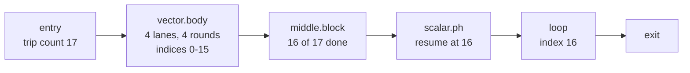

# P10. Vectorization

One instruction, several numbers at once: what a loop vectorizer and an SLP vectorizer each widen, what they must prove first, and why Vortex's matmul kernel earns a vector loop with no runtime check in front of it.

Level: Intermediate · Reading time: about 55 minutes · Builds on: [P6. Dependence analysis](p6-dependence-analysis.md), [A3. Floats and vectors in registers](../backend/a3-floats-and-vectors.md)

???+ remember "Before you start, remember"

    ??? question "Why does the matmul kernel's only loop-carried dependence, on `c`, stay legal under every reordering of `row`, `column` and `k`?"

        Its distance vector has a single nonzero component, on `k`. Reordering the loop levels can only move that component to a different position; it can never flip its sign. A vector with one nonzero component is lexicographically positive in every permutation, so every reordering of the nest is legal.

        Introduced in [P6. Dependence analysis](p6-dependence-analysis.md#when-a-loop-permutation-is-legal).

    ??? question "Why can a vectorized loop over the kernel's `c`, `a` and `b` skip the runtime overlap check a C compiler would need?"

        [References 9.8](../specification/references.md#98-aliasing) makes storage reached through a `&mut` parameter unreachable through any other parameter of the same call. The compiler may attach `noalias` on that proof, not a guess, and a proven fact needs no runtime check.

        Introduced in [O9. Memory: alias analysis and MemorySSA](o9-alias-analysis.md#promises-the-front-end-writes-down).

    ??? question "What is a loop's backedge-taken count, and why does a transformation that widens a loop need it?"

        The number of times the loop's back edge runs, one less than the trip count. A widened loop needs it to know how many full-width groups fit, and how many elements, if any, are left for whatever handles the remainder.

        Introduced in [O8. Loops: structure, induction variables and bounds checks](o8-loops.md#counting-iterations).

    ??? question "On the M4 Pro, why does the compiler vectorize a plain `sum += x[i]` reduction, while on x86-64 the same source is refused, even though neither target may reorder the additions?"

        The refusal is about legality, and legality is the same on both targets. What differs is what each target's cost model offers: LLVM's AArch64 description turns on ordered reductions, which keep the loop's original order; the x86-64 description does not, so every vector version there would have to reorder the sum.

        Introduced in [O1. The optimizer's contract](o1-optimizer-contract.md#legal-then-worth-doing).

!!! goals "In this chapter"

    - Explain what the loop vectorizer and the SLP vectorizer each widen, and why one needs a loop and the other does not.
    - Recognize the facts a vectorizer borrows from earlier passes: a computable trip count, no blocking dependence, and either no aliasing or a proof of exclusivity, before it may touch a loop at all.
    - Distinguish a vectorized reduction that keeps a loop's original order from one that reassociates it, and say which kind of target offers which.
    - Read a trip count that is not a multiple of the vector width off a vectorizer's own output, as a vector loop plus a scalar epilogue.
    - Connect NEON, SVE and SME to Vortex's fixed, compile-time-known shapes, and say which extension that shape suits and which it does not.

## One instruction, four numbers

[A2](../backend/a2-aarch64-assembly.md#branches-and-loops) left a loose end. Compiling a small `max_reference` function at plain `-O2`, Apple clang 21 printed an instruction that chapter left unexplained: `smax.4s v0, v1, v2`. Turn vectorization off (`-fno-vectorize`) and the same function compiles to a scalar loop, one `cmp` and one `csel` per element, exactly the instructions of the postincrement version A2 walked by hand. Leave vectorization on and four of those comparisons become one `smax.4s`.

A processor's arithmetic instructions normally work on one value at a time: one `add`, one `fadd`, one `smax`, each in its own register. A **SIMD** (single instruction, multiple data) instruction is built from several of those slots at once, packed into one wider register. AArch64's NEON gives every general vector register, `v0` through `v31`, a 128-bit width, and `.4s` tells the assembler to read that width as four 32-bit **lanes**. `smax.4s v0, v1, v2` runs the same comparison four times in parallel, lane 0 of `v1` against lane 0 of `v2` into lane 0 of `v0`, lane 1 against lane 1 into lane 1, and so on. Nothing about lane 0's result depends on lane 1's, or on lane 2's, or on lane 3's: the four comparisons are as independent as if they had run in four separate scalar instructions, only faster, because the processor issues one instruction instead of four. [A3](../backend/a3-floats-and-vectors.md) is where the register file that holds these values is described in full; this chapter is about the transformation that decides to fill it.

That independence between lanes is the single idea the rest of this chapter turns over from every angle. A transformation that packs several independent scalar operations into one vector operation, in whatever shape it finds them, is a **vectorizer**. LLVM ships two, built to find that independence in two different shapes of code.

## The loop vectorizer and the SLP vectorizer

The **loop vectorizer** widens one loop's iterations. Given a loop whose body does the same thing to `x[i]` for every `i` in a range, it rewrites the loop to process four (or eight, or two) values of `i` per trip through the body, replacing four scalar loads, one scalar multiply and one scalar store with one four-lane load, one four-lane multiply and one four-lane store.[^llvm-vec] It needs a loop, and it needs the iterations it widens to be independent of each other in the sense the next section makes precise.

The **SLP vectorizer** ("superword-level parallelism") needs neither. It looks at straight-line code, inside a single basic block, for a group of scalar operations that do the same thing to values that sit next to each other in memory, whether or not any loop produced them.[^slp00] Larsen and Amarasinghe's original description is of exactly this shape: a compiler unrolls a small loop, or a programmer writes out a short computation by hand on the components of a point or a pixel, and the result is several **isomorphic** statements, same operation, same shape of operands, that a loop vectorizer would never see because there is no loop left to widen.[^slp00]

The first example is four such statements, adding two vectors' worth of already-separate scalars:

--8<-- "includes/examples/optimize/p10-vectorization/slp_pack.ll.md"

Nothing here is a loop. `%r0` through `%r3` are four separate `fadd` instructions, each adding one element of `a` to the matching element of `b`. The SLP vectorizer recognizes that all four read from consecutive offsets of `a`, all four read from consecutive offsets of `b`, all four are the same opcode, and all four write to consecutive offsets of `r`: exactly the pattern it packs. Its output loads `a` and `b` as two `<4 x float>` values with one instruction each, adds them with one `fadd`, and stores the result with one instruction, using the same NEON-width register the loop vectorizer would have used, arrived at from a completely different starting shape of code.

??? check "A function computes four sums, r[0] = a[0] + b[0] through r[3] = a[3] + b[3], written out by hand with no loop. A second function sums a 4-element array in a loop, sum += x[i] for i in 0..4. Which vectorizer, if either, can widen each one?"

    The first is SLP's case: four isomorphic scalar operations in straight-line code, no loop for the loop vectorizer to widen. The second has a loop, but it is a **reduction**, four values collapsing into one, not four independent results; whether the loop vectorizer can widen it at all is the subject of two sections below, and the answer is not simply yes.

## The facts a vectorizer borrows

Neither vectorizer starts from nothing. [O10](o10-pass-pipelines.md) already made the general point: a late pass runs on facts earlier passes proved, not on facts it proves itself. Widening a loop needs three of those facts on hand before it may even begin, and Vortex's rules, together with the earlier chapters of this book, supply every one of them for the matmul kernel without asking the vectorizer to take anything on faith.

**A loop body with no blocking call.** [O5](o5-constants-and-dead-code.md) leaves the kernel's inner loop as straight-line arithmetic once its checks are proven away: no branch, no call to a function the vectorizer cannot see into. [O7](o7-inlining-and-sroa.md) is why that matters generally: a call the vectorizer cannot inline or reason about is opaque, and an opaque call inside a loop body blocks widening that loop, because the vectorizer has no way to run four calls' worth of unknown side effects at once and call it the same program.

**No loop-carried dependence that forbids the reorder.** [P6](p6-dependence-analysis.md#when-a-loop-permutation-is-legal) already showed that the kernel's `column` loop carries no dependence at all: `a[row, k]` and `b[k, column]` are read-only inside it, and the write to `c[row, column]` touches a different element on every value of `column`. Running four values of `column` at once, one per lane, is exactly the kind of reorder P6's legality rule permits, for the same reason interchange does: nothing forces one lane's work to wait for another's.

**No aliasing the compiler cannot rule out.** [O9](o9-alias-analysis.md#the-price-of-not-knowing-runtime-checks) built the general mechanism: when the vectorizer cannot prove two pointers disjoint, it can still widen the loop, but only behind a runtime check that compares the two ranges and falls back to a scalar loop if they overlap, a strategy LLVM calls **loop versioning**.[^llvm-vec] For a plain C function taking two `float *` parameters, that check, and the scalar fallback behind it, are the price of not knowing. For the matmul kernel, [References 9.8](../specification/references.md#98-aliasing) removes the price outright: storage reached through `c`, a `&mut` parameter, is not reachable through `a` or `b`, so the compiler may mark `c` `noalias` on a proof and the vectorizer needs no check and no fallback at all.

A **loop hint**, written as a pragma right above the loop, can ask the vectorizer to try harder, or forbid it from trying at all.[^clang-le] `#pragma clang loop vectorize(disable)` is how this chapter's own examples keep a reference loop scalar, so that a vectorized version has something honest to be checked against. [O1](o1-optimizer-contract.md#legal-then-worth-doing) already warned about the opposite hint: one that raises the vector width or turns vectorization on can, on its own, quietly grant the vectorizer permission to reorder floating-point operations that it would otherwise have refused to touch. A hint that only chooses among legal versions is harmless; the next section is about the one case where a hint can change what is legal.

## Reductions: ordered or reassociated

Every fact in the last section was about the kernel's `column` loop, where each lane produces a different element of `c`. The kernel's `k` loop is a different shape entirely: every one of its 64 iterations writes to the same place, `sum`, so widening it does not give four lanes four independent answers, it gives four lanes four partial answers that still have to be combined into one. [O3](o3-ssa.md#your-turn-the-kernel-in-ssa-form) already named `sum` for what it is in SSA form: a **reduction variable**, a phi whose value each iteration updates from the previous iteration's value, carried around the loop instead of read fresh from memory.

A reduction changes the legality question. Widening the `column` loop reorders which *element* runs before which other element, and O9 already showed why that is free. Widening a reduction loop reorders the *additions that build one element's own sum*, and [decision 56](../decisions/numbers.md#d56) is exactly the rule that fixes that order: an `f32` or `f64` operation rounds once, in the order the program wrote it, never contracted, never reassociated.[^langref] A vectorizer that groups four of the loop's additions into one lane and combines lanes at the end has, in general, changed which partial sums get rounded together first, and IEEE 754 addition is not associative, so a different grouping can round to a different final bit pattern.

Most targets close this off entirely: LLVM's documentation states plainly that it vectorizes a floating-point reduction only when at least `-fassociative-math -fno-signed-zeros -fno-trapping-math` is in effect, the subset of `-ffast-math` that grants the reassociation permission.[^llvm-vec-red] AArch64 and RISC-V are the exception the same page names: on these targets LLVM can instead generate an **ordered reduction**, one that combines the vector's lanes in the same left-to-right order the scalar loop used, so the widened loop's result matches the scalar one exactly, at some cost in speed, since the processor can no longer start each lane's next addition before the previous lane's finishes.[^llvm-vec-red]

The second example checks this directly rather than taking the claim on trust. It sums 64 floats three ways: once with vectorization forced off, so the compiler has no path but the strict left-to-right one; once with no hint at all, letting Clang's normal `-O2` pipeline decide; and once with `#pragma clang fp reassociate(on)`, which grants the permission the plain build withheld.

--8<-- "includes/examples/optimize/p10-vectorization/reduction_reassoc.cpp.md"

With inputs chosen to stress rounding, alternating a value large enough to threaten to swallow its neighbor with one that is not, the unhinted build's vectorized reduction lands on the same bits as the never-vectorized one: on this target, an ordered reduction really does preserve the exact result, not merely a plausible-looking one. Granting reassociation moves the last bit. Nothing here claims this holds for every input or every LLVM version; it is what this program, compiled with Apple clang 21 at `-O2`, computed on the owner's M4 Pro on 2026-09-24.

??? check "The example's reassociated sum differs from the scalar one in exactly one bit of a 32-bit float. Does that mean reassociation is unsafe to use?"

    It means reassociation changes the answer, which is a different claim from unsafe. IEEE 754 rounds every operation, so any two different orders of the same additions are already candidates for different final bits; reassociation is one concrete way to pick a different order, not a bug on top of correct arithmetic. Whether a one-bit difference matters depends on what the program promises its caller, which is exactly [decision 56](../decisions/numbers.md#d56)'s point: Vortex does not leave that choice implicit, so a program's output either matches the strict order or the language has been given explicit permission to differ, never a silent third option.

## Trip counts and the scalar epilogue

A loop's length rarely divides evenly by the width a vectorizer picks. [O8](o8-loops.md#counting-iterations) built the tool that matters here, the loop's **backedge-taken count**, one less than its trip count, computed from the loop's induction variable as an add recurrence. A vectorizer needs that count before it can decide how many full-width groups of iterations exist and how many elements, if any, are left over once those groups are exhausted.

The third example is a 17-element version of the axpy pattern the kernel's own `column` loop uses, forced to a 4-lane width so its output is easy to read:

--8<-- "includes/examples/optimize/p10-vectorization/scalar_epilogue.ll.md"

Seventeen is not a multiple of four. The transformed function keeps the original loop, unchanged, but reaches it from a new direction: a `vector.body` runs four groups of four lanes, covering indices 0 through 15, then a `middle.block` checks whether every element is done. It is not, so control falls into `scalar.ph`, which resumes the *original* scalar loop at index 16 instead of index 0. This resumed copy is the **scalar epilogue**: the same code the loop always had, now handling only the remainder the vector loop could not cover, in the same order it always ran in.

Nothing about this splits the kernel's answer in two. The vector loop and the scalar epilogue write to disjoint elements, in increasing order, of the same array; whichever one runs, an element's value is produced exactly once, by exactly one of the two loops, with the same arithmetic either way. A trip count of exactly 64, the kernel's own `column` extent at a 4-lane width, needs no epilogue at all: 64 divides evenly by 4, so the vector loop alone covers every element, and `middle.block`'s check for a remainder is decided at compile time, the way the example's own `br i1 false, ...` already shows for a trip count that is a multiple of the forced width.

??? check "At a forced width of 8, how many full-width groups and how many scalar epilogue iterations does a trip count of 20 need? What about a trip count of 64?"

    20 divided by 8 is 2 remainder 4: two 8-lane groups cover indices 0 through 15, and a 4-iteration scalar epilogue covers indices 16 through 19. 64 divided by 8 is 8 remainder 0: eight 8-lane groups cover every index, and the scalar epilogue never runs, exactly as the 4-lane case covers the kernel's own 64-element `column` extent with no remainder.

## Vectorizing the matmul's column loop

[O9](o9-alias-analysis.md#the-price-of-not-knowing-runtime-checks) already drew the shape this section fills in: the kernel run in `ikj` order, from [P7](p7-loop-transformations.md#interchange), has its innermost loop walk `column`, updating one row of `c` from one row of `b` scaled by `a[row, k]`, an axpy. This book cannot show Vortex's own vectorizer at work; that is the exercise below, not a worked answer. What it can show, in the fourth example, is the identical shape in a small function a reader can compile and check.

--8<-- "includes/examples/optimize/p10-vectorization/neon_saxpy.cpp.md"

`saxpy_neon` broadcasts `a` into every lane with `vdupq_n_f32`, loads four elements of `x` and four of `y`, and computes all four lanes' `a * x[i] + y[i]` with one `vfmaq_f32`. Every lane reads only its own `x[i]` and `y[i]` and writes only its own `y[i]`; nothing here is a reduction, so lane order is exactly as free as [P6](p6-dependence-analysis.md#when-a-loop-permutation-is-legal) already proved it is for the kernel's `column` loop, and the program's own check confirms what that proof promised: the NEON version and the scalar version agree on every element, bit for bit.

<figure class="vx-figure">
<svg viewBox="0 0 700 360" role="img" aria-labelledby="p10-f1-title p10-f1-desc">
<title id="p10-f1-title">One scalar broadcast into four independent lane FMAs</title>
<desc id="p10-f1-desc">A single box labelled a, at the left, sends four lines to four multiply-add units, one per lane, numbered 0 to 3 from top to bottom. Each lane also receives its own element of x and its own element of y, and produces its own element of y prime. No line crosses between lanes: lane k reads only x of k and y of k, and writes only y prime of k.</desc>
<defs>
<marker id="p10-f1-head" viewBox="0 0 10 10" refX="9" refY="5" markerWidth="6" markerHeight="6" orient="auto"><path class="vx-arrowhead" d="M0 0 L10 5 L0 10 z"/></marker>
</defs>
<rect class="vx-box-strong" x="10" y="140" width="90" height="80" rx="4"/>
<text class="vx-text" x="55" y="175" text-anchor="middle">a</text>
<text class="vx-text-muted" x="55" y="195" text-anchor="middle">broadcast</text>
<g class="vx-seq" style="--vx-i: 0; --vx-n: 4">
<text class="vx-text-muted" x="150" y="34">lane 0</text>
<rect class="vx-box" x="150" y="6" width="70" height="24" rx="3"/>
<text class="vx-mono" x="185" y="22" text-anchor="middle">x[0]</text>
<path class="vx-flow" d="M100 170 C 130 170, 130 42, 165 42" marker-end="url(#p10-f1-head)"/>
<path class="vx-flow" d="M185 30 L185 50" marker-end="url(#p10-f1-head)"/>
<rect class="vx-box-accent" x="150" y="50" width="70" height="40" rx="4"/>
<text class="vx-text" x="185" y="75" text-anchor="middle">×</text>
<rect class="vx-box" x="330" y="6" width="70" height="24" rx="3"/>
<text class="vx-mono" x="365" y="22" text-anchor="middle">y[0]</text>
<path class="vx-flow" d="M220 70 L310 70" marker-end="url(#p10-f1-head)"/>
<path class="vx-flow" d="M365 30 L365 50" marker-end="url(#p10-f1-head)"/>
<rect class="vx-box-accent" x="330" y="50" width="70" height="40" rx="4"/>
<text class="vx-text" x="365" y="75" text-anchor="middle">+</text>
<path class="vx-flow" d="M400 70 L500 70" marker-end="url(#p10-f1-head)"/>
<rect class="vx-box" x="500" y="58" width="110" height="24" rx="3"/>
<text class="vx-mono" x="555" y="74" text-anchor="middle">y'[0]</text>
</g>
<g class="vx-seq" style="--vx-i: 1; --vx-n: 4">
<text class="vx-text-muted" x="150" y="119">lane 1</text>
<rect class="vx-box" x="150" y="91" width="70" height="24" rx="3"/>
<text class="vx-mono" x="185" y="107" text-anchor="middle">x[1]</text>
<path class="vx-flow" d="M100 178 C 130 178, 130 127, 165 127" marker-end="url(#p10-f1-head)"/>
<path class="vx-flow" d="M185 115 L185 135" marker-end="url(#p10-f1-head)"/>
<rect class="vx-box-accent" x="150" y="135" width="70" height="40" rx="4"/>
<text class="vx-text" x="185" y="160" text-anchor="middle">×</text>
<rect class="vx-box" x="330" y="91" width="70" height="24" rx="3"/>
<text class="vx-mono" x="365" y="107" text-anchor="middle">y[1]</text>
<path class="vx-flow" d="M220 155 L310 155" marker-end="url(#p10-f1-head)"/>
<path class="vx-flow" d="M365 115 L365 135" marker-end="url(#p10-f1-head)"/>
<rect class="vx-box-accent" x="330" y="135" width="70" height="40" rx="4"/>
<text class="vx-text" x="365" y="160" text-anchor="middle">+</text>
<path class="vx-flow" d="M400 155 L500 155" marker-end="url(#p10-f1-head)"/>
<rect class="vx-box" x="500" y="143" width="110" height="24" rx="3"/>
<text class="vx-mono" x="555" y="159" text-anchor="middle">y'[1]</text>
</g>
<g class="vx-seq" style="--vx-i: 2; --vx-n: 4">
<text class="vx-text-muted" x="150" y="204">lane 2</text>
<rect class="vx-box" x="150" y="176" width="70" height="24" rx="3"/>
<text class="vx-mono" x="185" y="192" text-anchor="middle">x[2]</text>
<path class="vx-flow" d="M100 186 C 130 186, 130 212, 165 212" marker-end="url(#p10-f1-head)"/>
<path class="vx-flow" d="M185 200 L185 220" marker-end="url(#p10-f1-head)"/>
<rect class="vx-box-accent" x="150" y="220" width="70" height="40" rx="4"/>
<text class="vx-text" x="185" y="245" text-anchor="middle">×</text>
<rect class="vx-box" x="330" y="176" width="70" height="24" rx="3"/>
<text class="vx-mono" x="365" y="192" text-anchor="middle">y[2]</text>
<path class="vx-flow" d="M220 240 L310 240" marker-end="url(#p10-f1-head)"/>
<path class="vx-flow" d="M365 200 L365 220" marker-end="url(#p10-f1-head)"/>
<rect class="vx-box-accent" x="330" y="220" width="70" height="40" rx="4"/>
<text class="vx-text" x="365" y="245" text-anchor="middle">+</text>
<path class="vx-flow" d="M400 240 L500 240" marker-end="url(#p10-f1-head)"/>
<rect class="vx-box" x="500" y="228" width="110" height="24" rx="3"/>
<text class="vx-mono" x="555" y="244" text-anchor="middle">y'[2]</text>
</g>
<g class="vx-seq" style="--vx-i: 3; --vx-n: 4">
<text class="vx-text-muted" x="150" y="289">lane 3</text>
<rect class="vx-box" x="150" y="261" width="70" height="24" rx="3"/>
<text class="vx-mono" x="185" y="277" text-anchor="middle">x[3]</text>
<path class="vx-flow" d="M100 194 C 130 194, 130 297, 165 297" marker-end="url(#p10-f1-head)"/>
<path class="vx-flow" d="M185 285 L185 305" marker-end="url(#p10-f1-head)"/>
<rect class="vx-box-accent" x="150" y="305" width="70" height="40" rx="4"/>
<text class="vx-text" x="185" y="330" text-anchor="middle">×</text>
<rect class="vx-box" x="330" y="261" width="70" height="24" rx="3"/>
<text class="vx-mono" x="365" y="277" text-anchor="middle">y[3]</text>
<path class="vx-flow" d="M220 325 L310 325" marker-end="url(#p10-f1-head)"/>
<path class="vx-flow" d="M365 285 L365 305" marker-end="url(#p10-f1-head)"/>
<rect class="vx-box-accent" x="330" y="305" width="70" height="40" rx="4"/>
<text class="vx-text" x="365" y="330" text-anchor="middle">+</text>
<path class="vx-flow" d="M400 325 L500 325" marker-end="url(#p10-f1-head)"/>
<rect class="vx-box" x="500" y="313" width="110" height="24" rx="3"/>
<text class="vx-mono" x="555" y="329" text-anchor="middle">y'[3]</text>
</g>
</svg>
<figcaption>Figure 1. <code>vfmaq_f32</code> broadcasts one scalar, <code>a</code>, into every lane of a 128-bit register; each lane then computes its own <code>a * x[k] + y[k]</code> independently. No line crosses between lanes, so nothing here reorders an addition: the four results are the same four numbers a scalar loop would compute, produced together instead of one after another.</figcaption>
</figure>

The kernel's own `column` loop is the same shape at a larger width: one row of `a[row, k]`, held in a scalar (broadcast into every lane, exactly like `a` in the figure) times four adjacent elements of `b[k, column..column+3]`, added into four adjacent elements of `c[row, column..column+3]`. Arm's own worked example of a small matrix multiply uses this same load, broadcast-multiply-add, store shape on a 4×4 block, built from `vld1q_f32`, `vfmaq_laneq_f32` and `vst1q_f32`.[^arm-mm] This chapter's own example broadcasts a whole scalar into a lane with `vdupq_n_f32` rather than pulling one lane out of a loaded vector with `vfmaq_laneq_f32`; both instructions do the same job, feeding one value into every lane of a multiply, and Arm's version is worth reading once this one is clear, for how the same idea covers a full tile at once instead of one row.

Widening a loop is not free even once it is legal. [P5](p5-microarchitecture.md#doing-more-than-one-instruction-at-once) already introduced **execution ports** and **issue width**: an SIMD instruction still has to be issued, decoded and executed on some port, and a processor with a fixed number of vector ports can only retire so many `vfmaq_f32`-shaped instructions per cycle, wide or not. [P3](p3-roofline.md#the-roofline-two-ceilings-and-the-ridge-point) is where that ceiling gets a name, the compute bound a wider register raises but does not remove. If a microbenchmark isolates one vectorized loop to time it, [P1](p1-measure-first.md#keeping-the-compiler-from-helping-too-much)'s `DoNotOptimize` barrier is exactly what stops the same vectorizer, and every other optimization, from noticing the loop's result is never used and deleting the whole thing.

## NEON, SVE and SME

Every example so far uses **NEON**, AArch64's baseline SIMD extension: fixed 128-bit registers, a fixed lane count per element type, present on every AArch64 chip.[^arm-intr] Two newer extensions widen the same idea in different directions, and knowing which is for what matters more than memorizing their names.

**SVE** (Scalable Vector Extension) keeps the same idea, one instruction across several lanes, but does not fix the register width in the instruction encoding. A single SVE binary runs correctly on a 128-bit implementation and a 2048-bit one alike; the vector length is a property of the CPU, read at runtime, not compiled in.[^sve17] That is a good fit for a loop whose length is not known until the program runs. It is a poor fit for Vortex's own arrays: `[f32; 64, 64]`'s extent is fixed in the type, known to the compiler at every call site, so the loop it drives never needs to ask the CPU how wide to go.

**SME** (Scalable Matrix Extension) goes further. A streaming mode gives instructions access to a dedicated storage array, `ZA`, addressable as vectors or as two-dimensional tiles; an outer-product instruction such as `FMOPA` takes two vector registers and accumulates their outer product straight into a `ZA` tile, so a matrix accumulation like the kernel's own can be expressed as one tile update per instruction instead of a loop of vector FMAs.[^hellosme] Remke and Breuer report the M4 as the first shipping chip with SME, measure more than 2.3 FP32 TFLOPS from it directly, and find that small, JIT-generated matrix-multiplication kernels beat the vendor-optimized BLAS implementation they compared against in almost every configuration they tested.[^hellosme]

On the machine this book is written on, `sysctl hw.optional.arm` reports `AdvSIMD`, `FP16`, `DotProd`, `BF16`, `I8MM`, `SME` and `SME2` all present, but no separate `FEAT_SVE` key (checked 2026-09-24): NEON and SME, without the scalable-length SVE family in between. That is one machine, not a portability promise. A Vortex back end that targets AArch64 has to read what the running chip actually offers, the way this chapter's own command line did, rather than hard-code what one chip happened to report; [P4](p4-counters-and-tools.md) is where this book takes up the tools for asking a machine what it has.

## For Vortex

!!! vortex "Exercise"

    **Build** vectorization for the loop that O9 already cleared of runtime checks, on top of the loop structure and trip counts from [O8](o8-loops.md#for-vortex), the dependence testing from [P6](p6-dependence-analysis.md#for-vortex) and the `noalias` facts from [O9](o9-alias-analysis.md#for-vortex).

    1. A legality check for one loop level at a time: no loop-carried dependence forbids reordering it (P6's check, reordered vector to a single level), and every memory access it contains is either proven `noalias` or the check is willing to add a runtime version behind a `loop versioning` split.
    2. A width and an instruction shape for AArch64 NEON only, to start: 4 lanes for `f32`. Widen a loop whose trip count is a compile-time constant (every Vortex loop over a fixed array dimension is) by the chosen width, with a vector body plus, when the trip count does not divide evenly, a scalar epilogue that resumes the *original* scalar loop at the vector body's stopping point, exactly as this chapter's third example does.
    3. A reduction check: refuse to widen a loop whose induction variable is a reduction (a phi fed by an operation on itself) unless your compiler later adds an explicit, opt-in relaxed floating-point mode; until then, a reduction blocks vectorization of that loop level, not only that one operation.
    4. One optimization remark per decision, in the style [O1](o1-optimizer-contract.md#remarks-the-optimizers-report) built: a passed remark naming the width and citing the proof, for example "vectorized column ×4 (NEON); no runtime alias checks: c is &mut, exclusive for the call", and a missed remark with an analysis remark naming the blocking fact when a loop cannot be widened, for example "not vectorized: k carries a reduction on sum".

    **Not yet:** SVE or SME code generation (this machine has both, but Vortex's fixed shapes get their main benefit from NEON's fixed width already); the SLP vectorizer, which needs no loop at all and is a separate pass over straight-line code; interleaving several vector iterations per trip (a profitability question, not a legality one); any opt-in that lets a reduction reassociate, which is [P11](p11-floating-point.md)'s decision to design, not this chapter's to assume.

    **Proof that it works:**

    - Every golden test from O8 and O9 passes unchanged with vectorization on: same output, same runtime error line and exit status when a check still fails elsewhere in the program.
    - A bits test in the style of [P16](p16-capstone.md#the-bits-test): the kernel's output with vectorization on and off must match byte for byte, for every input those chapters already use.
    - A trip count sweep: 60, 64 and 65 elements over a 4-lane width, checked against the epilogue arithmetic in this chapter's third example (0, 0 and 1 leftover elements respectively), with a remark or a debug dump showing the vector-body and scalar-epilogue split your compiler chose.
    - A reduction test: a loop with a `sum +=` pattern must be refused, with a missed remark naming the reduction, not silently left scalar with no explanation.
    - A measurement under [P1](p1-measure-first.md)'s protocol: GFLOP/s for the kernel's `column` loop vectorized and not, on your machine, with the date and your compiler's version. Read the machine's actual SIMD width first (`sysctl hw.optional.arm` on Apple silicon, or the equivalent for your target), the way this chapter's NEON/SVE/SME section did, rather than assuming NEON's 4 lanes everywhere.

    | Loop | Width | Vectorized? | Remark | GFLOP/s, scalar | GFLOP/s, vectorized |
    | --- | --- | --- | --- | --- | --- |
    | kernel `column`, 64 × 64 | | | | | |
    | your own reduction test | | | | | |

## Key ideas

!!! recap "Questions you can now answer"

    - **What does the loop vectorizer widen, and what does the SLP vectorizer widen?** The loop vectorizer widens the iterations of one loop into wider, multi-lane iterations. The SLP vectorizer packs several isomorphic scalar operations in straight-line code, whether or not a loop produced them.
    - **What three facts does a loop vectorizer need before it may widen a loop at all?** A computable trip count, no loop-carried dependence that the widening would reorder illegally, and either no aliasing between the memory it touches or a proof, such as Vortex's `&mut` exclusivity, that removes the need for a runtime check.
    - **Why is vectorizing the kernel's `column` loop free, bit for bit, while vectorizing its `k` loop is not?** Different lanes of the `column` loop write different elements of `c`, so no addition is reordered. Every iteration of the `k` loop writes the same `sum`, so widening it groups additions differently than the scalar order, and IEEE 754 addition is not associative.
    - **What is an ordered reduction, and which targets support it?** A vectorized reduction that combines its lanes in the same left-to-right order the scalar loop used, at some cost in speed. LLVM's documentation names AArch64 and RISC-V as targets that can generate one; on most other targets a reduction vectorizes only under an explicit reassociation permission.
    - **What is a scalar epilogue, and when does a widened loop need one?** A resumed copy of the loop's original scalar body, covering whatever elements are left after the widest possible run of full-width vector iterations. It is needed exactly when the trip count is not a multiple of the chosen width.
    - **Why does Vortex's `[f32; 64, 64]` fit NEON's fixed-width model better than SVE's scalable one?** SVE's whole point is running correctly at a vector length the compiler does not know until the program runs. Vortex's array extents are constants in the type, known to the compiler at every call site, so nothing is gained by leaving the width undetermined.

## Where this comes back

!!! next "You will use this again in"

    - [P11. Floating point under optimization](p11-floating-point.md): *reduction vectorization needs `reassoc`*, *SIMD lanes as independent chains*
    - [P12. Anatomy of a fast GEMM](p12-fast-gemm.md): *the micro-kernel's own load, broadcast-multiply-add, store shape, at a larger tile*
    - [P13. Multithreading](p13-multithreading.md): *independent lanes and independent threads are the same legality question at two different widths*
    - [P16. Capstone: the ladder, measured](p16-capstone.md): *rung 3, vectorize across `column`*
    - [M8. Vectorization in MLIR](../mlir/m8-vectorization.md): *the same loop-versus-straight-line split, expressed as dialect-level rewrites*

## Sources and further reading

Read LLVM's Auto-Vectorization page first, end to end: it is short, and both vectorizers, the reduction rules and loop versioning are all sections of it. Larsen and Amarasinghe's original SLP paper is worth reading once the loop vectorizer is clear, for how differently the same lane-packing idea looks when it starts from straight-line code instead of a loop. Arm's own worked matrix-multiplication example is the natural next stop for the broadcast-multiply-add shape this chapter builds toward; read it next to this chapter's own NEON example rather than in place of it. Remke and Breuer's SME report is short and readable even without prior exposure to streaming-mode extensions.

[^llvm-vec]: LLVM Project, "Auto-Vectorization in LLVM", sections "The Loop Vectorizer", "The SLP Vectorizer" and "Runtime Checks of Pointers", read on 2026-09-24. <https://llvm.org/docs/Vectorizers.html>
[^slp00]: Samuel Larsen and Saman Amarasinghe, "Exploiting Superword Level Parallelism with Multimedia Instruction Sets", *Proceedings of the ACM SIGPLAN Conference on Programming Language Design and Implementation (PLDI 2000)*: the abstract and sections 1 and 3. <https://doi.org/10.1145/349299.349320>
[^llvm-vec-red]: LLVM Project, "Auto-Vectorization in LLVM", section "Reductions", read on 2026-09-24. <https://llvm.org/docs/Vectorizers.html#reductions>
[^langref]: LLVM Project, "LLVM Language Reference Manual", section "'llvm.vector.reduce.fadd.*' Intrinsic", read on 2026-09-24. <https://llvm.org/docs/LangRef.html>
[^clang-le]: Clang Project, "Clang Language Extensions", section "Extensions for loop hint optimizations", read on 2026-09-24. <https://clang.llvm.org/docs/LanguageExtensions.html#extensions-for-loop-hint-optimizations>
[^arm-intr]: Arm, "Intrinsics", the Neon, SVE, SVE2, SME and Helium reference, read on 2026-09-24. <https://developer.arm.com/architectures/instruction-sets/intrinsics/>
[^arm-mm]: Arm, "Optimizing C code with Neon intrinsics", the matrix-multiplication example (`vld1q_f32`, `vfmaq_laneq_f32`, `vst1q_f32` on a 4×4 block), read on 2026-09-24. <https://developer.arm.com/documentation/102467/0201/Example---matrix-multiplication>
[^sve17]: Nigel Stephens et al., "The ARM Scalable Vector Extension", *IEEE Micro* 37(2), 2017: the abstract and the description of a vector-length-agnostic programming model. <https://doi.org/10.1109/MM.2017.35> (open copy: <https://arxiv.org/abs/1803.06185>)
[^hellosme]: Ferdinand Remke and Angela Breuer, "Hello SME!", 2024: the abstract; the description of streaming SVE mode, the `ZA` array and outer-product instructions such as `FMOPA`; and the M4 measurements and BLAS comparison, read on 2026-09-24. <https://arxiv.org/abs/2409.18779>
