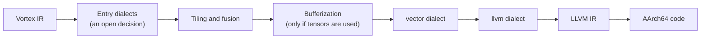

# A7. MLIR lowering path

This case study will build a second route from Vortex to machine code through MLIR, where tiling, fusion and vectorization already exist as transformations on structured IR. It then compares that route with the passes Vortex builds by hand for the CPU matmul ladder. Nothing has been built yet, so every result table below is empty.

Case study A7 · Status: Not started · Evidence so far: none

This page was written before the work, on purpose. It fixes the question, the
comparisons and the success criteria now, so that results cannot quietly
redefine them later. Every table has defined columns and empty cells. A cell
gets a value only when that value was measured or counted, and each value must
trace back to a commit and a raw data file. Until then the page makes no claim.
It is one of the [case studies](index.md) described in
[Vortex for reviewers](../index.md).

## The question

**Question.** If Vortex lowers its IR into MLIR and uses MLIR's existing
transformations, does it get the same answers as its own pipeline, how fast is
the resulting code compared with the passes Vortex builds by hand in the
[CPU matmul ladder](cpu-matmul-ladder.md), and what does the dependency cost?

**Claim.** None yet. When the tables are full, the claim will have this shape:
"Through MLIR, Vortex's matmul reaches *x* GFLOP/s at the tiled-and-vectorized
level, against *y* for its own passes, with bitwise-identical results, at a
build cost of *z*."

A few terms first. **MLIR** is a compiler infrastructure from the LLVM project
in which many IRs, called **dialects**, live side by side in one program, so
that a compiler can lower in small steps, one dialect at a time.[^mlir] A
**lowering path** is the sequence of dialects a program passes through on its
way to machine code. **Structured operations**, such as those of the `linalg`
dialect, describe a computation by its loops and by how it indexes its
operands, which is what lets MLIR tile and fuse them as general
transformations.[^linalg] **Bufferization** is the step that gives tensor
values, which MLIR treats as immutable, places in memory.[^bufferization]

## Why employers care

In the compiler job postings read while planning these pages (September 2026),
MLIR appeared often, but usually as a preferred skill; the teams expected LLVM
first. The teams that name it, such as ML compiler, accelerator compiler and
tile-language teams, spend their days on the transformations this study uses:
tiling, fusion, vectorization and lowering to a target. Those tasks appeared
more often in job descriptions than in qualification lists, because they are
the work itself.

A lowering path from a real language, with the IR shown and tested at every
step, shows fluency in the vocabulary those teams use: dialects, rewrite
patterns, bufferization, schedules written as IR. Comparing it honestly with
passes written by hand shows something more, which is judgment about what a
framework gives and what it costs.

## What to build

The study starts after the v0.1 compiler passes its
[release gate](../../compiler/guide/stage-11-release.md). It needs the
[CPU matmul ladder](cpu-matmul-ladder.md) (A1) to reach at least tiling and
vectorization, since those rungs are what it compares against, and it uses
random programs from [differential testing](differential-testing.md) (A3).

The planned path, left to right. Where tiling and fusion happen relative to
bufferization depends on the entry decision. The shape follows the MLIR Toy
tutorial, whose chapter 5 lowers part of a program to the `affine` dialect and
whose chapter 6 continues to the `llvm` dialect and LLVM IR.[^toy]

| Part | What it does | Done when | Taught in |
| --- | --- | --- | --- |
| Entry decision | Chooses the first MLIR form Vortex emits: `affine` or `scf` loops for Vortex's loops, `linalg` operations if Vortex gains whole-array operations, or a Vortex dialect of its own | A decision record gives the choice and the rejected alternatives | [M1](../../mlir/m1-why-mlir.md), [M5](../../mlir/m5-structured-ops.md), [M6](../../mlir/m6-affine-and-scf.md) |
| Emitter | Translates Vortex IR into the entry dialects, keeping source locations | `mlir-opt` accepts the translation of every v0.1 test program, and FileCheck tests cover each construct | [M2](../../mlir/m2-reading-mlir.md), [M4](../../mlir/m4-dialect-conversion.md) |
| Runtime checks | Keeps the bounds, overflow and division checks the specification requires, and removes one only where a proof exists | Programs that must stop with a runtime error still stop with the same error | [Stage 9](../../compiler/guide/stage-9-runtime-safety.md), [O8](../../optimize/o8-loops.md) |
| Pipeline | Tiling and fusion, bufferization where needed, vectorization with the `vector` dialect,[^vector] and lowering to the `llvm` dialect | One command saves the IR after every pass | [M5](../../mlir/m5-structured-ops.md), [M6](../../mlir/m6-affine-and-scf.md), [M7](../../mlir/m7-bufferization.md), [M8](../../mlir/m8-vectorization.md), [M4](../../mlir/m4-dialect-conversion.md) |
| Schedules outside the program | Tile sizes and transformation order live in a separate schedule, for example one written in the transform dialect[^transform] | Two schedules for one kernel give bitwise-identical results | [M9](../../mlir/m9-transform-dialect.md) |
| Diagnostics | Messages that originate inside MLIR point back to Vortex source | A test shows a Vortex source location in such a message | [Stage 1](../../compiler/guide/stage-1-source-and-diagnostics.md), [M2](../../mlir/m2-reading-mlir.md), [M4](../../mlir/m4-dialect-conversion.md) |

The transformations here are MLIR's own. Vortex's share of the work is the
emitter, a lowering that keeps the required runtime checks, and the schedules.
The page keeps that division visible, so that nobody mistakes MLIR's tiling
for Vortex's.

Not in this study: GPU lowering (case study [A8](gpu-matmul-ladder.md) and
chapter [M10](../../mlir/m10-mlir-for-gpus.md)), upstream MLIR changes
([A5](upstream-contributions.md)), automatic tuning
([A9](cost-model-autotuner.md)) and MLIR's Python bindings.

## Method

The measurement protocol is on
[How Vortex performance is measured](../measuring.md), and the test protocol
is on [How Vortex is tested](../testing.md). This section adds only what is
specific to this study.

### What is compared

1. **Correctness.** The MLIR path against the reference path, on the v0.1
   suite, random programs from A3, and programs that must stop with a runtime
   error. Output and exit status must match bit for bit. Every schedule
   variant (different tile sizes, with and without vectorization) must match
   too.
2. **IR at every stage.** The IR after each pass is saved, checked with
   FileCheck tests,[^filecheck] and shown on this page for one kernel.
3. **Speed.** Naive matmul at four transformation levels (naive,
   interchanged, tiled, tiled and vectorized), through the MLIR path and
   through A1's passes at the same level. Apple's Accelerate BLAS[^accelerate]
   is the vendor reference, switched to single-threaded mode with the
   `BLASSetThreading` function that the macOS 15 SDK declares, so that thread
   counts match.
4. **Cost.** Clean build time and binary size of the compiler with and
   without MLIR, and compile time per kernel.

For the speed comparison to mean anything, A1's passes and the MLIR schedule
use the same tile sizes and loop order wherever both can express them. Where
one cannot, the table says so.

### Machines

Timing runs on the owner's Apple M4 Pro; correctness and FileCheck tests run
in CI on macOS arm64 and Linux arm64. The MLIR version is pinned and recorded.
The MLIR on the owner's machine is 18.1.8, while Homebrew's `llvm` formula was
at version 23 in September 2026,[^brew] so pass names and options must be
checked against the pinned version rather than against the latest
documentation. Large MLIR-based projects pin as well: Triton builds against a
single LLVM commit, named in its repository.[^triton]

### What counts as success

1. **Same answers.** Bitwise-identical results to the reference path for
   every test program and every schedule variant. Reordering additions
   changes floating-point results, which the specification does not allow
   without permission
   ([section 4.4](../../specification/types-and-values.md#44-floating-point-values)),
   so any difference fails the test.
2. **IR you can read.** One command saves the IR after every pass, and each
   stage has at least one FileCheck test.
3. **An honest speed comparison.** Every level reports GFLOP/s for both paths
   with confidence intervals. MLIR does not have to win. Each gap needs an
   explanation from the IR.
4. **A known price.** The cost table is filled, and a decision record says
   whether the dependency is worth keeping.

## Setup

| Item | Value |
| --- | --- |
| Machine: chip, cores, memory | |
| Operating system and version | |
| MLIR and LLVM version (commit) | |
| Pass pipeline or transform script | |
| Accelerate version and thread setting | |
| Back end that produced the machine code for each path | |
| Vortex commit | |
| Date of the run | |

## Results

When the tables are filled, each row gets one or two sentences of
explanation, backed by the IR or the measurements. A number without an
explanation does not go in.

### IR at every stage

| Stage | Dialects present after the stage | Pass or transform used | FileCheck test | Bitwise equal to reference |
| --- | --- | --- | --- | --- |
| Emitted from Vortex IR | | | | |
| Tiled | | | | |
| Fused | | | | |
| Bufferized (only if tensors are used) | | | | |
| Vectorized | | | | |
| Lowered to the `llvm` dialect | | | | |
| Translated to LLVM IR | | | | |

- **Dialects present after the stage:** every dialect that still appears in
  the module, read from the saved IR.
- **Pass or transform used:** the pass name with its options, or the
  transform-dialect operation, exactly as run.
- **FileCheck test:** the test file that guards this stage.
- **Bitwise equal to reference:** whether the program, compiled with the
  pipeline stopped after this stage and lowered the rest of the way,
  produces the reference output exactly.

### Correctness

| Test set | Programs | Passed | Mismatches | Notes |
| --- | --- | --- | --- | --- |
| v0.1 test suite | | | | |
| Random programs from case study A3 | | | | |
| Programs that must stop with a runtime error | | | | |
| Schedule variants of matmul | | | | |

- **Programs:** how many programs or variants the set contains, fixed before
  the run.
- **Passed:** output and exit status identical to the reference path.
- **Mismatches:** anything else. Each one needs a bug-ledger entry.

### Speed against the hand-built passes

| Transformation level | Shape | A1 passes | MLIR path | MLIR relative to A1 | Accelerate, one thread |
| --- | --- | --- | --- | --- | --- |
| Naive | | | | | |
| Interchanged | | | | | |
| Tiled | | | | | |
| Tiled and vectorized | | | | | |

- **Shape:** the matrix dimensions M, N and K.
- **A1 passes, MLIR path, Accelerate:** GFLOP/s, computed as 2 × M × N × K
  divided by the median run time, with its 95% confidence interval.
- **MLIR relative to A1:** the MLIR path's GFLOP/s divided by A1's, with a
  confidence interval for the ratio. Above 1 means the MLIR path is faster.

### Cost of the dependency

| Measure | Without MLIR | With MLIR |
| --- | --- | --- |
| Clean build time of the compiler | | |
| Compiler binary size | | |
| Compile time for naive matmul | | |
| Compile time for the whole test suite | | |

- **Each cell:** the median of repeated measurements on the machine in the
  setup table, with the same build type in both columns.

## What did not work

Filled in as the work goes: one row per attempt that failed or was dropped.
Failed attempts are part of the evidence, because they show how the final
design was reached.

| Attempt | What happened | What it taught | Commit |
| --- | --- | --- | --- |
| | | | |

## Threats to validity

- **Different schedules under one name.** "Tiled" in A1 and in MLIR can mean
  different tile sizes or loop orders. The table compares the same schedule,
  or says where it could not.
- **Hidden reassociation.** A vectorized reduction can change the order in
  which additions happen. The bitwise tests catch this, and the page records
  which vectorization strategy each level used.
- **Flags that permit reordering.** LLVM IR can carry fast-math flags, such as
  `reassoc` and `contract`, that allow the back end to reorder or fuse
  floating-point operations.[^langref] The LLVM IR that the MLIR path produces
  is checked for them.
- **Version drift.** Results hold for the pinned MLIR version only. A later
  version can rename passes or change what they do.
- **Credit.** A fast result through MLIR shows good use of MLIR's
  transformations, not Vortex's own optimization work. Case study A1 is the
  evidence for the latter, and this page keeps the two apart.
- **Different back ends.** If A1's code reaches machine code through a
  different back end from the MLIR path's, part of any gap is a back-end
  difference. The setup table records which back end each path used.
- **One machine.** Results from one M4 Pro say little about other CPUs.

## What a reviewer should look at

| Evidence | What to check | Where |
| --- | --- | --- |
| One command that saves the IR after every pass and regenerates every table | It runs from a clean checkout with the pinned MLIR | |
| FileCheck tests for each stage | Each stage has a test, and the tests fail when the IR is wrong | |
| Commits for the emitter and the pipeline | Each construct lands with its own tests | |
| Decision records | The entry dialect, the version-pinning policy, and whether to keep the dependency | |
| CI runs | macOS arm64 and Linux arm64, passing on the commit in the setup table | |
| Raw data | A CSV file with every timed run | |
| IR walkthrough | The IR of one kernel after every stage, shown on this page | |

## Sources

[^mlir]: Chris Lattner et al., "MLIR: Scaling Compiler Infrastructure for Domain Specific Computation", *2021 IEEE/ACM International Symposium on Code Generation and Optimization (CGO)*, pages 2 to 14. <https://doi.org/10.1109/CGO51591.2021.9370308> (a free version is on arXiv under a different title: <https://arxiv.org/abs/2002.11054>)
[^linalg]: MLIR Project, "'linalg' Dialect". <https://mlir.llvm.org/docs/Dialects/Linalg/>
[^bufferization]: MLIR Project, "Bufferization". <https://mlir.llvm.org/docs/Bufferization/>
[^toy]: MLIR Project, "Toy Tutorial", chapters 5 and 6. <https://mlir.llvm.org/docs/Tutorials/Toy/>
[^vector]: MLIR Project, "'vector' Dialect". <https://mlir.llvm.org/docs/Dialects/Vector/>
[^transform]: MLIR Project, "Transform Dialect". <https://mlir.llvm.org/docs/Dialects/Transform/>
[^filecheck]: LLVM Project, "FileCheck - Flexible pattern matching file verifier". <https://llvm.org/docs/CommandGuide/FileCheck.html>
[^accelerate]: Apple, "BLAS", Accelerate documentation. <https://developer.apple.com/documentation/accelerate/blas>
[^brew]: Homebrew, "llvm" formula, checked on 2026-09-23. <https://formulae.brew.sh/formula/llvm>
[^triton]: Triton project, repository README. <https://github.com/triton-lang/triton>
[^langref]: LLVM Project, "LLVM Language Reference Manual", section "Fast-Math Flags". <https://llvm.org/docs/LangRef.html#fast-math-flags>
